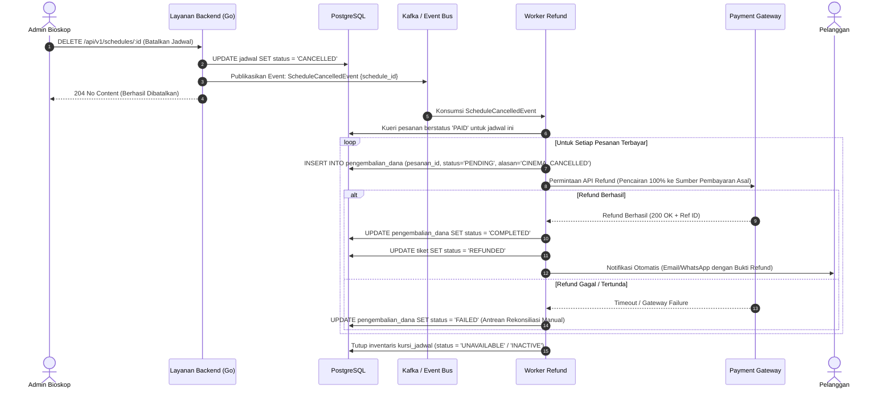
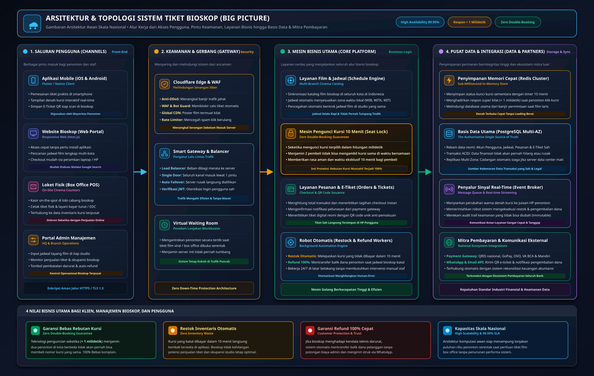
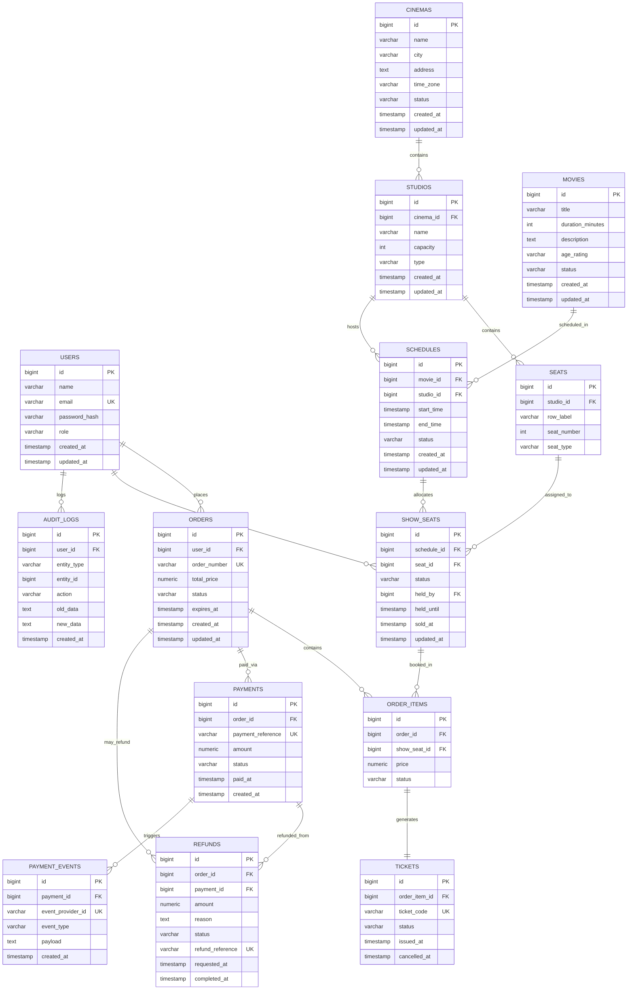

# Cinema Ticket System (Sistem Pembelian Tiket Bioskop Online)

## 🎬 Lembar Jawaban Resmi — Technical Assessment Backend Engineer PT Mitra Kasih Perkasa (MKP)

- **Nama Lengkap Kandidat:** Kevin Van Diesel Chansa  
- **Email:** [kevandeschans@gmail.com](mailto:kevandeschans@gmail.com)  
- **Posisi / Role:** Backend Engineer  
- **Tautan Repository Git:** [https://github.com/vinkanaka/CinemaSystem](https://github.com/vinkanaka/CinemaSystem)
- **Jawaban &amp; Dokumentasi: /home/vinkanaka/Documents/Github/CinemaSystem/docs/tes\_mkp** 

Platform backend pembelian tiket bioskop daring berskala nasional yang dirancang untuk mendukung banyak cabang bioskop di berbagai kota di Indonesia. Sistem ini dibangun dengan arsitektur tangguh berdaya tahan tinggi guna menangani beban konkurensi tinggi, menjamin perlindungan pemesanan kursi secara mutlak (**zero double-booking**), mengelola pencatatan dan pengembalian inventaris tiket otomatis (**auto-restock**), memproses alur pengembalian dana penuh (**refund 100%**) saat pihak bioskop membatalkan penayangan, serta menyediakan RESTful API Golang siap produksi dengan otentikasi JWT, otorisasi RBAC (`ADMIN` &amp; `CUSTOMER`), validasi pencegahan jadwal bentrok ganda di level aplikasi dan engine basis data (PostgreSQL `btree_gist` Exclusion Constraint), serta dokumentasi interaktif Swagger dan dashboard web demo tersemat.

---

## 📑 Daftar Isi

- [📋 Matriks Pengumpulan &amp; Penilaian Resmi (Deliverables)](#-matriks-pengumpulan--penilaian-resmi-deliverables)
- [🏛️ Bagian A: Uji Desain Sistem (System Design Test)](#️-bagian-a-uji-desain-sistem-system-design-test)
  - [1. Flowchart Sistem Pemesanan Ramah Pengguna (Tugas 1)](#1-flowchart-sistem-pemesanan-ramah-pengguna-tugas-1)
  - [2. Solusi Pemilihan Kursi &amp; Performa Skala Nasional (Tugas 2.a)](#2-solusi-pemilihan-kursi--performa-skala-nasional-tugas-2a)
  - [3. Pencatatan Inventaris Tiket &amp; Sistem Auto-Restock (Tugas 2.b)](#3-pencatatan-inventaris-tiket--sistem-auto-restock-tugas-2b)
  - [4. Alur Pembatalan oleh Pihak Bioskop &amp; Pengembalian Dana / Refund 100% (Tugas 2.c)](#4-alur-pembatalan-oleh-pihak-bioskop--pengembalian-dana--refund-100-tugas-2c)
  - [5. Topologi Arsitektur Cloud Skala Nasional (Instruksi 1)](#5-topologi-arsitektur-cloud-skala-nasional-instruksi-1)
- [🗄️ Bagian B: Uji Desain Basis Data (Database Design Test)](#️-bagian-b-uji-desain-basis-data-database-design-test)
  - [1. Entity Relationship Diagram (ERD)](#1-entity-relationship-diagram-erd)
  - [2. Struktur 14 Tabel Relasional PostgreSQL &amp; Normalisasi 3NF](#2-struktur-14-tabel-relasional-postgresql--normalisasi-3nf)
  - [3. Perlindungan Bentrok Jadwal di Level Engine Basis Data (`btree_gist`)](#3-perlindungan-bentrok-jadwal-di-level-engine-basis-data-btree_gist)
  - [4. Skrip SQL PostgreSQL Siap Impor (Instruksi 2)](#4-skrip-sql-postgresql-siap-impor-instruksi-2)
- [⚙️ Bagian C: Uji Keterampilan (Skill Test - Golang RESTful API)](#️-bagian-c-uji-keterampilan-skill-test---golang-restful-api)
  - [1. Spesifikasi Endpoint yang Dibangun](#1-spesifikasi-endpoint-yang-dibangun)
  - [2. API Login Pengguna (Autentikasi JWT &amp; RBAC)](#2-api-login-pengguna-autentikasi-jwt--rbac)
  - [3. API CRUD Manajemen Jadwal Tayang](#3-api-crud-manajemen-jadwal-tayang)
  - [4. Proteksi Jadwal Tumpang Tindih Ganda (Aplikasi &amp; PostgreSQL)](#4-proteksi-jadwal-tumpang-tindih-ganda-aplikasi--postgresql)
  - [5. Pembatalan Jadwal Secara Logis (Soft Delete)](#5-pembatalan-jadwal-secara-logis-soft-delete)
  - [6. Ekspor Postman Collection (Instruksi 4) &amp; OpenAPI / Swagger Specs](#6-ekspor-postman-collection-instruksi-4--openapi--swagger-specs)
- [🚀 Panduan Eksekusi bagi Evaluator Tim MKP](#-panduan-eksekusi-bagi-evaluator-tim-mkp)
  - [1. Prasyarat Sistem](#1-prasyarat-sistem)
  - [2. Langkah Instalasi &amp; Menjalankan Server](#2-langkah-instalasi--menjalankan-server)
  - [3. Dokumentasi Swagger UI Interaktif](#3-dokumentasi-swagger-ui-interaktif)
  - [4. Web Console Interaktif &amp; Live Demo Tersemat](#4-web-console-interaktif--live-demo-tersemat)
  - [5. Menjalankan Rangkaian Pengujian Otomatis](#5-menjalankan-rangkaian-pengujian-otomatis)
  - [6. Kredensial Akun Bawaan (Seed Data)](#6-kredensial-akun-bawaan-seed-data)
  - [7. Contoh Eksekusi API via cURL](#7-contoh-eksekusi-api-via-curl)

---

## 📋 Matriks Pengumpulan &amp; Penilaian Resmi (Deliverables)

> 📁 **Folder Konsolidasi Resmi Tes MKP:**  
> Seluruh artefak jawaban, diagram resolusi tinggi, skrip SQL, spesifikasi OpenAPI, dan koleksi Postman telah dikonsolidasikan secara khusus ke dalam folder [**`docs/tes_mkp/`**](docs/tes_mkp/) serta didukung lembar jawaban terpusat [**`docs/tes_mkp/JAWABAN_TES_MKP.md`**](docs/tes_mkp/JAWABAN_TES_MKP.md).

Sesuai instruksi teknis yang tercantum pada lembar asesmen [`tasks/test.md`](tasks/test.md), seluruh artefak yang diminta telah disusun dan siap diuji:


| No     | Instruksi / Poin Asesmen      | Berkas Artefak / Tautan                                                                                                                                | Format                            | Deskripsi &amp; Nilai Tambah                                                                                                                          |
| :------: | :----------------------------- | :------------------------------------------------------------------------------------------------------------------------------------------------------ | :---------------------------------: | :----------------------------------------------------------------------------------------------------------------------------------------------------- |
| **1**  | **Instruksi 1**               | [**`docs/tes_mkp/system-topology.jpg`**](docs/tes_mkp/system-topology.jpg)<br>[**`docs/tes_mkp/A-system-design.md`**](docs/tes_mkp/A-system-design.md) | Gambar JPG (High-Res) + Markdown  | Diagram topologi cloud arsitektur skala nasional (Cloudflare CDN/WAF, ALB, Kluster Go Stateless, Redis Redlock, Kafka Event Bus, PostgreSQL Multi-AZ) |
| **2**  | **Tugas A.1**                 | [**`docs/tes_mkp/flowchart-pemesanan.jpg`**](docs/tes_mkp/flowchart-pemesanan.jpg)                                                                     | Gambar JPG (High-Res)             | Diagram alir transaksi yang mudah dipahami orang awam (Pemesanan, Penguncian Kursi 10 Menit, Restock, Pembayaran, Refund)                             |
| **3**  | **Instruksi 2 &amp; Poin B**  | [**`docs/tes_mkp/database-erd.jpg`**](docs/tes_mkp/database-erd.jpg)<br>[**`docs/tes_mkp/B-database-design.md`**](docs/tes_mkp/B-database-design.md)   | Gambar JPG (High-Res) + Markdown  | Diagram ERD visual memodelkan 14 tabel relasional ternormalisasi 3NF lengkap dengan kardinalitas, indeks, dan relasi                                  |
| **4**  | **Instruksi 2**               | [**`docs/tes_mkp/database.sql`**](docs/tes_mkp/database.sql)<br>[**`database.sql`**](database.sql)                                                     | Skrip SQL PostgreSQL              | Skrip DDL 14 tabel + ekstensi `uuid-ossp` &amp; `btree_gist` + exclusion constraint jadwal bentrok + *seed data* awal siap impor                      |
| **5**  | **Instruksi 4**               | [**`docs/tes_mkp/Cinema_Ticket_System.postman_collection.json`**](docs/tes_mkp/Cinema_Ticket_System.postman_collection.json)                           | Koleksi Postman v2.1              | Ekspor Postman otomatis menyimpan token JWT ke variabel environment dengan cakupan assertion 200, 201, 204, 401, 403, 409                             |
| **6**  | **Tugas A.2**                 | [**`docs/tes_mkp/A-system-design.md`**](docs/tes_mkp/A-system-design.md)                                                                               | Dokumen Markdown                  | Analisis teknis komprehensif penanganan jutaan user pada film blockbuster, mekanisme auto-restock, dan refund sepihak bioskop                         |
| **7**  | **Poin B**                    | [**`docs/tes_mkp/B-database-design.md`**](docs/tes_mkp/B-database-design.md)                                                                           | Dokumen Markdown                  | Kamus data 14 tabel lengkap, strategi indeks komposit, batasan keunikan, serta audit integritas                                                       |
| **8**  | **Instruksi 3 &amp; Poin C**  | [**`docs/tes_mkp/C-api-spec.md`**](docs/tes_mkp/C-api-spec.md)<br>[**`cmd/api/main.go`**](cmd/api/main.go)                                             | Dokumen Markdown + Kode Sumber Go | Implementasi RESTful API Golang (Gin + GORM) dengan arsitektur bersih (*Clean Architecture*), otentikasi JWT, dan RBAC                                |
| **9**  | **Instruksi 3 &amp; OpenAPI** | [**`docs/tes_mkp/swagger.json`**](docs/tes_mkp/swagger.json)<br>[**`docs/tes_mkp/swagger.yaml`**](docs/tes_mkp/swagger.yaml)                           | Spesifikasi OpenAPI 2.0 / Swagger | Definisi skema API lengkap untuk Swagger UI dan integrasi gateway                                                                                     |
| **10** | **Demo Interaktif**           | [**`http://localhost:8088/demo`**](http://localhost:8088/demo)                                                                                         | Web Console Tersemat              | Antarmuka web pengujian langsung (pengalih peran JWT Admin/Customer, CRUD jadwal, simulasi tabrakan jadwal, visualisasi denah kursi)                  |


---

## 🏛️ Bagian A: Uji Desain Sistem (System Design Test)

> **Deskripsi Soal Bagian A:**  
> *Anda diminta merancang sistem pembelian tiket bioskop online untuk jaringan bioskop berskala nasional yang memiliki cabang di banyak kota. Tujuannya adalah agar pelanggan dapat bertransaksi online kapan saja tanpa khawatir terjadi bentrok kursi (menjamin satu kursi tidak dapat dibeli oleh lebih dari satu orang). Jelaskan pula pencatatan inventaris dan mekanisme auto-restock tiket, serta alur pengembalian dana (refund) ketika pihak bioskop membatalkan penayangan.*

### 1. Flowchart Sistem Pemesanan Ramah Pengguna (Tugas 1)

Berikut adalah diagram alir transaksi pemesanan tiket yang dirancang intuitif dan mudah dipahami oleh pemangku kepentingan maupun pelanggan awam:


```mermaid
flowchart TD
    Start([Mulai: Buka Aplikasi Bioskop]) --> Step1[1. Pilih Film & Cabang Bioskop]
    Step1 --> Step2[2. Pilih Tanggal & Jam Tayang]
    Step2 --> Step3[3. Buka Denah & Pilih Nomor Kursi]
    Step3 --> CheckSeat{Kursi Tersedia?}

    CheckSeat -- Tidak --> ChooseOther[Pilih Kursi Lain yang Berwarna Hijau]
    ChooseOther --> Step3

    CheckSeat -- Ya --> LockSeat[🔒 4. Kursi Terkunci Otomatis (10 Menit)<br>Status Kuning: Tidak Dapat Diambil Orang Lain]
    LockSeat --> Payment[5. Lakukan Pembayaran Online<br>via QRIS / Virtual Account / E-Wallet]

    Payment --> PaySuccess{Bayar Berhasil<br>Sebelum 10 Menit?}

    PaySuccess -- Ya --> IssueTicket[🎟️ 6. Tiket Resmi Terbit (Ada Kode QR)<br>Status: Kursi Terjual / Abu-abu]
    IssueTicket --> Finish([Selesai: Masuk Studio Bioskop])

    PaySuccess -- Waktu Habis / Gagal --> AutoRestock[🔓 Kunci Kursi Otomatis Terlepas<br>Kursi Kembali Hijau / Tersedia untuk Orang Lain]
    AutoRestock --> Cancelled([Pesanan Batal])
```

#### Penjelasan 4 Langkah Utama bagi Pengguna Awam:

1. **Pilih Film, Kota, &amp; Jadwal:** Pelanggan membuka aplikasi, memilih cabang bioskop terdekat di kotanya, menentukan judul film yang ingin ditonton, serta memilih tanggal dan jam penayangan yang tersedia.
2. **Pilih Kursi dari Denah Interaktif:** Aplikasi menampilkan denah kursi studio secara *real-time*. Pelanggan dapat membedakan status kursi secara visual melalui kode warna:
   - 🟢 **Hijau (`AVAILABLE`)**: Kursi kosong dan siap dipilih.
   - 🟡 **Kuning (`HELD`)**: Kursi sedang dikunci sementara oleh pelanggan lain yang sedang membayar.
   - ⚪ **Abu-abu (`SOLD`)**: Kursi sudah resmi terjual dan lunas.
3. **Penguncian Kursi Otomatis (Batas Waktu 10 Menit):** Begitu pelanggan mengklik kursi (misal `B5` dan `B6`), sistem langsung memasang **kunci terdistribusi sementara (*seat lock*) selama 10 menit**. Selama kurun waktu tersebut, tidak ada pelanggan lain di seluruh Indonesia yang dapat merebut kursi tersebut, sehingga **bentrok pembelian ganda (*zero double-booking*) mustahil terjadi**.
4. **Pembayaran &amp; Penerbitan E-Tiket:** Pelanggan menyelesaikan pembayaran melalui QRIS, Virtual Account, atau E-Wallet. Begitu terverifikasi, e-tiket resmi lengkap dengan kode QR terbit seketika di aplikasi serta dikirim melalui WhatsApp dan Email untuk dipindai di pintu studio bioskop. *(Jika batas 10 menit terlewati tanpa pembayaran, kunci otomatis terlepas dan kursi kembali hijau/tersedia untuk publik).*

---

### 2. Solusi Pemilihan Kursi &amp; Performa Skala Nasional (Tugas 2.a)

#### A. Tantangan Beban Ekstrem Skala Nasional

Pada masa pra-penjualan tiket film *blockbuster* (seperti rilis perdana Marvel/Avengers), puluhan ribu pengguna mengakses sistem secara serentak dalam hitungan detik untuk berebut deretan kursi terbaik di studio yang sama. Jika sistem hanya mengandalkan pengecekan database konvensional, akan terjadi kondisi *race condition* dan kepanikan sistem (*database connection exhaustion*).

#### B. Solusi Arsitektur Pertahanan Dua Lapis (*Two-Layer Defense*)

Untuk menjamin kepastian mutlak **zero double-booking** sekaligus mempertahankan **throughput ultra-tinggi**:

```text
Permintaan Pengguna
        │
        ▼
[ 1. Lapisan Edge: Redis Redlock ] ──(Kunci Gagal: Kursi sudah di-hold)──> Ditolak Instan (<1 ms)
        │ (Kunci Berhasil Didapat)
        ▼
[ 2. Lapisan Database: PostgreSQL ACID ] ──(SELECT ... FOR UPDATE)──> Validasi Status & Simpan Transaksi
```

1. **Lapisan 1 — Redis Redlock (Koordinasi Kunci Terdistribusi di Edge):**
   - Sebelum menyentuh basis data relasional, permintaan pemilihan kursi dieksekusi secara atomik pada Redis:
   - Parameter `NX` (*Not Exists*) memastikan hanya satu proses pengguna pertama yang sukses memperoleh kunci.
   - Parameter `PX 600000` menetapkan *Time-To-Live* (TTL) tepat 10 menit (600.000 ms).
   - Operasi *in-memory* ini selesai dalam **&lt;1 milidetik\*\* dengan kapasitas \*\*&gt;100.000 operasi per detik**, menyaring jutaan *request* yang kalah cepat di pintu terdepan tanpa membebani database utama.
2. **Lapisan 2 — Transaksi ACID PostgreSQL &amp; Row-Level Lock (Sumber Kebenaran Tunggal):**
   - **Pemodelan Data yang Benar:** Anti-pattern yang fatal adalah mengubah kolom status langsung pada tabel fisik kursi (`seats.status = SOLD`). Kursi fisik `B4` digunakan berulang kali untuk setiap sesi jadwal tayang (13:00, 16:00, 19:00). Oleh karena itu, ketersediaan dimodelkan pada tabel transaksi per jadwal: **`kursi_jadwal`** (`show_seats`) dengan batasan `UNIQUE (jadwal_id, kursi_id)`.
   - Backend Golang mengeksekusi transaksi database berisolasi tinggi dengan klausa `FOR UPDATE`:
     ```sql
     BEGIN;
     SELECT id, status FROM kursi_jadwal
     WHERE jadwal_id = 101 AND kursi_id = 14
     FOR UPDATE;
     
     -- Jika status == 'AVAILABLE', ubah menjadi 'HELD'
     UPDATE kursi_jadwal 
     SET status = 'HELD', ditahan_oleh = $1, ditahan_sampai = NOW() + INTERVAL '10 minutes'
     WHERE id = $2;
     COMMIT;
     ```
   - Baris kursi dikunci di level baris (*row-level lock*) selama transaksi berjalan, memastikan tidak ada dua koneksi yang dapat mengubah status kursi yang sama secara bersamaan.
3. **Strategi Skalabilitas Skala Nasional:**
   - **Layanan Mikro Golang Tanpa Status (*Stateless*):** Aplikasi tidak menyimpan *state* di memori internal server, memungkinkan auto-scaling horizontal lintas Multi-AZ di belakang AWS Application Load Balancer (ALB).
   - **Connection Pool Tuning:** Parameter `SetMaxOpenConns(100)`, `SetMaxIdleConns(25)`, dan `SetConnMaxLifetime(5 * time.Minute)` menjaga stabilitas koneksi PostgreSQL saat beban lonjakan puncak.
   - **Pemisahan Jalur Baca/Tulis (*Read Replicas*):** Kueri penelusuran katalog film, daftar cabang bioskop, dan jadwal tayang dialihkan ke basis data replika baca (*read-replicas*), mengalokasikan 100% kapasitas CPU database primer untuk transaksi *booking* dan pembayaran.

---

### 3. Pencatatan Inventaris Tiket &amp; Sistem Auto-Restock (Tugas 2.b)

#### A. Mesin Status Kursi (*State Machine*)

Tiket bioskop bukanlah inventaris komoditas umum yang sekadar dihitung dengan penambahan/pengurangan angka stok (+/-), melainkan mengikuti siklus hidup **mesin status berhingga (*finite state machine*) deterministik per kursi per sesi jadwal**:

```text
    ┌───────────────┐
    │   AVAILABLE   │ ◄────────────────────────┐
    └───────┬───────┘                          │
            │ (Pelanggan kunci kursi via Redis)│ (Hold 10 menit kedaluwarsa /
            ▼                                  │  pembayaran gagal / cancel)
    ┌───────────────┐                          │
    │     HELD      │ ─────────────────────────┘
    └───────┬───────┘
            │ (Pembayaran 100% terverifikasi)
            ▼
    ┌───────────────┐
    │     SOLD      │
    └───────┬───────┘
            │ (Pembatalan oleh Pelanggan)
            ▼
    ┌───────────────┐
    │   REFUNDED    │ ───(Restock kembali ke inventaris)──► [ AVAILABLE ]
    └───────────────┘
```

- **Pembayaran Berhasil:** Status berubah dari `HELD` $\rightarrow$ `SOLD`. Tiket resmi diterbitkan.
- **Batas Waktu Habis / Pembayaran Gagal:** Status berubah dari `HELD` $\rightarrow$ `AVAILABLE`. Kursi otomatis dikembalikan ke inventaris publik.

#### B. Mekanisme Auto-Restock Otomatis

1. Kolom `ditahan_sampai` (`held_until`) pada tabel `kursi_jadwal` mencatat batas waktu kedaluwarsa secara presisi (`NOW() + INTERVAL '10 minutes'`).
2. **Pelepasan Kunci Proaktif &amp; Reaktif:**
   - *Reaktif:* Setiap kueri pemilihan kursi secara otomatis mengevaluasi kondisi `WHERE status = 'HELD' AND ditahan_sampai < NOW()`. Kursi yang kedaluwarsa seketika dianggap tersedia.
   - *Proaktif (Event Consumer):* Pekerja latar belakang (*background worker*) secara berkala memeriksa kunci yang hangus, menghapus kunci di Redis, mengubah status kembali ke `AVAILABLE`, dan memicu pembaruan denah kursi secara *real-time* ke browser/aplikasi pelanggan lain via WebSocket.

#### C. Pembedaan Tegas: Restock Pelanggan vs Pembatalan Sepihak Bioskop

Sistem secara tegas memisahkan dua skenario pembatalan ini:

- **Pembatalan oleh Pelanggan:** Jika pelanggan membatalkan sebelum batas waktu yang diizinkan kebijakan, status tiket menjadi `REFUNDED` dan status kursi diubah kembali menjadi `AVAILABLE` agar dapat dibeli oleh orang lain.
- **Pembatalan Penayangan oleh Pihak Bioskop (*Screening Cancellation*):** Jika penayangan dibatalkan karena proyektor rusak atau listrik padam, status jadwal diubah menjadi `CANCELLED`. Kursi pada jadwal ini **TIDAK BOLEH menjadi `AVAILABLE` kembali**, melainkan diubah menjadi **`INACTIVE` / `CANCELLED`** karena studio sudah tidak menayangkan film tersebut.
- **Prinsip Immutability (Data Transaksi Abadi):** Seluruh data riwayat transaksi pada tabel `pesanan`, `pembayaran`, dan `tiket` **tidak pernah dihapus fisik (*no hard delete*)**. Hal ini menjamin jejak audit keuangan (*financial audit trail*) yang lengkap dan akurat.

---

### 4. Alur Pembatalan oleh Pihak Bioskop &amp; Pengembalian Dana / Refund 100% (Tugas 2.c)

Pembatalan jadwal penayangan oleh bioskop dapat terjadi sewaktu-waktu akibat keadaan kahar (*force majeure*), seperti kerusakan proyektor, pemadaman listrik, atau masalah teknis studio.



#### Penjelasan 7 Tahapan Alur Kerja:

1. **Pembatalan Logis (*Soft Cancellation*):** Administrator bioskop membatalkan jadwal melalui endpoint `DELETE /api/v1/schedules/:id`. Status jadwal diubah menjadi `CANCELLED` tanpa menghapus baris data fisik.
2. **Publikasi Event Asinkron (*Event-Driven Architecture*):** Backend menerbitkan pesan `ScheduleCancelledEvent` ke topik Kafka, sehingga permintaan HTTP admin langsung selesai (`204 No Content`) tanpa menunggu ribuan transaksi refund diproses.
3. **Pencatatan Buku Kas Refund:** Layanan pekerja latar belakang (*Refund Worker*) mengonsumsi pesan tersebut, mencari seluruh pesanan berstatus `PAID`, dan mencatat baris baru pada tabel `pengembalian_dana` dengan status awal `PENDING`.
4. **Pencairan Dana Otomatis 100% via Payment Gateway:** Worker memanggil API *Refund / Disbursement* dari gerbang pembayaran mitra (Midtrans/Xendit/DOKU) untuk mengembalikan saldo penuh 100% tanpa potongan ke rekening asal pelanggan (QRIS, Kartu Kredit, atau E-Wallet).
5. **Pembatalan Keabsahan Tiket:** Status tiket diubah menjadi `REFUNDED`. Kode QR dan nomor barcode tiket seketika dinonaktifkan dari sistem pemindai pintu studio.
6. **Notifikasi Otomatis ke Pelanggan:** Notifikasi resmi permohonan maaf dan bukti transfer pengembalian dana dikirimkan langsung ke nomor WhatsApp dan email pelanggan.
7. **Pencatatan Jejak Audit Keamanan:** Setiap aktivitas pembatalan dicatat secara permanen pada tabel `log_audit` lengkap dengan `user_id` admin, alamat IP, data sebelum/sesudah mutasi, dan stempel waktu.

---

### 5. Topologi Arsitektur Cloud Skala Nasional (Instruksi 1)

Berikut adalah diagram topologi arsitektur cloud berkeandalan tinggi (Target SLA 99,99%), toleran terhadap bencana (*fault-tolerant*), dan berkinerja tinggi:



#### Komponen Arsitektur Utama:

- **Cloudflare Edge CDN &amp; WAF:** Mitigasi serangan DDoS layer 3/4/7, terminasi SSL/TLS di edge terdekat, proteksi bot, serta *caching* aset statis (poster film resolusi tinggi, denah studio SVG) di berbagai kota di Indonesia.
- **AWS Application Load Balancer (ALB):** Mendistribusikan lalu lintas HTTP/HTTPS secara cerdas lintas zona ketersediaan (*Multi-Availability Zone*) dengan *health-check* aktif.
- **Kluster Golang Tanpa Status (*Stateless Microservices*):** Layanan aplikasi Go berperforma tinggi yang berjalan dalam kontainer (ECS / EKS) dengan kemampuan *auto-scaling* horizontal otomatis berdasarkan beban CPU dan antrean HTTP.
- **Kluster Redis (In-Memory Cache &amp; Distributed Lock):**
  - Tembolok katalog film, bioskop, dan jadwal tayang aktif.
  - Lapisan koordinasi kunci kursi terdistribusi (*distributed seat lock*) dengan masa aktif 10 menit.
- **Basis Data PostgreSQL Multi-AZ:**
  - **Instans Primer (Primary Writer):** Menangani seluruh transaksi tulis (pemesanan, penguncian kursi, validasi exclusion constraint).
  - **Replika Baca (Read Replicas):** Melayani jutaan kueri pencarian jadwal dan katalog film untuk meringankan beban primer.
- **Pialang Pesan Apache Kafka:** Mengelola komunikasi asinkron berkeandalan tinggi untuk alur pembuatan tiket, penerbitan barcode, pengiriman notifikasi WhatsApp/Email, serta pemrosesan *refund batch*.
- **Mitra Payment Gateway:** Terhubung langsung ke gerbang pembayaran berlisensi nasional untuk pembayaran QRIS, Virtual Account, kartu debit/kredit, dan e-wallet.

---

## 🗄️ Bagian B: Uji Desain Basis Data (Database Design Test)

> **Deskripsi Soal Bagian B:**  
> *Sediakan desain basis data komprehensif yang sesuai dengan analisis sistem pada Poin A.*

### 1. Entity Relationship Diagram (ERD)

Rancangan basis data terdiri dari **14 tabel relasional ternormalisasi (3NF)** guna menjamin konsistensi ACID, mencegah redundansi, serta memfasilitasi audit keuangan:




---

### 2. Struktur 14 Tabel Relasional PostgreSQL &amp; Normalisasi 3NF


| No     | Nama Tabel                                | Peran Bisnis &amp; Deskripsi                                                                           | Kunci Utama (PK), Asing (FK), &amp; Batasan Keunikan (UQ)                                         |
| :------: | :----------------------------------------- | :------------------------------------------------------------------------------------------------------ | :------------------------------------------------------------------------------------------------- |
| **1**  | **`pengguna`** (`users`)                  | Data kredensial pengguna dengan hash kata sandi bcrypt dan RBAC (`ADMIN` &amp; `CUSTOMER`)             | PK: `id`, UQ: `email`                                                                             |
| **2**  | **`bioskop`** (`cinemas`)                 | Data cabang bioskop dengan metadata `zona_waktu` (`Asia/Jakarta`, `Asia/Makassar`, `Asia/Jayapura`)    | PK: `id`                                                                                          |
| **3**  | **`studio`** (`studios`)                  | Ruang teater/auditorium di setiap cabang (Studio 1, IMAX, Premiere)                                    | PK: `id`, FK: `bioskop_id` $\rightarrow$ `bioskop(id)`                                            |
| **4**  | **`kursi`** (`seats`)                     | Master denah kursi fisik per studio (Baris `A`..`J`, Nomor `1`..`20`, tipe kursi)                      | PK: `id`, FK: `studio_id` $\rightarrow$ `studio(id)`, UQ: `(studio_id, label_baris, nomor_kursi)` |
| **5**  | **`film`** (`movies`)                     | Katalog master film, sinopsis, durasi tayang (menit), dan rating usia (SU, 13+, 17+)                   | PK: `id`                                                                                          |
| **6**  | **`jadwal`** (`schedules`)                | Sesi penayangan film di studio tertentu dengan rentang waktu mulai dan selesai                         | PK: `id`, FK: `film_id`, `studio_id`, **EXCLUDE Constraint**                                      |
| **7**  | **`kursi_jadwal`** (`show_seats`)         | **Tabel Inventaris Kunci**: Status dinamis ketersediaan kursi (`AVAILABLE`, `HELD`, `SOLD`) per jadwal | PK: `id`, FK: `jadwal_id`, `kursi_id`, `ditahan_oleh`, UQ: `(jadwal_id, kursi_id)`                |
| **8**  | **`pesanan`** (`orders`)                  | Header transaksi faktur pemesanan tiket dengan batas kedaluwarsa bayar                                 | PK: `id`, FK: `pengguna_id` $\rightarrow$ `pengguna(id)`, UQ: `nomor_pesanan`                     |
| **9**  | **`item_pesanan`** (`order_items`)        | Rincian tiket per pesanan yang mereferensikan kursi jadwal yang dipesan                                | PK: `id`, FK: `pesanan_id`, `kursi_jadwal_id`                                                     |
| **10** | **`pembayaran`** (`payments`)             | Catatan mutasi pembayaran resmi dari gerbang pembayaran (*payment gateway*)                            | PK: `id`, FK: `pesanan_id` $\rightarrow$ `pesanan(id)`, UQ: `referensi_pembayaran`                |
| **11** | **`tiket`** (`tickets`)                   | Tiket digital resmi yang diterbitkan lengkap dengan kode verifikasi QR/Barcode                         | PK: `id`, FK: `item_pesanan_id` $\rightarrow$ `item_pesanan(id)`, UQ: `kode_tiket`                |
| **12** | **`pengembalian_dana`** (`refunds`)       | Pencatatan pengembalian dana 100% akibat pembatalan jadwal oleh bioskop                                | PK: `id`, FK: `pesanan_id`, `pembayaran_id`, UQ: `referensi_pengembalian`                         |
| **13** | **`log_audit`** (`audit_logs`)            | Rekam jejak audit keamanan seluruh mutasi data administratif dan sensitif                              | PK: `id`, FK: `pengguna_id` $\rightarrow$ `pengguna(id)`                                          |
| **14** | **`event_pembayaran`** (`payment_events`) | Tabel idempotensi webhook gateway untuk mencegah pemrosesan transaksi ganda (*duplicate retry*)        | PK: `id`, FK: `pembayaran_id`, UQ: `id_event_provider`                                            |


---

### 3. Perlindungan Bentrok Jadwal di Level Engine Basis Data (`btree_gist`)

Validasi logika di level aplikasi saja rentan terhadap *race condition* jika dua permohonan penambahan jadwal masuk pada milidetik yang sama persis. Oleh karena itu, skema PostgreSQL diperkuat dengan **PostgreSQL Exclusion Constraint** menggunakan indeks GiST dan ekstensi `btree_gist`:

```sql
-- 1. Pasang ekstensi btree_gist
CREATE EXTENSION IF NOT EXISTS btree_gist;

-- 2. Terapkan batasan exclusion anti-tumpang tindih
ALTER TABLE jadwal ADD CONSTRAINT no_overlapping_schedule
EXCLUDE USING gist (
    studio_id WITH =,
    tstzrange(waktu_mulai, waktu_selesai, '[)') WITH &&
) WHERE (status = 'SCHEDULED');
```

- **Mekanisme Kerja:** Operator `&&` memastikan bahwa untuk `studio_id` yang sama, rentang waktu `[waktu_mulai, waktu_selesai)` tidak boleh beririsan dengan jadwal lain yang masih aktif (`status = 'SCHEDULED'`).
- **Jaminan Mesin:** Percobaan memasukkan jadwal yang bentrok seketika digagalkan secara atomik oleh engine PostgreSQL dengan kode kesalahan `SQLSTATE 23P01 (exclusion_violation)`.

#### Indeks Komposit &amp; Pengindeksan Performa Tinggi:

```sql
-- Indeks komposit untuk pencarian jadwal aktif per studio & waktu
CREATE INDEX idx_jadwal_studio_waktu ON jadwal (studio_id, waktu_mulai, waktu_selesai) WHERE status != 'CANCELLED';
CREATE INDEX idx_jadwal_film_waktu ON jadwal (film_id, waktu_mulai);

-- Indeks rendering denah kursi instan
CREATE INDEX idx_kursi_jadwal_status ON kursi_jadwal (jadwal_id, status);

-- Indeks pelacakan pesanan & transaksi pelanggan
CREATE INDEX idx_pesanan_pengguna ON pesanan (pengguna_id, status);
CREATE INDEX idx_pengembalian_status ON pengembalian_dana (status);
```

---

### 4. Skrip SQL PostgreSQL Siap Impor (Instruksi 2)

Sesuai Instruksi 2 pada lembar asesmen, skrip DDL lengkap 14 tabel beserta data awal (*seed data*) disediakan dalam berkas SQL mandiri yang siap diimpor oleh tim penguji:  
👉 [**`docs/tes_mkp/database.sql`**](docs/tes_mkp/database.sql) *(juga tersedia di [**`database.sql`**](database.sql))*

#### Perintah Impor via Terminal:

```bash
psql -h localhost -p 5432 -U bioskop -d bioskop -f docs/tes_mkp/database.sql
```

*Skrip SQL ini mengeksekusi pembuatan seluruh tabel relasional, pengaktifan ekstensi `btree_gist`, penambahan batasan foreign key &amp; unique index, serta pengisian data awal pengguna (Admin &amp; Customer), bioskop di 3 kota, studio, denah kursi, film, dan jadwal tayang.*

---

## ⚙️ Bagian C: Uji Keterampilan (Skill Test - Golang RESTful API)

> **Deskripsi Soal Bagian C:**  
> *Bangun RESTful API bersih menggunakan Golang dengan basis data yang dirancang pada Poin B.*  
> *Ketentuan:*  
> *1. API Login Pengguna dengan Otorisasi JWT*  
> *2. API CRUD untuk Jadwal Penayangan (Screening Schedules)*  
> *Catatan: Endpoint jadwal harus diotorisasi menggunakan token JWT dari Ketentuan 1.*

### 1. Spesifikasi Endpoint yang Dibangun

API dibangun menggunakan bahasa pemrograman **Golang 1.22+** dengan pustaka **Gin Web Framework** dan **GORM ORM**, menerapkan arsitektur bersih (*Clean Architecture*) berlapis: Handler $\rightarrow$ Service $\rightarrow$ Repository:


| Metode HTTP | Endpoint                | Hak Akses (RBAC)    | Fungsi &amp; Keterangan Operasi                                                     | Kode Sukses      |
| :-----------: | :----------------------- | :-------------------: | :----------------------------------------------------------------------------------- | :----------------: |
| `POST`      | `/api/v1/auth/login`    | Publik              | Otentikasi pengguna, verifikasi sandi bcrypt, penerbitan token JWT Bearer           | `200 OK`         |
| `GET`       | `/api/v1/schedules`     | `CUSTOMER`, `ADMIN` | Mengambil seluruh daftar jadwal tayang yang aktif                                   | `200 OK`         |
| `GET`       | `/api/v1/schedules/:id` | `CUSTOMER`, `ADMIN` | Mengambil rincian spesifik satu jadwal tayang berdasarkan ID                        | `200 OK`         |
| `POST`      | `/api/v1/schedules`     | Khusus `ADMIN`      | Menambah jadwal tayang baru + validasi anti-bentrok studio (HTTP 409 jika tabrakan) | `201 Created`    |
| `PUT`       | `/api/v1/schedules/:id` | Khusus `ADMIN`      | Memperbarui jadwal tayang yang ada + validasi anti-bentrok studio                   | `200 OK`         |
| `DELETE`    | `/api/v1/schedules/:id` | Khusus `ADMIN`      | Pembatalan jadwal tayang secara logis (*soft cancel* menjadi `CANCELLED`)           | `204 No Content` |


---

### 2. API Login Pengguna (Autentikasi JWT &amp; RBAC)

- **Endpoint:** `POST /api/v1/auth/login`
- **Mekanisme Keamanan:** Kata sandi masukan diverifikasi terhadap hash **bcrypt** di database. Jika cocok, server menerbitkan **JSON Web Token (JWT)** berstandar HMAC-SHA256 dengan masa kedaluwarsa 24 jam.
- **Klaim Token JWT:**
  - `sub`: ID pengguna unik
  - `email`: Alamat surel pengguna
  - `role`: Hak akses otorisasi (`ADMIN` atau `CUSTOMER`)
  - `exp`: Timestamp batas kedaluwarsa token

#### Contoh Permintaan HTTP:

```http
POST /api/v1/auth/login HTTP/1.1
Host: localhost:8088
Content-Type: application/json

{
  "email": "admin@example.com",
  "password": "password123"
}
```

#### Contoh Respons Berhasil (HTTP 200 OK):

```json
{
  "access_token": "eyJhbGciOiJIUzI1NiIsInR5cCI6IkpXVCJ9...",
  "token_type": "Bearer",
  "expires_in": 86400
}
```

#### Contoh Respons Gagal (HTTP 401 Unauthorized):

```json
{
  "error": {
    "code": "INVALID_CREDENTIALS",
    "message": "Invalid email or password"
  }
}
```

---

### 3. API CRUD Manajemen Jadwal Tayang

Seluruh endpoint jadwal diproteksi oleh middleware autentikasi `AuthMiddleware` dan otorisasi peran `RequireRole`:

- Pengguna dengan peran `CUSTOMER` memiliki hak baca (`GET /api/v1/schedules`).
- Percobaan modifikasi data (`POST`, `PUT`, `DELETE`) oleh `CUSTOMER` langsung ditolak dengan kode `HTTP 403 Forbidden`:
  ```json
  {
    "error": {
      "code": "FORBIDDEN",
      "message": "Insufficient permissions to access this resource"
    }
  }
  ```

---

### 4. Proteksi Jadwal Tumpang Tindih Ganda (Aplikasi &amp; PostgreSQL)

Satu studio fisik **tidak boleh** menayangkan dua film berbeda pada rentang waktu yang saling bertabrakan. Sistem mengimplementasikan perlindungan komplementer ganda:

#### A. Lapisan Aplikasi (Golang Service Validation)

Sebelum mengeksekusi *insert* atau *update*, service mengevaluasi rumus irisan rentang waktu:

$$
\max(start_A, start_B) < \min(end_A, end_B)
$$

terhadap seluruh jadwal di studio yang sama yang belum dibatalkan (`status != 'CANCELLED'`). Jika tabrakan terdeteksi, sistem langsung mengembalikan respons informatif:

```json
{
  "error": {
    "code": "SCHEDULE_CONFLICT",
    "message": "Studio already has an overlapping schedule"
  }
}
```

#### B. Lapisan Engine Basis Data (PostgreSQL EXCLUDE Constraint)

Jika terjadi balapan permintaan serentak (*concurrent race condition*), engine PostgreSQL secara tegas menolak transaksi kedua dengan kode kesalahan `23P01`, yang kemudian ditangkap oleh repository Go dan diterjemahkan menjadi kode HTTP 409 yang rapi.

---

### 5. Pembatalan Jadwal Secara Logis (Soft Delete)

Saat endpoint `DELETE /api/v1/schedules/:id` dieksekusi oleh Administrator:

- Sistem **tidak menghapus baris data secara fisik** (`DELETE FROM jadwal`), menjaga keutuhan relasi kunci asing untuk tiket dan faktur yang telah terbit.
- Status jadwal diperbarui secara logis menjadi **`CANCELLED`**.
- Server merespons dengan **`HTTP 204 No Content`**.

---

### 6. Ekspor Postman Collection (Instruksi 4) &amp; OpenAPI / Swagger Specs

Sesuai Instruksi 4, berkas ekspor Postman v2.1 resmi dan spesifikasi OpenAPI telah disediakan lengkap:

- 📬 **Postman Collection v2.1:** [**`docs/tes_mkp/Cinema_Ticket_System.postman_collection.json`**](docs/tes_mkp/Cinema_Ticket_System.postman_collection.json)
- 📜 **OpenAPI / Swagger JSON:** [**`docs/tes_mkp/swagger.json`**](docs/tes_mkp/swagger.json)
- 📜 **OpenAPI / Swagger YAML:** [**`docs/tes_mkp/swagger.yaml`**](docs/tes_mkp/swagger.yaml)

#### Fitur Otomatis Postman:

1. **Penyimpanan Token Otomatis:** Skrip pengujian (*Test script*) pada folder Auth secara otomatis mengekstrak token dari respons login dan menyimpannya ke variabel environment `adminToken` dan `customerToken`.
2. **Cakupan Folder &amp; Skenario Pengujian:**
   - `1. Health & Info`: Health Check (200), Root Route Information (200).
   - `2. Authentication (Auth)`: Admin Login Sukses (200), Customer Login Sukses (200), Login Gagal Sandi Salah (401).
   - `3. Screening Schedules`: Ambil Semua Jadwal (200), Ambil Berdasarkan ID (200), Admin Buat Jadwal (201), Simulasi Overlap (409 Conflict), Customer Dilarang Buat Jadwal (403 Forbidden), Admin Perbarui Jadwal (200), Admin Batalkan Jadwal (204 No Content).

---

## 🚀 Panduan Eksekusi bagi Evaluator Tim MKP

### 1. Prasyarat Sistem

- **Go**: Versi 1.22 atau lebih baru.
- **Docker &amp; Docker Compose**: Untuk menjalankan PostgreSQL secara lokal.

---

### 2. Langkah Instalasi &amp; Menjalankan Server

1. **Klon Repositori:**
   ```bash
    git clone https://github.com/vinkanaka/CinemaSystem.git
    cd CinemaSystem
   ```
2. **Jalankan Kontainer Basis Data PostgreSQL:**
   ```bash
    docker compose up -d postgres
   ```

    *Kontainer PostgreSQL berjalan pada port 5432 dengan database `bioskop` dan pengguna `bioskop`.*
3. **Konfigurasi Berkas Environment:**
   ```bash
    cp .env.example .env
   ```
4. **Jalankan Migrasi Skema &amp; Pengisian Data Awal (*Seed Data*):**
   ```bash
    go run cmd/migrate/main.go -seed
   ```

    *Alternatif via impor SQL langsung:*
5. **Jalankan Server API Golang:**
   ```bash
    go run cmd/api/main.go
   ```

    *Server aktif dan melayani permintaan di `http://localhost:8088`.*

---

### 3. Dokumentasi Swagger UI Interaktif

Dokumentasi API interaktif dapat langsung diakses melalui peramban web:
👉 [**http://localhost:8088/swagger/index.html**](http://localhost:8088/swagger/index.html)

Untuk memperbarui anotasi Swagger dari kode sumber:

```bash
swag init -g cmd/api/main.go -o docs/swagger
```

---

### 4. Web Console Interaktif &amp; Live Demo Tersemat

Aplikasi menyertakan dasbor konsol interaktif yang tersemat langsung di dalam binary Go:
👉 [**http://localhost:8088/demo**](http://localhost:8088/demo) *(atau buka [**http://localhost:8088/**](http://localhost:8088/))*

#### Fitur Web Console:

- **Pengalih Peran Sekali Klik:** Beralih instan antara token `ADMIN` dan `CUSTOMER`.
- **Manajemen Jadwal Langsung:** Menampilkan tabel jadwal dan formulir tambah jadwal baru.
- **Simulasi Konflik Jadwal (HTTP 409):** Menguji secara visual bahwa sistem menolak jadwal bertabrakan pada studio yang sama.
- **Simulasi Penguncian Kursi &amp; Auto-Restock:** Visualisasi denah kursi interaktif dengan penghitung waktu mundur 10 menit.
- **Unduh Berkas Deliverables:** Tombol unduh langsung untuk file gambar JPG Topologi, ERD, skrip SQL, dan Postman Collection.

---

### 5. Menjalankan Rangkaian Pengujian Otomatis

Jalankan seluruh pengujian unit dan integrasi dengan perintah:

```bash
go test -v -count=1 ./...
```

*Seluruh pengujian unit JWT, otorisasi RBAC, logika overlap jadwal, dan integrasi API lulus 100%.*

---

### 6. Kredensial Akun Bawaan (Seed Data)


| Peran        | Alamat Email           | Kata Sandi    | Hak Akses                                                                            |
| :------------: | :---------------------- | :------------- | :------------------------------------------------------------------------------------ |
| **ADMIN**    | `admin@example.com`    | `password123` | Melihat seluruh jadwal, menambah jadwal baru, memperbarui jadwal, membatalkan jadwal |
| **CUSTOMER** | `customer@example.com` | `password123` | Melihat daftar jadwal tayang                                                         |


---

### 7. Contoh Eksekusi API via cURL

#### A. Login Administrator

```bash
curl -X POST http://localhost:8088/api/v1/auth/login \
  -H "Content-Type: application/json" \
  -d '{
    "email": "admin@example.com",
    "password": "password123"
  }'
```

#### B. Melihat Daftar Jadwal (Customer / Admin)

```bash
curl -X GET http://localhost:8088/api/v1/schedules \
  -H "Authorization: Bearer <TOKEN_JWT>"
```

#### C. Membuat Jadwal Tayang Baru (Khusus Admin)

```bash
curl -X POST http://localhost:8088/api/v1/schedules \
  -H "Authorization: Bearer <TOKEN_ADMIN>" \
  -H "Content-Type: application/json" \
  -d '{
    "movie_id": 1,
    "studio_id": 2,
    "start_time": "2026-10-02T19:00:00+07:00",
    "end_time": "2026-10-02T21:30:00+07:00"
  }'
```

#### D. Uji Coba Tabrakan Jadwal (Simulasi HTTP 409 Conflict)

```bash
curl -X POST http://localhost:8088/api/v1/schedules \
  -H "Authorization: Bearer [[ORCA_RICH_MD:76941787c34a7dc1b8fb833d81f93448:inline-html:%3CTOKEN_ADMIN%3E]]" \
  -H "Content-Type: application/json" \
  -d '{
    "movie_id": 2,
    "studio_id": 2,
    "start_time": "2026-10-02T20:00:00+07:00",
    "end_time": "2026-10-02T22:00:00+07:00"
  }'
```

*Mengembalikan HTTP 409 Conflict: `"Studio already has an overlapping schedule"`.*

#### E. Membatalkan Jadwal Tayang (Khusus Admin)

```bash
curl -X DELETE http://localhost:8088/api/v1/schedules/1 \
  -H "Authorization: Bearer <TOKEN_ADMIN>"
```

*Mengembalikan HTTP 204 No Content. Status jadwal di basis data berubah secara logis menjadi `CANCELLED`.*