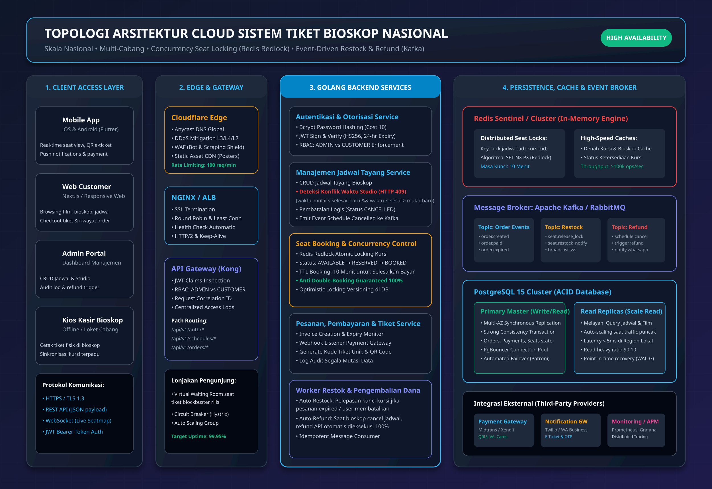
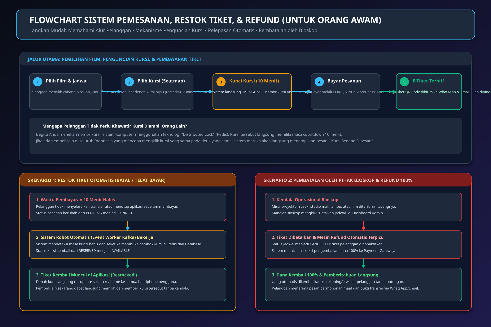
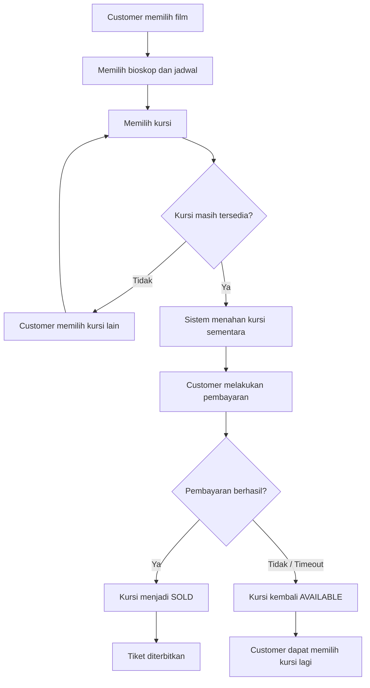
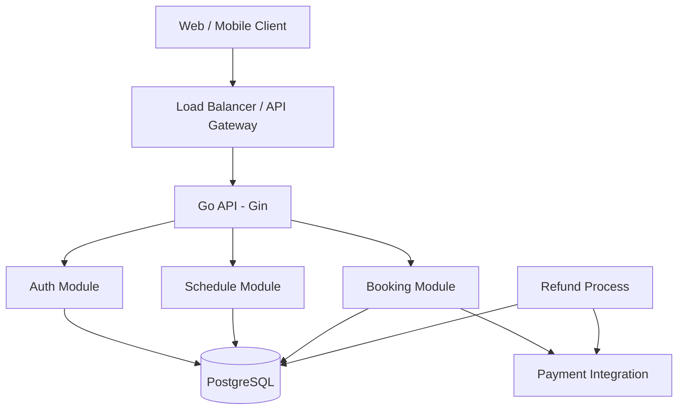
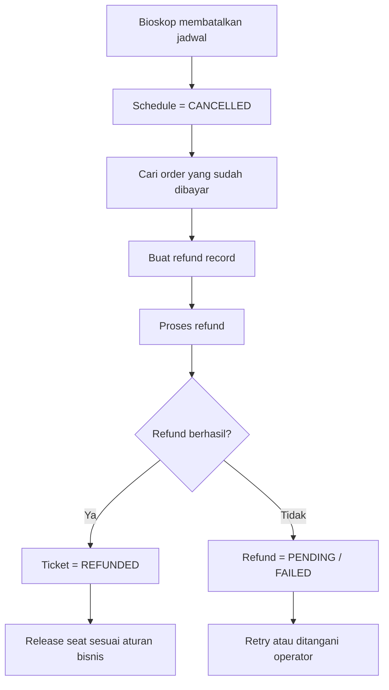

# A. System Design Test

## 📐 Topologi Arsitektur Cloud (JPG Export)


## 🔄 Flowchart Sistem Pemesanan, Restok, & Refund (Untuk Orang Awam)


---

## 1. Tujuan Sistem

Platform ini digunakan untuk pembelian tiket bioskop secara online pada jaringan bioskop berskala nasional dengan banyak cabang dan banyak customer yang dapat melakukan transaksi secara bersamaan.

Tujuan utama sistem:

1. Customer dapat melihat jadwal tayang secara online.
2. Customer dapat memilih kursi.
3. Satu kursi pada satu jadwal tayang tidak dapat dijual kepada dua customer.
4. Sistem tetap dapat melayani banyak request secara bersamaan.
5. Kursi yang sedang dalam proses pembayaran dapat ditahan sementara.
6. Kursi dapat kembali tersedia ketika pembayaran gagal atau hold berakhir.
7. Tiket yang telah terjual tercatat dan dapat ditelusuri.
8. Jika bioskop membatalkan jadwal, customer yang terdampak dapat diproses untuk refund.
9. Riwayat transaksi tetap tersimpan untuk kebutuhan audit dan pelacakan.

---

## 2. Asumsi

Agar desain memiliki batas yang jelas, digunakan beberapa asumsi:

- Satu studio memiliki sejumlah kursi fisik.
- Satu schedule merepresentasikan satu film yang tayang pada satu studio dan waktu tertentu.
- Status kursi bersifat spesifik untuk schedule, bukan global.
- Pembayaran dilakukan melalui payment gateway eksternal.
- Payment gateway dapat mengirim status pembayaran kembali ke backend.
- Hold kursi memiliki waktu kedaluwarsa.
- Pengembalian kursi setelah pembatalan mengikuti aturan bisnis bioskop.
- Sistem menggunakan PostgreSQL sebagai sumber data transaksional.

---

## 3. Konsep Dasar Seat Inventory

Kesalahan desain yang umum adalah menyimpan:

```text
Seat A10 = SOLD
```

Padahal satu kursi fisik dapat digunakan untuk jadwal yang berbeda.

Contoh:

```text
Schedule 1001 + Seat A10 = SOLD
Schedule 1002 + Seat A10 = AVAILABLE
```

Karena itu status kursi harus disimpan pada level **schedule/show**.

Digunakan tabel:

```text
show_seats
----------
id
schedule_id
seat_id
status
held_by
held_until
sold_at
updated_at
```

Dengan constraint:

```text
UNIQUE(schedule_id, seat_id)
```

Dengan desain ini, satu kursi hanya dapat mempunyai satu status untuk satu schedule.

---

## 4. Flowchart Utama untuk Orang Awam

Flow sederhana:



Inti proses:

```text
Pilih kursi
    ↓
Cek availability
    ↓
Hold sementara
    ↓
Bayar
    ↓
Berhasil → SOLD → Tiket diterbitkan
Gagal    → AVAILABLE
```

---

## 5. High-Level Architecture



Untuk implementasi skill test, aplikasi tetap dibuat sebagai satu **modular monolith**.

Modul booking/payment/refund dijelaskan sebagai bagian dari desain A tetapi tidak diwajibkan untuk diimplementasikan pada bagian C.

---

## 6. Alur Pemilihan Kursi

Alur teknis:

```text
Customer memilih kursi A10
        ↓
Backend menerima request
        ↓
Start database transaction
        ↓
Lock row show_seats A10
        ↓
Periksa status
        ↓
AVAILABLE?
    ┌───┴────┐
   Ya       Tidak
    |          |
    v          v
Set HELD     Reject
    |
Set held_until
    |
Commit
```

Setelah kursi berhasil di-hold:

```text
HELD
 |
 +--> Payment success
 |       |
 |       v
 |      SOLD
 |
 +--> Payment failed
 |
 +--> Hold expired
         |
         v
      AVAILABLE
```

---

## 7. Penanganan Concurrency

### Masalah

Misalnya dua customer memilih A10 hampir bersamaan:

```text
Customer A → A10
Customer B → A10
```

Jika aplikasi hanya melakukan:

```text
if status == AVAILABLE
    set status = HELD
```

kedua request dapat sama-sama membaca:

```text
A10 = AVAILABLE
```

sebelum salah satunya menyimpan perubahan.

Akibatnya, dua customer berpotensi mendapatkan kursi yang sama.

### Solusi

Gunakan:

```text
Database Transaction
+
Row-Level Lock
```

Konsep:

```sql
BEGIN;

SELECT id, status
FROM show_seats
WHERE schedule_id = $1
  AND seat_id = $2
FOR UPDATE;

-- check status

UPDATE show_seats
SET status = 'HELD',
    held_by = $3,
    held_until = $4
WHERE id = $5;

COMMIT;
```

`FOR UPDATE` membuat transaksi lain yang ingin mengubah row yang sama harus menunggu.

Hasil:

```text
Request A
    ↓
Lock A10
    ↓
AVAILABLE
    ↓
HELD
    ↓
Commit

Request B
    ↓
Menunggu lock
    ↓
Membaca status baru
    ↓
HELD
    ↓
Reject
```

Dengan demikian, hanya satu customer yang dapat berhasil melakukan hold terhadap A10 pada schedule tersebut.

---

## 8. Mengapa Seat Locking Tidak Hanya Menggunakan Cache

Cache dapat membantu performa pembacaan, tetapi seat state merupakan data transaksional yang sangat sensitif terhadap race condition.

Jika cache berisi:

```text
A10 = AVAILABLE
```

padahal database sebenarnya sudah:

```text
A10 = HELD
```

maka aplikasi dapat memberikan informasi yang salah.

Karena itu:

- PostgreSQL menjadi source of truth.
- Cache, jika suatu saat digunakan, hanya menjadi optimasi.
- Keputusan akhir untuk perubahan seat state dilakukan pada database transaction.

---

## 9. Temporary Seat Hold

Customer membutuhkan waktu untuk menyelesaikan pembayaran.

Contoh:

```text
19:00:00 → A10 HELD
19:05:00 → hold expired
```

Jika pembayaran belum berhasil sampai `held_until`, sistem mengembalikan kursi menjadi:

```text
AVAILABLE
```

Alur:

```text
AVAILABLE
    ↓
HELD
    ↓
┌───────────────────────┐
│ Payment success?      │
└───────────────────────┘
       /       \
     Yes       No / Timeout
      |             |
      v             v
    SOLD        AVAILABLE
```

---

## 10. Transaction dan Data Consistency

Perubahan yang saling bergantung sebaiknya dilakukan dalam database transaction.

Contoh pembelian:

```text
BEGIN
   |
Create order
   |
Lock show seat
   |
Update seat
   |
Create order item
   |
Create payment record
   |
COMMIT
```

Jika salah satu langkah gagal:

```text
ROLLBACK
```

Tujuannya mencegah kondisi tidak konsisten seperti:

```text
Seat = SOLD
Order = tidak ada
Ticket = tidak ada
```

---

## 11. Idempotency

Idempotency digunakan untuk menghindari pemrosesan request yang sama lebih dari satu kali ketika client melakukan retry.

Contoh:

```http
POST /api/v1/orders/123/pay
Idempotency-Key: 550e8400-e29b-41d4-a716-446655440000
```

Request pertama:

```text
Payment diproses
Result disimpan
```

Jika request yang sama dikirim lagi:

```text
Idempotency-Key sudah pernah diproses
        ↓
Kembalikan hasil sebelumnya
```

Idempotency berbeda dengan seat locking:

```text
Row-level locking
→ mencegah konflik concurrent update

Idempotency
→ mencegah duplicate processing dari request yang sama
```

---

## 12. Ticket Recording dan "Restock"

Tiket bioskop sebaiknya tidak diperlakukan seperti barang fisik yang cukup ditambah atau dikurangi jumlahnya.

Yang dikelola adalah inventory kursi untuk suatu schedule.

Contoh:

```text
Schedule 1001

A1  SOLD
A2  SOLD
A3  AVAILABLE
A4  HELD
```

Ketika A4 timeout:

```text
A4  HELD → AVAILABLE
```

Ketika pembayaran A3 berhasil:

```text
A3  AVAILABLE → SOLD
```

Ketika transaksi dibatalkan dan aturan bisnis mengizinkan seat release:

```text
A3  SOLD → AVAILABLE
```

Namun data ticket/order/payment/refund tetap dipertahankan.

Jadi:

```text
Seat state
    → dapat berubah

Transaction history
    → tidak dihapus
```

---

## 13. Ticket Issuance

Setelah pembayaran terverifikasi berhasil:

```text
Payment = PAID
        ↓
Order = PAID
        ↓
Seat = SOLD
        ↓
Generate ticket
        ↓
Ticket = ISSUED
```

Ticket memiliki identitas unik seperti:

```text
ticket_code
```

Kode tersebut dapat digunakan untuk validasi tiket ketika customer datang ke bioskop.

---

## 14. Pembatalan dari Pihak Bioskop

Ketika bioskop membatalkan schedule:

```text
Schedule
SCHEDULED → CANCELLED
```

Kemudian sistem mencari order yang sudah dibayar pada schedule tersebut.

Flow:



---

## 15. Refund

Refund memiliki record terpisah agar prosesnya dapat dilacak.

Contoh status:

```text
PENDING
PROCESSING
COMPLETED
FAILED
```

Data penting:

```text
order_id
payment_id
amount
reason
status
refund_reference
requested_at
completed_at
```

Jika refund gagal, order dan pembayaran tetap mempunyai histori.

Contoh:

```text
Payment = PAID
Refund  = FAILED
Ticket  = REFUND_PENDING
```

Kemudian proses refund dapat dicoba kembali.

---

## 16. Performance dan High Concurrency

Sistem berskala nasional harus dapat melayani banyak request secara bersamaan.

### Stateless API

Go API dibuat stateless sehingga beberapa instance dapat berjalan di belakang load balancer:

```text
               Load Balancer
              /      |      \
             /       |       \
         API-1     API-2     API-3
             \       |       /
              \      |      /
               PostgreSQL
```

Session user tidak disimpan di memory instance karena authentication menggunakan JWT.

### Database indexing

Index yang relevan:

```text
schedules(movie_id, start_time)
schedules(studio_id, start_time)
show_seats(schedule_id, status)
orders(user_id)
orders(status)
tickets(ticket_code)
refunds(status)
```

### Connection pooling

Go database connection pool digunakan agar setiap request tidak membuat koneksi database baru.

### Cache

Data yang tidak terlalu sering berubah seperti metadata film, bioskop, dan schedule dapat di-cache pada skala besar.

Namun seat availability tidak boleh bergantung sepenuhnya pada cache karena database tetap menjadi source of truth.

### Scaling bertahap

Jika traffic meningkat, komponen seperti Redis dan message broker dapat ditambahkan sebagai optimasi atau asynchronous processing.

Namun untuk desain awal dan skill test:

```text
Go API
+
PostgreSQL
```

sudah cukup untuk menunjukkan pendekatan yang benar.

---

## 17. Security

Minimal security controls:

- Password disimpan menggunakan bcrypt.
- Login menghasilkan JWT.
- Endpoint yang membutuhkan authentication memeriksa `Authorization: Bearer <token>`.
- Role digunakan untuk membatasi operasi admin.
- Input divalidasi.
- Query database menggunakan parameterized query/GORM.
- JWT memiliki expiry.
- Secret disimpan dalam environment variable.
- Password, JWT, dan credential tidak ditulis ke log.
- HTTPS digunakan pada deployment production.

Role sederhana:

```text
CUSTOMER
ADMIN
```

Authorization:

```text
CUSTOMER
    → dapat membaca schedule

ADMIN
    → dapat membuat, mengubah, dan membatalkan schedule
```

---

## 18. Logging dan Audit

Untuk operasi penting, sistem dapat menyimpan audit trail.

Contoh:

```text
ADMIN
Action: CANCEL_SCHEDULE
Entity: Schedule
Entity ID: 1001
Time: 2026-10-01 12:00
```

Audit membantu ketika terjadi dispute atau diperlukan penelusuran transaksi.

Audit tidak harus menjadi endpoint pada bagian C.

---

## 19. Failure Scenarios

### Skenario 1: Dua customer memilih kursi yang sama

```text
Problem:
dua request mengakses A10 bersamaan

Solution:
database transaction + FOR UPDATE
```

### Skenario 2: Customer meninggalkan halaman pembayaran

```text
Problem:
seat terlalu lama dalam status HELD

Solution:
hold expiration
```

### Skenario 3: Pembayaran berhasil tetapi response API timeout

```text
Problem:
payment kemungkinan sudah berhasil tetapi client tidak menerima response

Solution:
payment verification + idempotency
```

### Skenario 4: Payment webhook dikirim dua kali

```text
Problem:
payment event duplicate

Solution:
idempotent processing berdasarkan payment reference / event ID
```

### Skenario 5: Bioskop membatalkan schedule

```text
Problem:
customer sudah membayar

Solution:
schedule = CANCELLED
+
refund workflow
+
ticket = REFUNDED setelah refund berhasil
```

---

## 20. Ringkasan Solusi

| Masalah | Solusi |
|---|---|
| Seat dipakai dua user | Transaction + row-level lock |
| Seat terbengkalai saat pembayaran | Temporary hold + expiration |
| Seat kembali tersedia | `HELD → AVAILABLE` |
| Tiket berhasil dibeli | `HELD → SOLD` + ticket record |
| Duplicate payment request | Idempotency key |
| Pembatalan bioskop | Schedule `CANCELLED` |
| Refund | Refund transaction terpisah |
| Riwayat transaksi | Tidak menghapus order/payment/ticket |
| Banyak user | Stateless Go API + horizontal scaling |
| Database performance | Index + connection pooling |
| Data seat stale | PostgreSQL sebagai source of truth |
