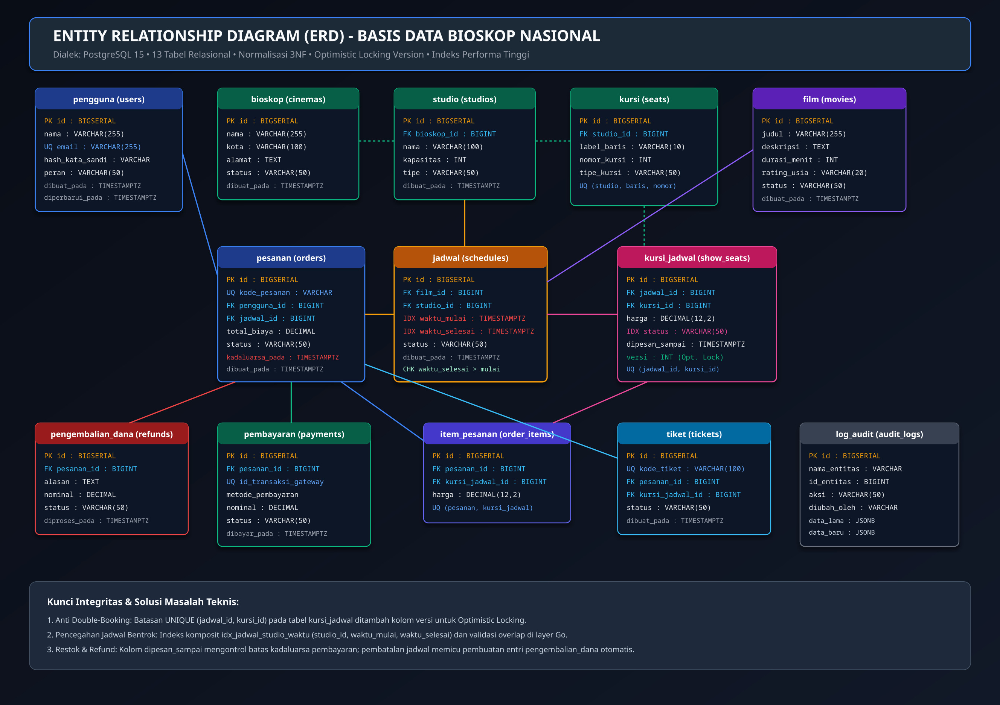
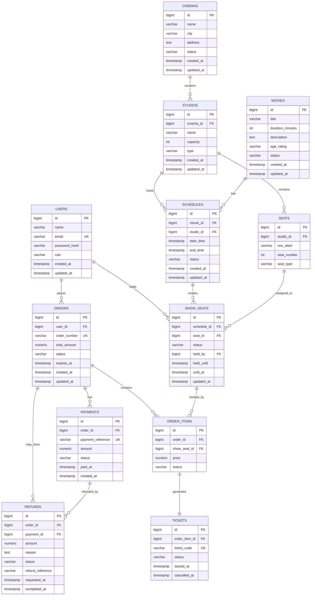

# B. Database Design Test

## 🗄️ Diagram Entity Relationship (ERD JPG Export)


> 💡 **Skrip SQL Siap Impor untuk Tim MKP**:  
> Seluruh skema DDL (13 tabel relasional) dan data awal (seeder) telah dikompilasi menjadi satu berkas mandiri: [**`docs/skema_dan_data_awal_bioskop.sql`**](skema_dan_data_awal_bioskop.sql).  
> Dapat langsung diimpor menggunakan perintah: `psql -U bioskop -d bioskop -f docs/skema_dan_data_awal_bioskop.sql`

---

## 1. Tujuan

Database harus mendukung:

- User authentication.
- Data bioskop dan cabang.
- Studio.
- Seat/kursi.
- Film.
- Jadwal tayang.
- Inventory kursi per jadwal.
- Order.
- Pembayaran.
- Ticket.
- Refund.
- Audit trail.

Desain dibuat lebih detail daripada kebutuhan API agar konsisten dengan System Design pada bagian A.

---

# 2. Entity Relationship



---

# 3. Table: users

Digunakan untuk authentication dan authorization.

```text
users
-----
id
name
email
password_hash
role
created_at
updated_at
```

### Constraints

```text
PRIMARY KEY (id)
UNIQUE (email)
```

### Role

```text
CUSTOMER
ADMIN
```

Password tidak disimpan dalam plaintext.

---

# 4. Table: cinemas

Menyimpan cabang bioskop.

```text
cinemas
-------
id
name
city
address
status
created_at
updated_at
```

Satu cinema memiliki banyak studio.

```text
cinema 1 ---- N studios
```

---

# 5. Table: studios

Menyimpan studio/ruangan pada satu cabang.

```text
studios
-------
id
cinema_id
name
capacity
type
created_at
updated_at
```

Foreign key:

```text
cinema_id → cinemas.id
```

Contoh:

```text
Cinema Semarang
    ├── Studio 1
    ├── Studio 2
    └── Studio 3
```

---

# 6. Table: seats

Menyimpan kursi fisik pada studio.

```text
seats
-----
id
studio_id
row_label
seat_number
seat_type
```

Contoh:

```text
A1
A2
A3
B1
B2
B3
```

Satu studio memiliki banyak seat.

```text
studio 1 ---- N seats
```

---

# 7. Table: movies

Menyimpan informasi film.

```text
movies
------
id
title
duration_minutes
description
age_rating
status
created_at
updated_at
```

Contoh status:

```text
ACTIVE
INACTIVE
```

---

# 8. Table: schedules

Schedule adalah satu jadwal penayangan film pada satu studio.

```text
schedules
---------
id
movie_id
studio_id
start_time
end_time
status
created_at
updated_at
```

Foreign key:

```text
movie_id  → movies.id
studio_id → studios.id
```

Status:

```text
SCHEDULED
CANCELLED
COMPLETED
```

---

# 9. Table: show_seats

Ini adalah tabel penting untuk pengelolaan availability kursi.

```text
show_seats
----------
id
schedule_id
seat_id
status
held_by
held_until
sold_at
updated_at
```

### Status

```text
AVAILABLE
HELD
SOLD
```

### Constraint

```text
UNIQUE(schedule_id, seat_id)
```

Constraint ini memastikan satu seat tidak mempunyai dua record untuk schedule yang sama.

Contoh:

```text
schedule_id | seat_id | status
------------|---------|---------
1001        | A10     | SOLD
1002        | A10     | AVAILABLE
```

Kursi A10 yang sama tetap dapat digunakan pada schedule lain.

### Hold

Saat customer memilih seat:

```text
status = HELD
held_by = user_id
held_until = timestamp
```

Jika pembayaran berhasil:

```text
status = SOLD
sold_at = timestamp
```

Jika hold expired:

```text
status = AVAILABLE
held_by = NULL
held_until = NULL
```

---

# 10. Table: orders

Satu order mewakili transaksi customer.

```text
orders
------
id
user_id
order_number
total_amount
status
expires_at
created_at
updated_at
```

Contoh status:

```text
PENDING
PAID
CANCELLED
EXPIRED
REFUNDED
```

`order_number` harus unique.

---

# 11. Table: order_items

Satu order dapat mempunyai lebih dari satu tiket.

```text
order_items
-----------
id
order_id
show_seat_id
price
status
```

Relationship:

```text
order 1 ---- N order_items
```

Setiap item mengacu pada seat tertentu pada show tertentu.

---

# 12. Table: payments

Menyimpan informasi pembayaran.

```text
payments
--------
id
order_id
payment_reference
amount
status
paid_at
created_at
```

Status contoh:

```text
PENDING
PAID
FAILED
EXPIRED
```

`payment_reference` sebaiknya unique untuk mencegah duplicate payment record.

---

# 13. Table: tickets

Ticket dibuat setelah transaksi berhasil.

```text
tickets
-------
id
order_item_id
ticket_code
status
issued_at
cancelled_at
```

Status contoh:

```text
ISSUED
USED
CANCELLED
REFUNDED
```

`ticket_code` unique.

Ticket tidak dihapus ketika refund.

Statusnya berubah.

---

# 14. Table: refunds

Mencatat proses pengembalian uang.

```text
refunds
-------
id
order_id
payment_id
amount
reason
status
refund_reference
requested_at
completed_at
```

Status:

```text
PENDING
PROCESSING
COMPLETED
FAILED
```

Contoh reason:

```text
CINEMA_CANCELLED
CUSTOMER_CANCELLED
SYSTEM_ERROR
```

---

# 15. Table: audit_logs

Opsional tetapi berguna untuk operasi penting.

```text
audit_logs
----------
id
user_id
entity_type
entity_id
action
old_value
new_value
created_at
```

Contoh:

```text
entity_type = SCHEDULE
entity_id   = 1001
action      = CANCEL
```

Audit trail menjaga histori perubahan penting tanpa menghapus data lama.

---

# 16. Relationships

## User

```text
users 1 ---- N orders
users 1 ---- N show_seats (held_by)
```

## Cinema

```text
cinemas 1 ---- N studios
```

## Studio

```text
studios 1 ---- N seats
studios 1 ---- N schedules
```

## Movie

```text
movies 1 ---- N schedules
```

## Schedule

```text
schedules 1 ---- N show_seats
```

## Order

```text
orders 1 ---- N order_items
orders 1 ---- N payments
orders 1 ---- N refunds
```

## Ticket

```text
order_items 1 ---- 1 tickets
```

---

# 17. Important Constraints

### User email

```sql
UNIQUE(email)
```

Mencegah dua account mempunyai email yang sama.

### Schedule seat

```sql
UNIQUE(schedule_id, seat_id)
```

Ini penting untuk menjaga satu seat hanya muncul sekali pada satu schedule.

### Order number

```sql
UNIQUE(order_number)
```

### Payment reference

```sql
UNIQUE(payment_reference)
```

### Ticket code

```sql
UNIQUE(ticket_code)
```

---

# 18. Important Indexes

Recommended indexes:

```text
idx_schedules_movie_start
    (movie_id, start_time)

idx_schedules_studio_start
    (studio_id, start_time)

idx_show_seats_schedule_status
    (schedule_id, status)

idx_orders_user
    (user_id)

idx_orders_status
    (status)

idx_tickets_code
    (ticket_code)

idx_refunds_status
    (status)
```

Index `show_seats(schedule_id, status)` membantu query seperti:

```text
Ambil semua seat AVAILABLE untuk satu schedule
```

---

# 19. Data Integrity

Database harus menjaga referential integrity dengan foreign key.

Contoh:

```text
schedule.movie_id
    → movies.id

schedule.studio_id
    → studios.id

studio.cinema_id
    → cinemas.id

seat.studio_id
    → studios.id

show_seat.schedule_id
    → schedules.id

show_seat.seat_id
    → seats.id
```

Foreign key mencegah orphan record.

---

# 20. Cancellation Strategy

Untuk schedule, lebih aman menggunakan logical cancellation daripada menghapus histori.

Contoh:

```text
SCHEDULED
    ↓
CANCELLED
```

Daripada:

```sql
DELETE FROM schedules;
```

Hal ini memungkinkan order, ticket, dan refund tetap mengacu pada schedule yang pernah ada.

---

# 21. Database untuk API Skill Test

Bagian C hanya membutuhkan operasi:

```text
Login
Schedule CRUD
```

Karena itu komponen database yang paling langsung digunakan oleh API adalah:

```text
users
cinemas
studios
movies
schedules
```

Tabel berikut tetap menjadi bagian desain full system:

```text
show_seats
orders
order_items
payments
tickets
refunds
audit_logs
```

Tidak semua tabel tersebut membutuhkan endpoint pada skill test C.

---

# 22. Migration Order

Urutan migration:

```text
000001 users
        ↓
000002 cinemas
        ↓
000003 studios
        ↓
000004 seats
        ↓
000005 movies
        ↓
000006 schedules
        ↓
000007 show_seats
        ↓
000008 orders
        ↓
000009 order_items
        ↓
000010 payments
        ↓
000011 tickets
        ↓
000012 refunds
        ↓
000013 audit_logs
```

Untuk implementasi minimum, migration dapat dibuat hanya sampai `schedules` terlebih dahulu dan sisanya ditambahkan sesuai kebutuhan pengembangan sistem.

---

# 23. Ringkasan

Database menggunakan relational model:

```text
Cinema
  ↓
Studio
  ↓
Seat

Movie
  ↓
Schedule
  ↓
Show Seat

User
  ↓
Order
  ├── Order Item
  │      ↓
  │    Ticket
  ├── Payment
  └── Refund
```

Kunci desain seat:

```text
show_seats(schedule_id, seat_id)
```

dengan:

```text
UNIQUE(schedule_id, seat_id)
```

dan state:

```text
AVAILABLE
HELD
SOLD
```

Desain tersebut mendukung concurrency, ticket inventory, cancellation, dan refund yang dijelaskan pada A.
