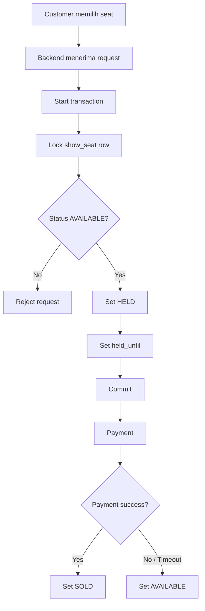
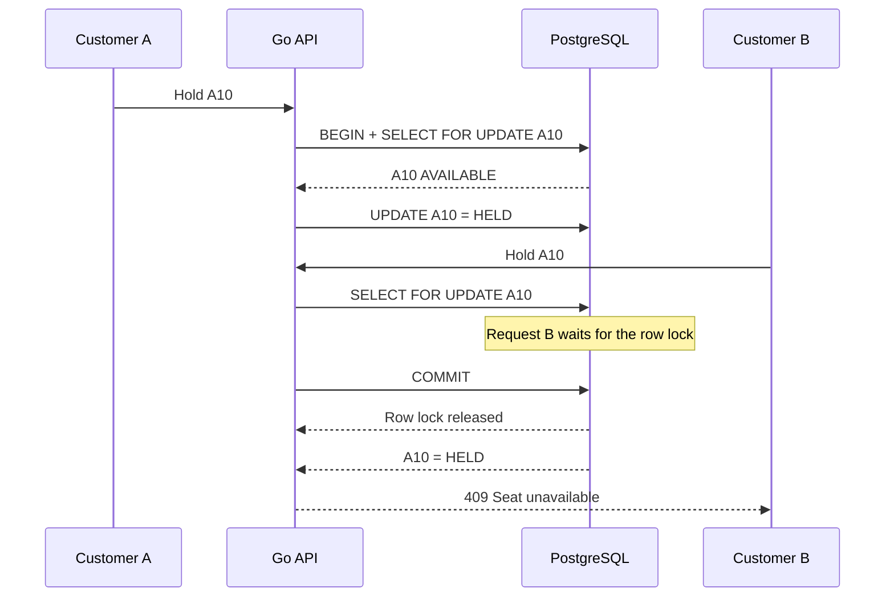

# Booking Flow and Concurrency

## Normal booking

## Concurrent requests

## Important rule

`FOR UPDATE` protects the critical section.

Idempotency is a separate mechanism for duplicate requests.
