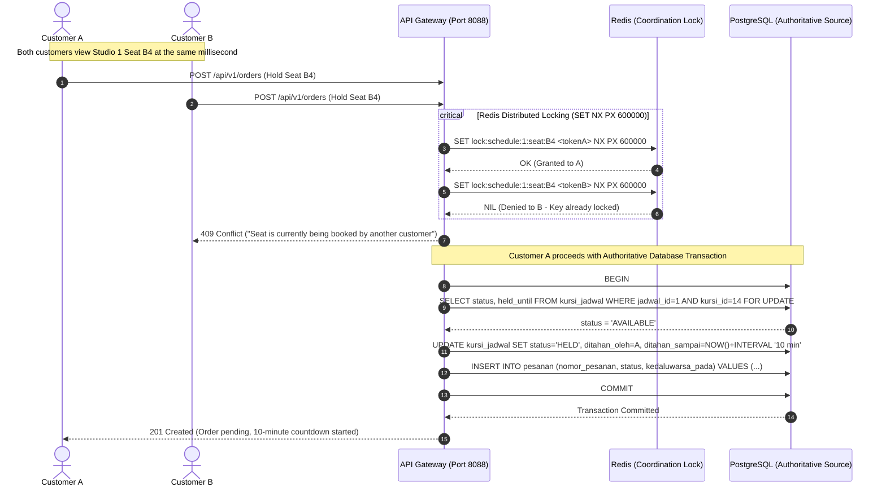

# Booking Flow and Concurrency Control

This document visualizes the multi-user concurrent seat reservation lifecycle, distributed coordination layer, and PostgreSQL transactional guarantees.

---

## 1. Standard Booking & Payment Flow

```mermaid
flowchart TD
    A[Customer selects seats] --> B[Backend receives hold request]
    B --> C[Acquire Redis Distributed Lock<br>Key: lock:schedule:id:seat:id]
    C --> D{Redis Lock Acquired?}

    D -->|No| E[Reject immediately - 409 Conflict<br>Seat currently selected by another user]
    D -->|Yes| F[Start PostgreSQL Transaction]

    F --> G[SELECT * FROM kursi_jadwal FOR UPDATE]
    G --> H{State == AVAILABLE or expired HELD?}

    H -->|No| I[Rollback & Release Redis Lock<br>Reject - 409 Conflict]
    H -->|Yes| J[UPDATE kursi_jadwal<br>SET status = 'HELD', held_by = user_id,<br>held_until = NOW() + INTERVAL '10 minutes']

    J --> K[Insert pesanan in PENDING status<br>with expires_at = held_until]
    K --> L[COMMIT PostgreSQL Transaction]
    L --> M[Customer proceeds to Checkout<br>Simulate Successful Payment]

    M --> N{Payment Success before 10m TTL?}

    N -->|Yes| O[BEGIN Transaction<br>UPDATE kursi_jadwal SET status = 'SOLD', sold_at = NOW()<br>UPDATE pesanan SET status = 'PAID'<br>INSERT tiket & event_pembayaran<br>COMMIT]
    O --> P[🎟️ Tickets Issued with QR Code]

    N -->|No / Expired| Q[Automated Worker or Next Transaction:<br>UPDATE kursi_jadwal SET status = 'AVAILABLE', held_by = NULL<br>UPDATE pesanan SET status = 'EXPIRED'<br>Release Redis Lock Key]
    Q --> R[🔓 Seats Restocked for Other Customers]
```

---

## 2. Concurrent Seat Selection Sequence (Customer A vs Customer B)



---

## 3. Concurrency and Idempotency Rules

1. **Redis Redlock vs PostgreSQL Source of Truth**:
   - **Redis** is used as an ultra-fast **coordination layer** to deflect millions of concurrent duplicate requests at the network edge within sub-milliseconds.
   - **PostgreSQL** is the **immutable authoritative source of truth**. Every hold, purchase, ticket issuance, and refund is committed within an ACID database transaction using row-level locking (`SELECT ... FOR UPDATE`).
2. **Idempotency Protection**:
   - Webhook retries from payment gateways are filtered against `event_pembayaran.id_event_provider UNIQUE`.
   - Client payment submissions enforce unique order numbers (`pesanan.nomor_pesanan UNIQUE`) and idempotent payment references (`pembayaran.referensi_pembayaran UNIQUE`).
3. **Seat State Invariant**:
   - Only three mutually exclusive operational states exist for a seat within a schedule:
     ```text
     AVAILABLE ⇄ HELD → SOLD
     ```
   - If payment fails or the 10-minute hold window expires (`held_until < NOW()`), the seat automatically transitions back to `AVAILABLE`.
