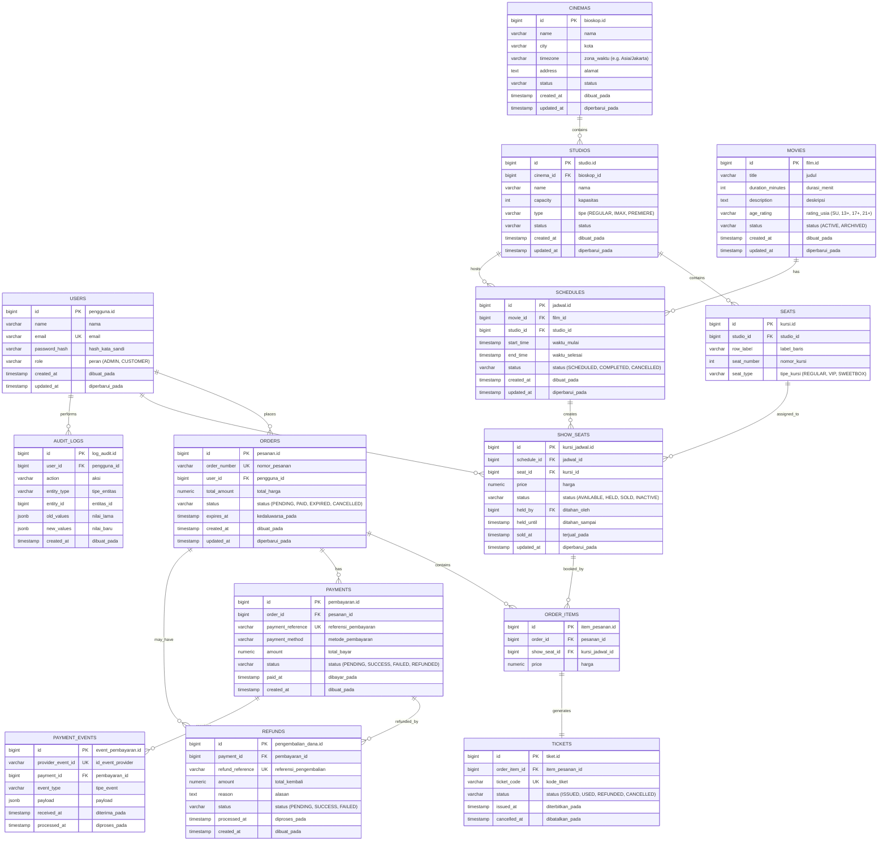

# Entity Relationship Diagram (ERD)

Relational model schema representing the full cinema ticketing domain across **14 relational tables** in PostgreSQL (Third Normal Form / 3NF), synchronized with [`database.sql`](../database.sql):



---

## Key Constraints & Guarantees

1. **Anti Double-Booking**:
   - Unique constraint `uq_jadwal_kursi UNIQUE (jadwal_id, kursi_id)` on `kursi_jadwal`.
   - Seat lifecycle state machine: `AVAILABLE` → `HELD` (10-minute hold window) → `SOLD`.
2. **Dual-Layer Overlap Prevention**:
   - Application layer: Interval intersection validation returning HTTP 409 Conflict.
   - Database engine level: PostgreSQL `btree_gist` exclusion constraint:
     ```sql
     CONSTRAINT no_overlapping_schedule EXCLUDE USING gist (
         studio_id WITH =,
         tstzrange(waktu_mulai, waktu_selesai, '[)') WITH &&
     ) WHERE (status = 'SCHEDULED')
     ```
3. **Webhook Idempotency Protection**:
   - `event_pembayaran` with `id_event_provider VARCHAR(100) NOT NULL UNIQUE` prevents duplicate webhook processing from external payment gateways.
4. **National Multi-City Support**:
   - `bioskop.zona_waktu` (`Asia/Jakarta`, `Asia/Makassar`, `Asia/Jayapura`) combined with PostgreSQL `TIMESTAMPTZ` ensures unambiguous screening timestamps across Indonesian time zones.
5. **Full Financial Auditability**:
   - Physical records in `pesanan`, `pembayaran`, `tiket`, `pengembalian_dana`, and `log_audit` are never hard-deleted.
