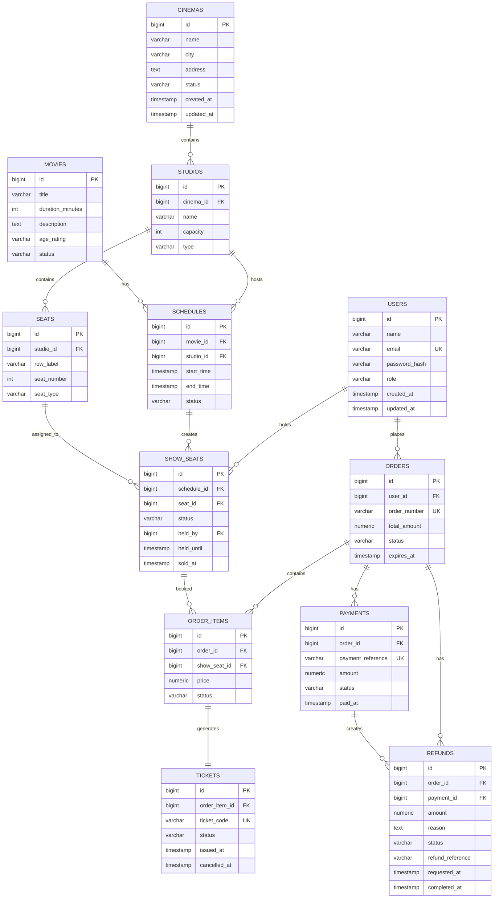

# ERD

```mermaid
erDiagram
    USERS ||--o{ ORDERS : places
    USERS ||--o{ SHOW_SEATS : holds
    CINEMAS ||--o{ STUDIOS : contains
    STUDIOS ||--o{ SEATS : contains
    STUDIOS ||--o{ SCHEDULES : hosts
    MOVIES ||--o{ SCHEDULES : has
    SCHEDULES ||--o{ SHOW_SEATS : creates
    SEATS ||--o{ SHOW_SEATS : assigned_to
    ORDERS ||--o{ ORDER_ITEMS : contains
    SHOW_SEATS ||--o{ ORDER_ITEMS : booked
    ORDER_ITEMS ||--|| TICKETS : generates
    ORDERS ||--o{ PAYMENTS : has
    ORDERS ||--o{ REFUNDS : has
    PAYMENTS ||--o{ REFUNDS : creates

    USERS {
        bigint id PK
        varchar name
        varchar email UK
        varchar password_hash
        varchar role
        timestamp created_at
        timestamp updated_at
    }

    CINEMAS {
        bigint id PK
        varchar name
        varchar city
        text address
        varchar status
        timestamp created_at
        timestamp updated_at
    }

    STUDIOS {
        bigint id PK
        bigint cinema_id FK
        varchar name
        int capacity
        varchar type
    }

    SEATS {
        bigint id PK
        bigint studio_id FK
        varchar row_label
        int seat_number
        varchar seat_type
    }

    MOVIES {
        bigint id PK
        varchar title
        int duration_minutes
        text description
        varchar age_rating
        varchar status
    }

    SCHEDULES {
        bigint id PK
        bigint movie_id FK
        bigint studio_id FK
        timestamp start_time
        timestamp end_time
        varchar status
    }

    SHOW_SEATS {
        bigint id PK
        bigint schedule_id FK
        bigint seat_id FK
        varchar status
        bigint held_by FK
        timestamp held_until
        timestamp sold_at
    }

    ORDERS {
        bigint id PK
        bigint user_id FK
        varchar order_number UK
        numeric total_amount
        varchar status
        timestamp expires_at
    }

    ORDER_ITEMS {
        bigint id PK
        bigint order_id FK
        bigint show_seat_id FK
        numeric price
        varchar status
    }

    PAYMENTS {
        bigint id PK
        bigint order_id FK
        varchar payment_reference UK
        numeric amount
        varchar status
        timestamp paid_at
    }

    TICKETS {
        bigint id PK
        bigint order_item_id FK
        varchar ticket_code UK
        varchar status
        timestamp issued_at
        timestamp cancelled_at
    }

    REFUNDS {
        bigint id PK
        bigint order_id FK
        bigint payment_id FK
        numeric amount
        text reason
        varchar status
        varchar refund_reference
        timestamp requested_at
        timestamp completed_at
    }
```
