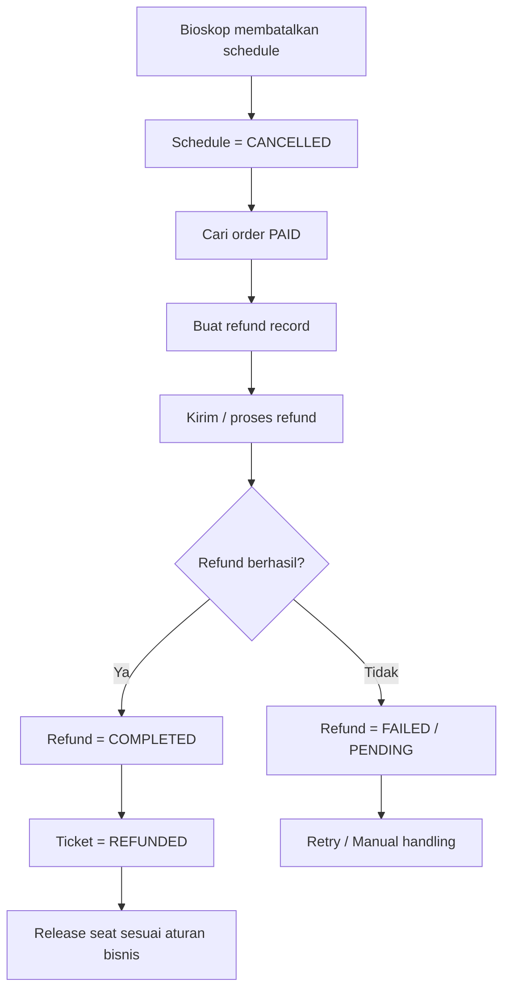

# Cinema Cancellation and Refund Flow



## Data preservation

Pembatalan tidak menghapus:

```text
order
payment
ticket
```

Sebaliknya:

```text
schedule → CANCELLED
refund   → created
ticket   → REFUNDED
```

Dengan demikian histori transaksi tetap tersedia.
