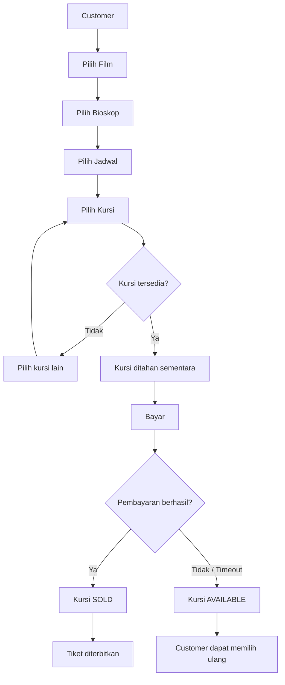

# System Flow

```mermaid
flowchart TD
    A[Customer] --> B[Pilih Film]
    B --> C[Pilih Bioskop]
    C --> D[Pilih Jadwal]
    D --> E[Pilih Kursi]

    E --> F{Kursi tersedia?}

    F -->|Tidak| G[Pilih kursi lain]
    G --> E

    F -->|Ya| H[Kursi ditahan sementara]
    H --> I[Bayar]

    I --> J{Pembayaran berhasil?}

    J -->|Ya| K[Kursi SOLD]
    K --> L[Tiket diterbitkan]

    J -->|Tidak / Timeout| M[Kursi AVAILABLE]
    M --> N[Customer dapat memilih ulang]
```
