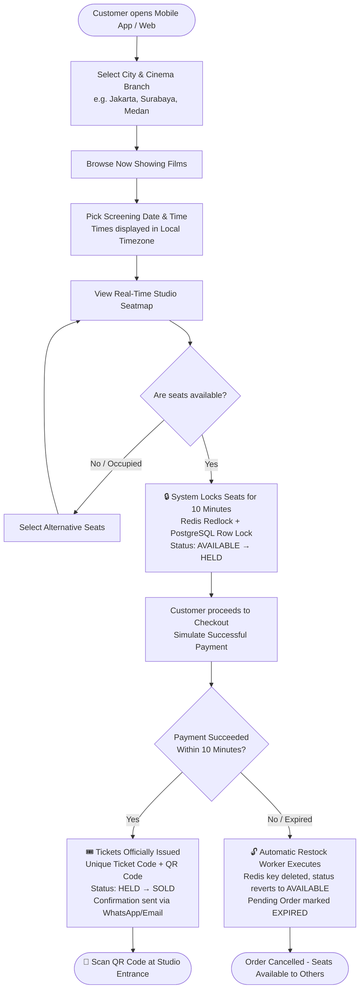

# End-to-End System Flow

This flowchart illustrates the comprehensive customer journey across movie discovery, multi-city branch selection, real-time seat reservation, distributed locking, simulated payment, ticket issuance, and auto-restock mechanisms.

---

## Key Operational Stages

1. **Discovery & Timezone Adaptation**: Customers browse cinema branches nationwide. Timestamps are stored in PostgreSQL as `TIMESTAMPTZ` and rendered dynamically in the cinema branch's local timezone (`bioskop.zona_waktu`).
2. **Instant Hold (Zero Double-Booking)**: Clicking a seat triggers an atomic 10-minute hold (`HELD`) enforced by Redis distributed lock and PostgreSQL row-level locks.
3. **Simulated Payment Gateway**: Integration with payment gateways (Midtrans / Xendit). Successful payment transitions seats to `SOLD`.
4. **Automated Inventory Restocking**: If payment is not finalized before the 10-minute countdown expires, an automated consumer releases the seat lock, instantly returning the seat to `AVAILABLE` without human intervention.
