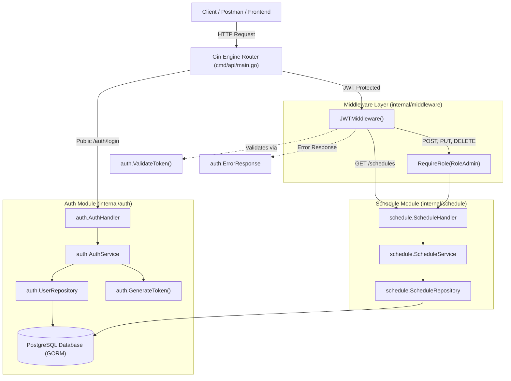

# Internal Modules Architecture & Relationships

This document details the architectural structure, responsibilities, and cross-module interactions within the `internal/` directory of the **Cinema Ticket System**, specifically:
1. [`internal/auth`](auth.md)
2. [`internal/middleware`](middleware.md)
3. [`internal/schedule`](schedule.md)

---

## 1. High-Level Architecture Map

The project adopts a **Clean / Layered Architecture** pattern structured as a modular monolith:



---

## 2. Summary of Documented Modules

| Module | Directory Location | Primary Responsibility | Key Interactions |
|---|---|---|---|
| **Auth** | [`internal/auth`](auth.md) | Manages user credentials, bcrypt password verification, JWT generation & validation. | Consumed by `cmd/api`, `internal/middleware`, and the `pengguna` database table. |
| **Middleware** | [`internal/middleware`](middleware.md) | Gin HTTP interceptors for Bearer JWT token extraction and role-based access control (RBAC). | Imports `internal/auth`, protects endpoints declared in `internal/schedule`. |
| **Schedule** | [`internal/schedule`](schedule.md) | CRUD management of screening schedules, RFC3339 time window validation, and studio overlap conflict prevention. | Guarded by `internal/middleware`, wired from `cmd/api`, interacts with `jadwal`, `film`, and `studio` tables. |

---

## 3. Cross-File Relationship Matrix

```
[cmd/api/main.go]
   │
   ├─► internal/config/config.go  (Loads JWT secret & server port)
   ├─► internal/database/postgres.go (GORM PostgreSQL database connection)
   │
   ├─► [internal/auth]
   │     ├─ NewRepository()  <-- Receives *gorm.DB
   │     ├─ NewService()     <-- Receives user repo, jwtSecret, expiryHours
   │     └─ NewHandler()     <-- Mounts POST /api/v1/auth/login
   │
   ├─► [internal/middleware]
   │     ├─ JWTMiddleware()  <-- Uses auth.ValidateToken()
   │     └─ RequireRole()    <-- Validates auth.RoleAdmin constant
   │
   └─► [internal/schedule]
         ├─ NewRepository()  <-- Receives *gorm.DB
         ├─ NewService()     <-- Receives schedule repository
         └─ NewHandler()     <-- Mounts GET/POST/PUT/DELETE /api/v1/schedules
```

---

## 4. Documentation Index

For in-depth per-file technical specifications, please consult:
- [`docs/modules/auth.md`](auth.md) — Authentication module, JWT token lifecycle, and credential handling.
- [`docs/modules/middleware.md`](middleware.md) — Gin middleware layer, JWT claim extraction, and RBAC enforcement.
- [`docs/modules/schedule.md`](schedule.md) — Screening schedule service, time window validation, and overlap detection algorithms.
