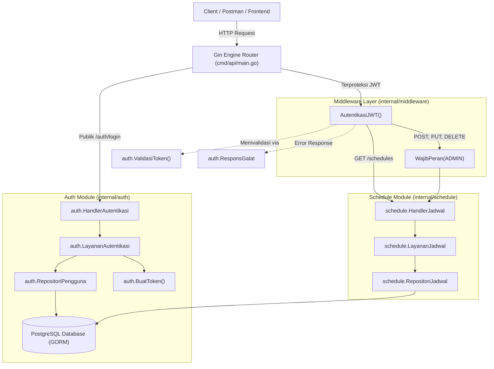

# Arsitektur & Keterkaitan Modul Internal (Internal Modules Architecture)

Dokumen ini menjelaskan struktur, tanggung jawab, dan relasi antarmodul pada direktori `internal/` di proyek **Cinema Ticket System**, khususnya:
1. [`internal/auth`](auth.md)
2. [`internal/middleware`](middleware.md)
3. [`internal/schedule`](schedule.md)

---

## 1. Peta Arsitektur Tingkat Tinggi (High-Level Architecture)

Proyek ini mengadopsi pola **Clean / Layered Architecture** dalam monolit modular (*modular monolith*):



---

## 2. Ringkasan Modul yang Dijelaskan

| Modul | Lokasi Direktori | Fungsi Utama | Keterkaitan Utama |
|---|---|---|---|
| **Auth** | [`internal/auth`](auth.md) | Mengelola data pengguna, verifikasi password bcrypt, pembuatan & validasi JWT. | Digunakan oleh `cmd/api`, `internal/middleware`, dan database `pengguna`. |
| **Middleware** | [`internal/middleware`](middleware.md) | Interseptor HTTP Gin untuk ekstraksi JWT Bearer token dan penegakan otorisasi peran (RBAC). | Mengimpor `internal/auth`, melindungi endpoint pada `internal/schedule`. |
| **Schedule** | [`internal/schedule`](schedule.md) | Manajemen CRUD jadwal tayang bioskop, validasi rentang waktu, dan pencegahan konflik tumpang tindih waktu studio. | Dilindungi oleh `internal/middleware`, diinjeksi dari `cmd/api`, terikat dengan tabel `jadwal`, `film`, dan `studio`. |

---

## 3. Matriks Keterkaitan Antarberkas (Cross-File Relationship Matrix)

```
[cmd/api/main.go]
   │
   ├─► internal/config/config.go  (Memuat secret JWT & port)
   ├─► internal/database/postgres.go (Koneksi database GORM)
   │
   ├─► [internal/auth]
   │     ├─ BaruRepositori()  <-- Menerima *gorm.DB
   │     ├─ BaruLayanan()     <-- Menerima repo, rahasiaJWT, jamKedaluwarsa
   │     └─ BaruHandler()     <-- Menghandle POST /api/v1/auth/login
   │
   ├─► [internal/middleware]
   │     ├─ AutentikasiJWT()  <-- Menggunakan auth.ValidasiToken()
   │     └─ WajibPeran()      <-- Menggunakan konstanta auth.PeranAdmin
   │
   └─► [internal/schedule]
         ├─ BaruRepositori()  <-- Menerima *gorm.DB
         ├─ BaruLayanan()     <-- Menerima repo jadwal
         └─ BaruHandler()     <-- Menghandle GET/POST/PUT/DELETE /api/v1/schedules
```

---

## 4. Indeks Berkas Dokumentasi

Untuk membaca rincian mendalam tiap modul per berkas, silakan buka:
- [`docs/modules/auth.md`](auth.md) — Rincian modul autentikasi dan penanganan JWT.
- [`docs/modules/middleware.md`](middleware.md) — Rincian middleware proteksi JWT dan kontrol hak akses peran (RBAC).
- [`docs/modules/schedule.md`](schedule.md) — Rincian modul manajemen jadwal tayang bioskop dan algoritma deteksi konflik studio.
