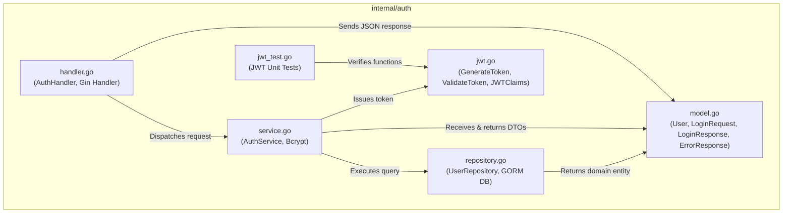

# Authentication Module (`internal/auth`)

The `internal/auth` directory manages the entire user authentication domain, credential storage, cryptographic password verification (bcrypt), and JSON Web Token (JWT) issuance and validation.

---

## 1. File Catalog & Architectural Roles

The module contains 6 core source files:

| File Name | Layer | Primary Responsibility |
|---|---|---|
| [`model.go`](file:///home/vinkanaka/Documents/Github/CinemaSystem/internal/auth/model.go) | **Domain & DTO** | Defines database entity `User`, role constants (`RoleAdmin`, `RoleCustomer`), login request DTO (`LoginRequest`), login response DTO (`LoginResponse`), and standard error contracts (`ErrorResponse`, `ErrorDetail`). |
| [`jwt.go`](file:///home/vinkanaka/Documents/Github/CinemaSystem/internal/auth/jwt.go) | **Security / Utility** | Handles token creation (`GenerateToken`) and verification (`ValidateToken`) using HMAC-SHA256 and custom claim structures (`JWTClaims`). |
| [`repository.go`](file:///home/vinkanaka/Documents/Github/CinemaSystem/internal/auth/repository.go) | **Data Access (Repository)** | Abstracts database queries against the `pengguna` table in PostgreSQL using GORM via the `UserRepository` interface. |
| [`service.go`](file:///home/vinkanaka/Documents/Github/CinemaSystem/internal/auth/service.go) | **Business Logic (Service)** | Implements authentication logic: account lookups by email, bcrypt password hash verification, and JWT generation upon successful credential match. |
| [`handler.go`](file:///home/vinkanaka/Documents/Github/CinemaSystem/internal/auth/handler.go) | **Presentation (Controller/HTTP)** | Binds Gin HTTP requests on `POST /auth/login`, validates JSON payloads, delegates to the service layer, and writes standardized HTTP response codes and JSON bodies according to OpenAPI / Swagger specifications. |
| [`jwt_test.go`](file:///home/vinkanaka/Documents/Github/CinemaSystem/internal/auth/jwt_test.go) | **Unit Test** | Tests token issuance, claim fidelity (Subject and Role), expiration calculation, and signature rejection when validated against an invalid secret. |

---

## 2. Technical Details per File

### A. [`model.go`](file:///home/vinkanaka/Documents/Github/CinemaSystem/internal/auth/model.go)
- **Role Constants**:
  ```go
  const (
      RoleAdmin    = "ADMIN"
      RoleCustomer = "CUSTOMER"
  )
  ```
- **Database Entity (`User`)**:
  - Mapped to table `pengguna` via `TableName() string`.
  - `PasswordHash` is tagged with `json:"-"` to strictly prevent password hashes from leaking to API responses.
  - GORM tags: `primaryKey;autoIncrement`, `uniqueIndex`, `not null`.
- **Input & Output DTOs**:
  - `LoginRequest`: Validated via Gin binding `binding:"required,email"`. Provides helper method `EffectivePassword()`.
  - `LoginResponse`: Returns `access_token`, `token_type: "Bearer"`, and expiration duration `expires_in` in seconds.
- **Standardized Error Envelope**:
  - `ErrorResponse` encapsulates `ErrorDetail` with the uniform schema:
    ```json
    { "error": { "code": "...", "message": "..." } }
    ```

### B. [`jwt.go`](file:///home/vinkanaka/Documents/Github/CinemaSystem/internal/auth/jwt.go)
- **Custom Claims (`JWTClaims`)**:
  - Embeds standard `jwt.RegisteredClaims` from `github.com/golang-jwt/jwt/v5`.
  - Custom field `Role string` (`"ADMIN"` or `"CUSTOMER"`).
  - Stores user ID in the standard `Subject` (`sub`) claim as a numeric string.
- **Function `GenerateToken`**:
  - Signature: `(userID int64, role, secret string, expiryHours int) (string, int64, error)`.
  - Calculates UTC expiration timestamp (`time.Now().UTC()`) and returns lifespan in seconds (`expiryHours * 3600`).
  - Signs tokens using `jwt.SigningMethodHS256`.
- **Function `ValidateToken`**:
  - Parses and verifies HMAC signature against the supplied `secret`.
  - Checks signing method algorithm (`token.Method.(*jwt.SigningMethodHMAC)`) to eliminate algorithm confusion vulnerabilities (e.g. manipulating header to `alg: none` or RSA pubkey bypasses).
  - Asserts token validity (`token.Valid`).

### C. [`repository.go`](file:///home/vinkanaka/Documents/Github/CinemaSystem/internal/auth/repository.go)
- **Interface Contract (`UserRepository`)**:
  - `FindByEmail(ctx context.Context, email string) (*User, error)`
  - `FindByID(ctx context.Context, id int64) (*User, error)`
- **GORM Implementation (`repository`)**:
  - Scopes database operations with context (`r.db.WithContext(ctx)`).
  - Converts internal GORM errors `gorm.ErrRecordNotFound` into clean domain sentinel errors `ErrUserNotFound`.

### D. [`service.go`](file:///home/vinkanaka/Documents/Github/CinemaSystem/internal/auth/service.go)
- **Interface Contract (`AuthService`)**:
  - `Login(ctx context.Context, request LoginRequest) (*LoginResponse, error)`
- **Authentication Business Flow**:
  1. Look up user by email via `repo.FindByEmail`.
  2. If user does not exist, return generic `ErrInvalidCredentials` (preventing user enumeration timing attacks).
  3. Compare password hash using `bcrypt.CompareHashAndPassword`. If mismatched, return `ErrInvalidCredentials`.
  4. Generate signed JWT token via `GenerateToken`.
  5. Return initialized `LoginResponse` pointer.

### E. [`handler.go`](file:///home/vinkanaka/Documents/Github/CinemaSystem/internal/auth/handler.go)
- **Gin Controller (`AuthHandler`)**:
  - Holds reference to `AuthService`.
  - `Login(c *gin.Context)`:
    - Binds JSON body via `c.ShouldBindJSON(&request)`. On validation failure, responds with HTTP 400 (`INVALID_REQUEST`).
    - Checks `request.EffectivePassword() == ""`. If empty, responds with HTTP 400 (`INVALID_REQUEST`).
    - Calls `h.service.Login(...)`.
    - If `ErrInvalidCredentials`, returns HTTP 401 (`INVALID_CREDENTIALS`).
    - If unanticipated failure occurs, returns HTTP 500 (`INTERNAL_ERROR`).
    - On success, returns HTTP 200 OK with `LoginResponse`.
  - Decorated with Swagger annotations (`@Summary`, `@Tags Authentication`, `@Router /auth/login [post]`).

### F. [`jwt_test.go`](file:///home/vinkanaka/Documents/Github/CinemaSystem/internal/auth/jwt_test.go)
- Standalone unit test without database dependencies:
  - Verifies issued token string is non-empty.
  - Verifies expiration duration calculation (24 hours = 86,400 seconds).
  - Verifies extracted claims (`Role` and `Subject`) match input arguments.
  - Verifies token validation fails immediately when evaluated against an invalid secret.

---

## 3. Internal Module Dependency Graph



---

## 4. Cross-Module Relationships & External Dependencies

1. **`cmd/api/main.go`**:
   - Composition root (Dependency Injection): Instantiates `auth.NewRepository(db)`, passes it to `auth.NewService(...)`, and mounts `auth.NewHandler(...)`.
   - Registers public route: `v1.POST("/auth/login", authHandler.Login)`.
2. **`internal/middleware/auth.go`**:
   - Imports `cinema-ticket-system/internal/auth`.
   - Calls `auth.ValidateToken()` to verify bearer tokens on protected endpoints.
   - Uses `auth.ErrorResponse` and `auth.ErrorDetail` for uniform error contracts on missing/expired tokens (401).
   - Uses `auth.RoleAdmin` constant to configure RBAC role guards.
3. **`internal/database/postgres.go` & `internal/database/seed.go`**:
   - `postgres.go`: Provides initialized `*gorm.DB` instance passed into `auth.NewRepository`.
   - `seed.go`: Seeds default accounts (`admin@example.com` and `customer@example.com`) with bcrypt-hashed passwords.
4. **`migrations/000001_skema_awal_bioskop.up.sql` & `database.sql`**:
   - DDL migration creating the `pengguna` table (`id`, `nama`, `email`, `hash_kata_sandi`, `peran`, `dibuat_pada`, `diperbarui_pada`).
5. **`internal/config/config.go`**:
   - Provides runtime settings `JWTSecret` and `JWTExpireHours`.
6. **`tests/api_test.go`**:
   - Executes end-to-end integration tests by logging in via API and asserting valid tokens are returned.
