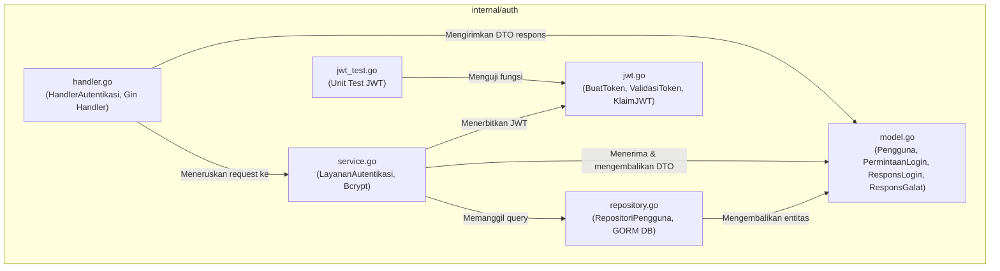

# Modul Autentikasi (`internal/auth`)

Direktori `internal/auth` mengelola seluruh domain autentikasi pengguna, penyimpanan kredensial, verifikasi password berbasis hash cryptographic (bcrypt), serta penerbitan dan validasi JSON Web Token (JWT).

---

## 1. Daftar Berkas & Peran Masing-Masing

Direktori ini terdiri dari 6 berkas:

| Nama Berkas | Lapisan (Layer) | Peran & Tanggung Jawab Utama |
|---|---|---|
| [`model.go`](file:///home/vinkanaka/Documents/Github/CinemaSystem/internal/auth/model.go) | **Domain & DTO** | Mendefinisikan entitas database `Pengguna`, konstanta peran (`PeranAdmin`, `PeranCustomer`), payload permintaan login (`PermintaanLogin`), respons login (`ResponsLogin`), serta format standar error (`ResponsGalat`, `DetailGalat`). |
| [`jwt.go`](file:///home/vinkanaka/Documents/Github/CinemaSystem/internal/auth/jwt.go) | **Security / Util** | Mengelola pembuatan token (`BuatToken` / `GenerateToken`) dan validasi token (`ValidasiToken` / `ValidateToken`) dengan algoritma HMAC-SHA256 serta struktur klaim token (`KlaimJWT`). |
| [`repository.go`](file:///home/vinkanaka/Documents/Github/CinemaSystem/internal/auth/repository.go) | **Data Access (Repository)** | Mengabstraksikan akses ke tabel `pengguna` di basis data PostgreSQL menggunakan GORM melalui interface `RepositoriPengguna`. |
| [`service.go`](file:///home/vinkanaka/Documents/Github/CinemaSystem/internal/auth/service.go) | **Business Logic (Service)** | Mengimplementasikan logika autentikasi: pencarian akun berdasarkan email, komparasi bcrypt hash password, serta pembuatan JWT token jika kredensial cocok. |
| [`handler.go`](file:///home/vinkanaka/Documents/Github/CinemaSystem/internal/auth/handler.go) | **Presentation (Controller/HTTP)** | Menerima request HTTP Gin pada rute `POST /auth/login`, memvalidasi format input JSON, memanggil layer service, dan mengembalikan status code HTTP serta body JSON sesuai spesifikasi OpenAPI / Swagger. |
| [`jwt_test.go`](file:///home/vinkanaka/Documents/Github/CinemaSystem/internal/auth/jwt_test.go) | **Unit Test** | Menguji fungsionalitas pembuatan token JWT, validitas klaim (Subject dan Role), masa kedaluwarsa (detik), dan penolakan token jika ditandatangani dengan secret yang salah. |

---

## 2. Rincian Teknis Per Berkas

### A. [`model.go`](file:///home/vinkanaka/Documents/Github/CinemaSystem/internal/auth/model.go)
- **Konstanta Peran**:
  ```go
  const (
      PeranAdmin    = "ADMIN"
      PeranCustomer = "CUSTOMER"
  )
  ```
- **Struktur Entitas Basis Data (`Pengguna`)**:
  - Mapped ke tabel `pengguna` via `TableName() string`.
  - Field `HashKataSandi` diberi tag `json:"-"` agar hash password tidak pernah bocor ke output JSON API.
  - Tag GORM: `primaryKey;autoIncrement`, `uniqueIndex`, `not null`.
- **Payload DTO Input & Output**:
  - `PermintaanLogin`: Memiliki validasi tag Gin `binding:"required,email"`. Menyediakan metode pembantu `KataSandiEfektif()` untuk mendukung fleksibilitas nama atribut `password` maupun `kata_sandi`.
  - `ResponsLogin`: Mengembalikan `access_token`, `token_type: "Bearer"`, dan durasi aktif `expires_in` (dalam satuan detik).
- **Format Respons Galat Terstandar**:
  - `ResponsGalat` membungkus `DetailGalat` dengan struktur `{ "error": { "code": "...", "message": "..." } }`.
- **Dukungan Dua Bahasa**:
  - Menyediakan *type alias* bahasa Inggris (`User = Pengguna`, `LoginRequest = PermintaanLogin`, `LoginResponse = ResponsLogin`, `ErrorResponse = ResponsGalat`) guna menjaga interoperabilitas kode.

### B. [`jwt.go`](file:///home/vinkanaka/Documents/Github/CinemaSystem/internal/auth/jwt.go)
- **Klaim Kustom (`KlaimJWT`)**:
  - Menyematkan `jwt.RegisteredClaims` bawaan `github.com/golang-jwt/jwt/v5`.
  - Menyimpan klaim kustom: `Peran string` (berisi `"ADMIN"` atau `"CUSTOMER"`).
  - Menyimpan ID pengguna pada field standar `Subject` (`sub`) dalam bentuk string numerik.
- **Fungsi `BuatToken`**:
  - Menerima parameter `(idPengguna, peran, rahasia, jamKedaluwarsa)`.
  - Menghitung waktu masa aktif UTC (`time.Now().UTC()`) dan detik kedaluwarsa (`jamKedaluwarsa * 3600`).
  - Menandatangani token menggunakan algoritma `jwt.SigningMethodHS256`.
- **Fungsi `ValidasiToken`**:
  - Melakukan *parsing* dan verifikasi *signature* terhadap kunci rahasia (`rahasia`).
  - Memeriksa keabsahan algoritma penandatanganan (`t.Method.(*jwt.SigningMethodHMAC)`) untuk menangkal celah keamanan *algorithm confusion attack* (misal memanipulasi header menjadi `alg: none` atau asymmetric key).
  - Memverifikasi masa berlaku token (`token.Valid`).

### C. [`repository.go`](file:///home/vinkanaka/Documents/Github/CinemaSystem/internal/auth/repository.go)
- **Kontrak Antarmuka (`RepositoriPengguna`)**:
  - `CariBerdasarkanEmail(ctx context.Context, email string) (*Pengguna, error)`
  - `CariBerdasarkanID(ctx context.Context, id int64) (*Pengguna, error)`
- **Implementasi GORM (`repositori`)**:
  - Mengisolasi interaksi langsung dengan basis data (`r.db.WithContext(ctx)`).
  - Mengonversi galat internal GORM `gorm.ErrRecordNotFound` menjadi galat domain seragam `GalatPenggunaTidakDitemukan` (`ErrUserNotFound`).

### D. [`service.go`](file:///home/vinkanaka/Documents/Github/CinemaSystem/internal/auth/service.go)
- **Kontrak Antarmuka (`LayananAutentikasi`)**:
  - `Login(ctx context.Context, permintaan PermintaanLogin) (*ResponsLogin, error)`
- **Alur Bisnis Autentikasi**:
  1. Mencari pengguna di database melalui `repo.CariBerdasarkanEmail`.
  2. Jika pengguna tidak ditemukan, mengembalikan `GalatKredensialTidakValid` (tidak membocorkan apakah email terdaftar atau tidak, mencegah *user enumeration*).
  3. Membandingkan hash kata sandi menggunakan `bcrypt.CompareHashAndPassword`. Jika hash berbeda, mengembalikan `GalatKredensialTidakValid`.
  4. Menerbitkan token JWT dengan memanggil `BuatToken`.
  5. Mengembalikan pointer `ResponsLogin` siap pakai.

### E. [`handler.go`](file:///home/vinkanaka/Documents/Github/CinemaSystem/internal/auth/handler.go)
- **Penangan HTTP Gin (`HandlerAutentikasi`)**:
  - Menyimpan referensi `layanan LayananAutentikasi`.
  - Method `Login(c *gin.Context)`:
    - Membaca body request dengan `c.ShouldBindJSON(&permintaan)`. Jika gagal/format email salah, mengembalikan HTTP 400 (`INVALID_REQUEST`).
    - Memeriksa `KataSandiEfektif() == ""`. Jika kosong, mengembalikan HTTP 400 (`INVALID_REQUEST`).
    - Memanggil `h.layanan.Login(...)`.
    - Jika galat berupa `GalatKredensialTidakValid`, mengembalikan HTTP 401 (`INVALID_CREDENTIALS`).
    - Jika galat lain terjadi, mengembalikan HTTP 500 (`INTERNAL_ERROR`).
    - Jika sukses, mengembalikan HTTP 200 OK dengan payload `ResponsLogin`.
  - Dilengkapi anotasi anotasi Swagger (`@Summary`, `@Tags Autentikasi`, `@Router /auth/login [post]`).

### F. [`jwt_test.go`](file:///home/vinkanaka/Documents/Github/CinemaSystem/internal/auth/jwt_test.go)
- Melakukan unit test mandiri tanpa ketergantungan basis data:
  - Memverifikasi bahwa token yang dibuat tidak kosong.
  - Memverifikasi kalkulasi durasi kedaluwarsa (24 jam = 86400 detik).
  - Memverifikasi bahwa klaim `Peran` dan `Subject` terisi persis sesuai input.
  - Memverifikasi bahwa validasi menggunakan *secret* yang salah langsung ditolak dengan mengembalikan galat.

---

## 3. Hubungan Antarberkas di Dalam `internal/auth`



---

## 4. Hubungan dengan Berkas & Direktori Lain

1. **`cmd/api/main.go`**:
   - Titik perakitan (*dependency injection*): Menginisialisasi `auth.BaruRepositori(basisData)`, kemudian menginjeksinya ke `auth.BaruLayanan(...)`, lalu ke `auth.BaruHandler(...)`.
   - Mendaftarkan rute publik: `v1.POST("/auth/login", handlerAuth.Login)`.
2. **`internal/middleware/auth.go`**:
   - Mengimpor `cinema-ticket-system/internal/auth`.
   - Menggunakan fungsi `auth.ValidasiToken()` untuk memverifikasi bearer token yang dikirimkan klien pada setiap request yang terproteksi.
   - Menggunakan `auth.ResponsGalat` dan `auth.DetailGalat` untuk menyeragamkan format respons saat token tidak ada (401) atau kedaluwarsa.
   - Menggunakan konstanta `auth.PeranAdmin` sebagai argumen *role-guard* rute sensitif.
3. **`internal/database/postgres.go` & `internal/database/seed.go`**:
   - `postgres.go`: Menyediakan instansi `*gorm.DB` yang diteruskan ke `auth.BaruRepositori`.
   - `seed.go`: Memasukkan data akun default awal (`admin@example.com` dan `customer@example.com`) dengan password yang telah di-hash menggunakan `bcrypt`.
4. **`migrations/000001_buat_tabel_pengguna.up.sql`**:
   - Skrip migrasi DDL yang mendefinisikan skema tabel `pengguna` (`id`, `nama`, `email`, `hash_kata_sandi`, `peran`, `dibuat_pada`, `diperbarui_pada`).
5. **`internal/config/config.go`**:
   - Menyediakan nilai konfigurasi `RahasiaJWT` (secret key) dan `KedaluwarsaJWTJam` (lama masa aktif token dalam jam).
6. **`tests/api_test.go`**:
   - Melakukan uji integrasi menyeluruh (*end-to-end*) dengan melakukan login via API dan menggunakan token yang diterima untuk mengakses endpoint jadwal.
