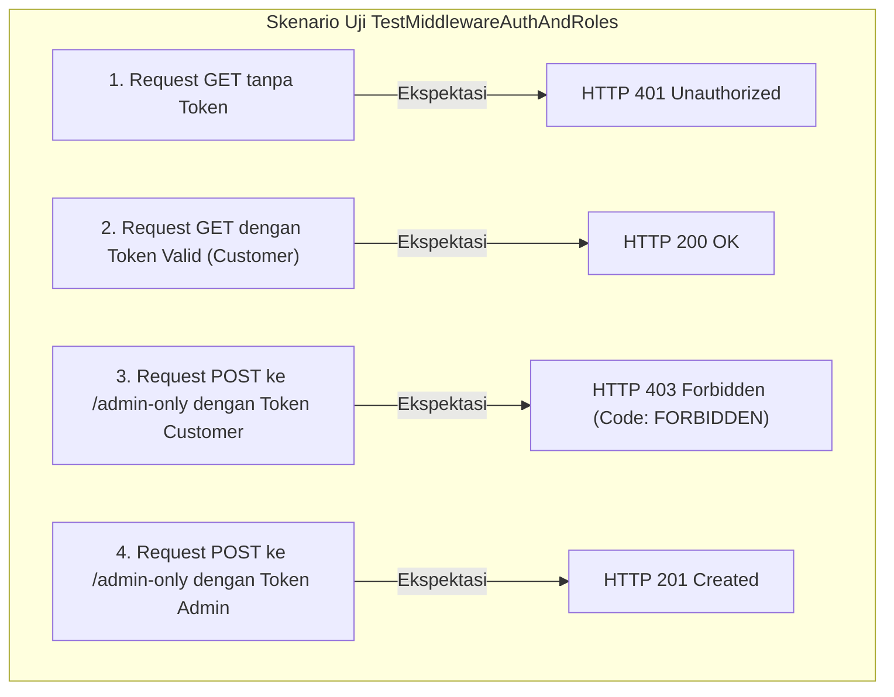
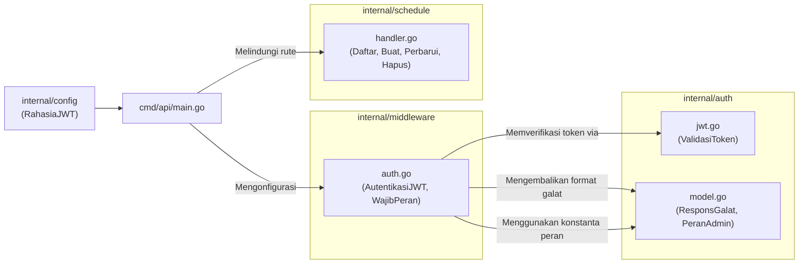

# Modul Middleware (`internal/middleware`)

Direktori `internal/middleware` berfungsi sebagai lapisan penjaga gerbang (*gatekeeper*) pada HTTP pipeline framework Gin. Modul ini bertanggung jawab memverifikasi identitas pengguna (autentikasi) dan menegakkan kontrol hak akses berbasis peran (otorisasi / Role-Based Access Control).

---

## 1. Daftar Berkas & Peran Masing-Masing

| Nama Berkas | Lapisan (Layer) | Peran & Tanggung Jawab Utama |
|---|---|---|
| [`auth.go`](file:///home/vinkanaka/Documents/Github/CinemaSystem/internal/middleware/auth.go) | **HTTP Interceptor / Guard** | Menyediakan dua middleware Gin utama: <br>1. `AutentikasiJWT`: Memvalidasi header `Authorization: Bearer <token>`, mengurai klaim JWT, serta menyuntikkan `userID` dan `userRole` ke konteks Gin.<br>2. `WajibPeran`: Memeriksa peran pengguna di konteks Gin dan menolak akses jika peran tidak terdaftar dalam daftar izin. |
| [`auth_test.go`](file:///home/vinkanaka/Documents/Github/CinemaSystem/internal/middleware/auth_test.go) | **Integration / Unit Test** | Menguji pipeline HTTP secara menyeluruh menggunakan `net/http/httptest` dan Gin router pada 4 skenario keamanan: ketiadaan token (401), token valid (200), pelanggaran hak akses peran (403), dan akses peran yang sah (201). |

---

## 2. Rincian Teknis Per Berkas

### A. [`auth.go`](file:///home/vinkanaka/Documents/Github/CinemaSystem/internal/middleware/auth.go)

#### 1. Konstanta Kunci Konteks Gin
```go
const (
    KunciKonteksIDPengguna    = "userID"
    KunciKonteksPeranPengguna = "userRole"
)
```
Konstanta ini digunakan sebagai *key* untuk menyimpan dan mengambil data pengguna pada `gin.Context` (`c.Set()` dan `c.Get()`).

#### 2. Fungsi `AutentikasiJWT(rahasia string) gin.HandlerFunc` (Alias: `JWTAuth`)
Alur kerja middleware autentikasi:
1. **Pemeriksaan Header**:
   - Membaca header HTTP `Authorization`.
   - Jika kosong, request dihentikan (`c.AbortWithStatusJSON(401)`) dengan kode galat `UNAUTHORIZED` ("Authorization header is required").
2. **Pemeriksaan Format**:
   - Memecah string dengan spasi (`strings.SplitN(headerOtorisasi, " ", 2)`).
   - Memastikan terdiri dari 2 bagian dan bagian pertama adalah `Bearer` (tidak sensitif huruf besar/kecil via `strings.EqualFold`).
   - Jika tidak cocok, request dihentikan dengan status 401 dan pesan "Invalid authorization header format. Expected 'Bearer <token>'".
3. **Validasi Kriptografi Token**:
   - Memanggil `auth.ValidasiToken(stringToken, rahasia)`.
   - Jika token kedaluwarsa atau tandatangan tidak sah, request dihentikan dengan HTTP 401 (`INVALID_TOKEN`).
4. **Ekstraksi Identitas Pengguna**:
   - Mengambil klaim `Subject` (`klaim.Subject`) dan mengonversinya menjadi integer 64-bit (`strconv.ParseInt(..., 10, 64)`).
   - Menyimpan hasil ke dalam konteks Gin:
     - `c.Set(KunciKonteksIDPengguna, idPengguna)`
     - `c.Set(KunciKonteksPeranPengguna, klaim.Peran)`
5. **Penerusan Request**:
   - Memanggil `c.Next()` untuk melanjutkan eksekusi ke handler berikutnya.

#### 3. Fungsi `WajibPeran(peranDiizinkan ...string) gin.HandlerFunc` (Alias: `RequireRoles`)
Alur kerja middleware otorisasi (RBAC):
1. Mengubah daftar `peranDiizinkan` menjadi *lookup map* (`map[string]bool`) untuk pencarian bernilai O(1).
2. Mengambil peran pengguna dari konteks Gin (`c.Get(KunciKonteksPeranPengguna)`).
3. Jika nilai peran belum ada di konteks (artinya endpoint ini belum dilewatkan ke middleware `AutentikasiJWT`), request dihentikan dengan HTTP 401 (`UNAUTHORIZED: Authentication required`).
4. Memeriksa apakah peran pengguna cocok dengan map izin:
   - Jika tidak memiliki izin (misal peran `CUSTOMER` mencoba mengakses rute khusus `ADMIN`), eksekusi diputus dengan status HTTP 403 Forbidden:
     ```json
     {
       "error": {
         "code": "FORBIDDEN",
         "message": "Insufficient permissions to access this resource"
       }
     }
     ```
5. Jika memiliki izin, memanggil `c.Next()`.

---

### B. [`auth_test.go`](file:///home/vinkanaka/Documents/Github/CinemaSystem/internal/middleware/auth_test.go)

Berkas ini menguji integrasi antara `internal/auth` dan `internal/middleware` menggunakan router Gin dalam `TestMode`:



---

## 3. Hubungan Antarberkas di Dalam `internal/middleware`

- [`auth_test.go`](file:///home/vinkanaka/Documents/Github/CinemaSystem/internal/middleware/auth_test.go) bertindak sebagai *consumer* langsung dari fungsi yang dideklarasikan di [`auth.go`](file:///home/vinkanaka/Documents/Github/CinemaSystem/internal/middleware/auth.go).
- Keduanya berbagi pemahaman yang sama terhadap kontrak konteks Gin (`KunciKonteksIDPengguna` dan `KunciKonteksPeranPengguna`).

---

## 4. Hubungan dengan Berkas & Direktori Lain



1. **Keterkaitan Erat dengan `internal/auth`**:
   - `internal/middleware` **secara eksplisit mengimpor** `cinema-ticket-system/internal/auth`.
   - Bergantung pada `auth.ValidasiToken()` untuk mengecek keaslian signature dan mengekstrak klaim pengguna.
   - Bergantung pada `auth.ResponsGalat` dan `auth.DetailGalat` untuk memastikan format JSON respon saat gagal autentikasi/otorisasi identik dengan standar API sistem.
   - Bergantung pada konstanta `auth.RoleAdmin` dan `auth.RoleCustomer`.
2. **Keterkaitan dengan `cmd/api/main.go`**:
   - Di `cmd/api/main.go`, middleware ini dipasang pada grup rute API v1:
     ```go
     // Rute terproteksi JWT untuk seluruh jadwal
     terproteksi := v1.Group("")
     terproteksi.Use(middleware.AutentikasiJWT(konfigurasi.RahasiaJWT))
     {
         terproteksi.GET("/schedules", handlerJadwal.Daftar)
         terproteksi.GET("/schedules/:id", handlerJadwal.AmbilBerdasarkanID)

         // Pembatasan rute mutasi jadwal khusus Admin
         khususAdmin := terproteksi.Group("")
         khususAdmin.Use(middleware.WajibPeran(auth.PeranAdmin))
         {
             khususAdmin.POST("/schedules", handlerJadwal.Buat)
             khususAdmin.PUT("/schedules/:id", handlerJadwal.Perbarui)
             khususAdmin.DELETE("/schedules/:id", handlerJadwal.Hapus)
         }
     }
     ```
3. **Keterkaitan dengan `internal/schedule`**:
   - Handler jadwal pada `internal/schedule` tidak perlu lagi melakukan parsing token JWT manual atau pengecekan peran berulang kali di setiap fungsi; seluruh tanggung jawab keamanan ditangani terlebih dahulu oleh `internal/middleware`.
