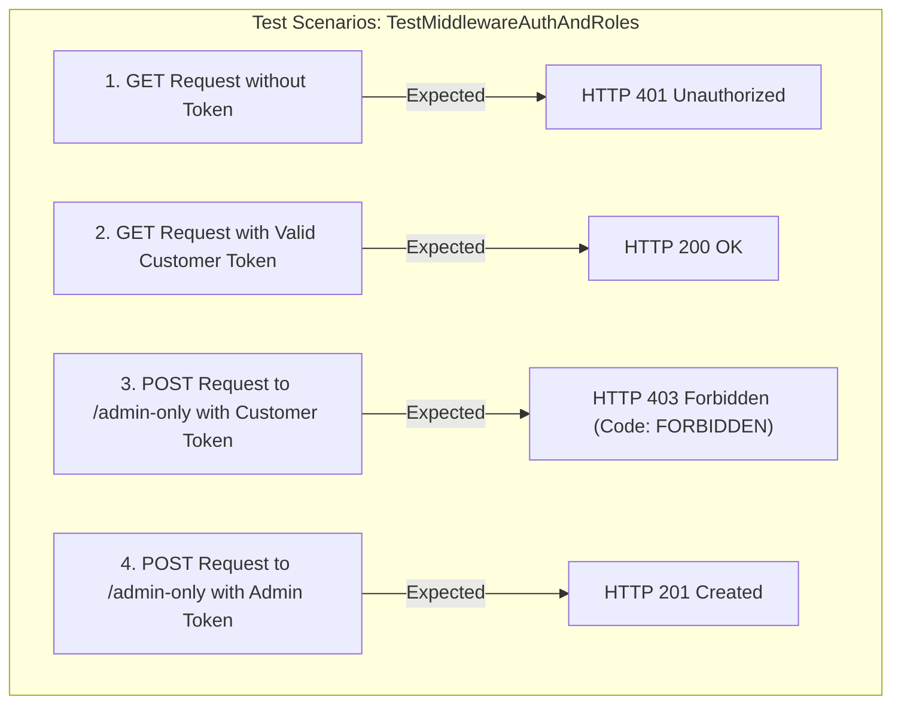
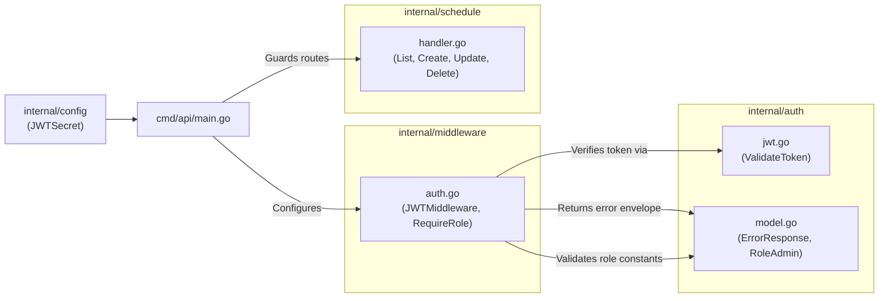

# Middleware Module (`internal/middleware`)

The `internal/middleware` directory acts as the gatekeeper layer for the Gin HTTP pipeline. It is responsible for user identity verification (authentication) and enforcing role-based access control (RBAC authorization).

---

## 1. File Catalog & Architectural Roles

| File Name | Layer | Primary Responsibility |
|---|---|---|
| [`auth.go`](file:///home/vinkanaka/Documents/Github/CinemaSystem/internal/middleware/auth.go) | **HTTP Interceptor / Guard** | Provides two core Gin middlewares: <br>1. `JWTMiddleware`: Validates header `Authorization: Bearer <token>`, decodes JWT claims, and injects `userID` and `userRole` into the Gin request context.<br>2. `RequireRoles` / `RequireRole`: Inspects the user's role stored in the Gin context and denies access if the role is not authorized. |
| [`auth_test.go`](file:///home/vinkanaka/Documents/Github/CinemaSystem/internal/middleware/auth_test.go) | **Integration / Unit Test** | Thoroughly tests the HTTP pipeline using `net/http/httptest` and Gin router across 4 core security test cases: missing token (401), valid token (200), role permission violation (403), and authorized administrative access (201). |

---

## 2. Technical Details per File

### A. [`auth.go`](file:///home/vinkanaka/Documents/Github/CinemaSystem/internal/middleware/auth.go)

#### 1. Gin Context Key Constants
```go
const (
    ContextKeyUserID   = "userID"
    ContextKeyUserRole = "userRole"
)
```
These constants serve as keys for storing and extracting authenticated user metadata in `gin.Context` (`c.Set()` and `c.Get()`).

#### 2. Function `JWTMiddleware(secret string) gin.HandlerFunc`
Authentication middleware execution workflow:
1. **Header Inspection**:
   - Reads the HTTP `Authorization` header.
   - If empty, the request terminates immediately (`c.AbortWithStatusJSON(401)`) with error code `UNAUTHORIZED` ("Authorization header is required").
2. **Format Inspection**:
   - Splits header string by whitespace (`strings.SplitN(authHeader, " ", 2)`).
   - Verifies 2 parts are present and the first part is `Bearer` (case-insensitive check via `strings.EqualFold`).
   - If mismatched, aborts with HTTP 401 and message "Invalid authorization header format. Expected 'Bearer <token>'".
3. **Cryptographic Token Verification**:
   - Invokes `auth.ValidateToken(tokenString, secret)`.
   - If the token is expired or the HMAC signature is invalid, aborts with HTTP 401 (`INVALID_TOKEN`).
4. **User Identity Extraction**:
   - Extracts `claims.Subject` and converts it to a 64-bit integer (`strconv.ParseInt(..., 10, 64)`).
   - Injects the extracted identity into the Gin context:
     - `c.Set(ContextKeyUserID, userID)`
     - `c.Set(ContextKeyUserRole, claims.Role)`
5. **Pipeline Continuation**:
   - Calls `c.Next()` to continue execution down the handler chain.

#### 3. Function `RequireRoles(allowedRoles ...string) gin.HandlerFunc`
Authorization middleware execution workflow (RBAC):
1. Converts the list of `allowedRoles` into a lookup map (`map[string]bool`) for O(1) membership checks.
2. Retrieves the current user's role from the Gin context (`c.Get(ContextKeyUserRole)`).
3. If the role is missing from context (meaning the endpoint was not wrapped with `JWTMiddleware`), aborts with HTTP 401 (`UNAUTHORIZED: Authentication required`).
4. Validates whether the user's role is in the allowed map:
   - If unauthorized (e.g. A `CUSTOMER` attempting to execute an `ADMIN`-only route), execution terminates with HTTP 403 Forbidden:
     ```json
     {
       "error": {
         "code": "FORBIDDEN",
         "message": "Insufficient permissions to access this resource"
       }
     }
     ```
5. If authorized, calls `c.Next()`.

---

### B. [`auth_test.go`](file:///home/vinkanaka/Documents/Github/CinemaSystem/internal/middleware/auth_test.go)

Tests the integration between `internal/auth` and `internal/middleware` using Gin router in `TestMode`:



---

## 3. Internal Module Relationships

- [`auth_test.go`](file:///home/vinkanaka/Documents/Github/CinemaSystem/internal/middleware/auth_test.go) directly tests and exercises the functions declared in [`auth.go`](file:///home/vinkanaka/Documents/Github/CinemaSystem/internal/middleware/auth.go).
- Both files share the same context contract constants (`ContextKeyUserID` and `ContextKeyUserRole`).

---

## 4. Cross-Module Relationships & External Dependencies



1. **Direct Coupling with `internal/auth`**:
   - `internal/middleware` **explicitly imports** `cinema-ticket-system/internal/auth`.
   - Relies on `auth.ValidateToken()` to verify signature integrity and decode user claims.
   - Relies on `auth.ErrorResponse` and `auth.ErrorDetail` to guarantee uniform API error envelopes.
   - Relies on constants `auth.RoleAdmin` and `auth.RoleCustomer`.
2. **Integration in `cmd/api/main.go`**:
   - In `cmd/api/main.go`, the middleware is mounted on the v1 API route group:
     ```go
     // Protected routes accessible to all authenticated users
     protected := v1.Group("")
     protected.Use(middleware.JWTMiddleware(cfg.JWTSecret))
     {
         protected.GET("/schedules", scheduleHandler.List)
         protected.GET("/schedules/:id", scheduleHandler.GetByID)

         // Administrative mutation routes
         adminOnly := protected.Group("")
         adminOnly.Use(middleware.RequireRole(auth.RoleAdmin))
         {
             adminOnly.POST("/schedules", scheduleHandler.Create)
             adminOnly.PUT("/schedules/:id", scheduleHandler.Update)
             adminOnly.DELETE("/schedules/:id", scheduleHandler.Delete)
         }
     }
     ```
3. **Decoupling `internal/schedule`**:
   - Schedule handlers in `internal/schedule` do not need manual token parsing or repetitive permission checks; all authentication and authorization guarantees are enforced beforehand by `internal/middleware`.
