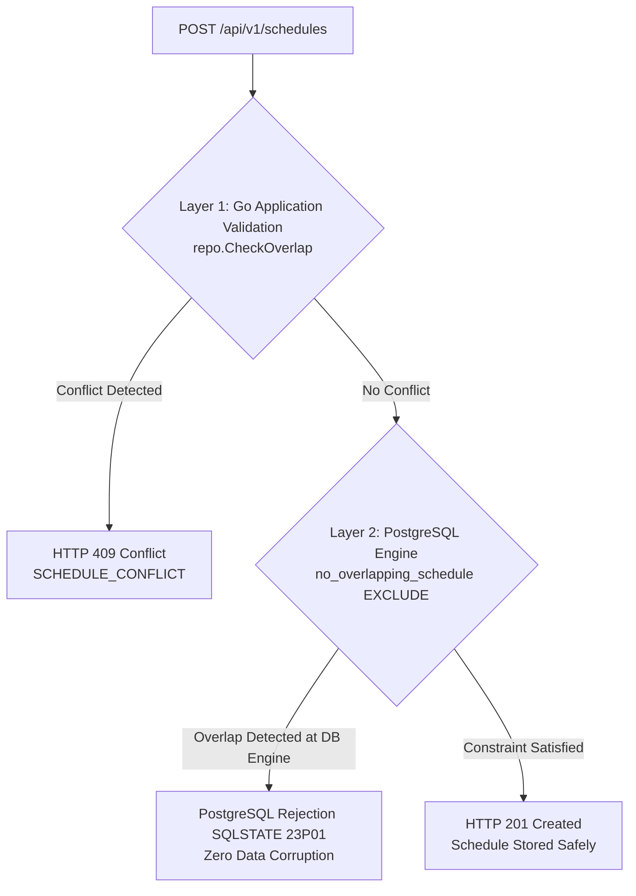
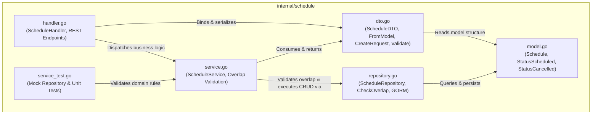
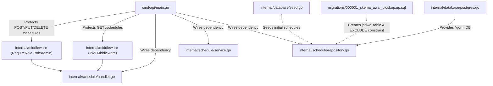

# Screening Schedule Module (`internal/schedule`)

The `internal/schedule` directory manages cinema screening schedule operations. This module provides complete schedule CRUD functionality, RFC3339 time window validation, auditorium conflict prevention (schedule overlap detection), and soft logical cancellations.

---

## 1. File Catalog & Architectural Roles

| File Name | Layer | Primary Responsibility |
|---|---|---|
| [`model.go`](file:///home/vinkanaka/Documents/Github/CinemaSystem/internal/schedule/model.go) | **Domain Entity** | Defines the `Schedule` model mapped to PostgreSQL table `jadwal`, along with schedule status constants (`StatusScheduled`, `StatusCancelled`, `StatusCompleted`). |
| [`dto.go`](file:///home/vinkanaka/Documents/Github/CinemaSystem/internal/schedule/dto.go) | **Data Transfer Object** | Provides API payload structures: `ScheduleDTO`, single/list response envelopes, create/update request payloads, logical time validation (`Validate()`), and model-to-DTO conversion functions (`FromModel`). |
| [`repository.go`](file:///home/vinkanaka/Documents/Github/CinemaSystem/internal/schedule/repository.go) | **Data Access (Repository)** | Communicates with PostgreSQL via GORM. Provides time-ordered queries, primary key lookups, data persistence, logical cancellation, and the critical overlap collision query (`CheckOverlap`). |
| [`service.go`](file:///home/vinkanaka/Documents/Github/CinemaSystem/internal/schedule/service.go) | **Business Logic (Service)** | Orchestrates cinema business rules: verifies start time precedes end time, confirms no conflicting active schedule exists in the studio prior to saving, and transforms domain models into DTOs. |
| [`handler.go`](file:///home/vinkanaka/Documents/Github/CinemaSystem/internal/schedule/handler.go) | **Presentation (Controller/HTTP)** | Implements 5 RESTful Gin endpoints (`GET /schedules`, `GET /schedules/:id`, `POST /schedules`, `PUT /schedules/:id`, `DELETE /schedules/:id`), handles JSON binding and route param extraction, and maps domain errors to HTTP status codes (200, 201, 204, 400, 404, 409, 500). |
| [`service_test.go`](file:///home/vinkanaka/Documents/Github/CinemaSystem/internal/schedule/service_test.go) | **Unit Test** | Comprehensively tests service layer logic using an in-memory mock repository: time integrity, schedule creation, overlap collision detection, studio isolation, schedule cancellation, and re-booking of cancelled time slots. |

---

## 2. Technical Details per File

### A. [`model.go`](file:///home/vinkanaka/Documents/Github/CinemaSystem/internal/schedule/model.go)
- **Schedule Status Constants**:
  ```go
  const (
      StatusScheduled = "SCHEDULED"
      StatusCancelled = "CANCELLED"
      StatusCompleted = "COMPLETED"
  )
  ```
- **Database Entity (`Schedule`)**:
  - `ID`: Auto-incrementing primary key (`primaryKey;autoIncrement`).
  - `MovieID`: Foreign key reference to movie entity (`column:film_id;not null;index`).
  - `StudioID`: Foreign key reference to studio entity (`column:studio_id;not null;index`).
  - `StartTime`: Screening start timestamp in UTC (`column:waktu_mulai;not null`).
  - `EndTime`: Screening end timestamp in UTC (`column:waktu_selesai;not null`).
  - `Status`: Current state (default: `"SCHEDULED"`).
  - `CreatedAt` & `UpdatedAt`: Standard audit timestamps.
  - `TableName() string { return "jadwal" }`.

### B. [`dto.go`](file:///home/vinkanaka/Documents/Github/CinemaSystem/internal/schedule/dto.go)
- **Output DTO (`ScheduleDTO`)**:
  - Standard JSON contract: `id`, `movie_id`, `studio_id`, `start_time`, `end_time`, `status`.
- **Transformation Utility (`FromModel`)**:
  - Maps `*Schedule` instances to clean `ScheduleDTO` response representations.
- **Input DTOs (`CreateScheduleRequest` & `UpdateScheduleRequest`)**:
  - Direct JSON attribute bindings (`movie_id`, `studio_id`, `start_time`, `end_time`).
  - Validation Method (`Validate()`):
    - Asserts `movie_id > 0` and `studio_id > 0`.
    - Asserts start and end times are non-zero (`!StartTime.IsZero()`).
    - **Time Integrity**: Validates `end_time` strictly occurs after `start_time` (`EndTime.After(StartTime)`).

### C. [`repository.go`](file:///home/vinkanaka/Documents/Github/CinemaSystem/internal/schedule/repository.go)
- **Interface Contract (`ScheduleRepository`)**:
  - `FindAll(ctx context.Context) ([]Schedule, error)`: Retrieves all schedules ordered chronologically (`ORDER BY waktu_mulai ASC`).
  - `FindByID(ctx context.Context, id int64) (*Schedule, error)`: Lookup by primary key.
  - `Create(ctx context.Context, schedule *Schedule) error`: Persists a new schedule record.
  - `Update(ctx context.Context, schedule *Schedule) error`: Persists modified fields.
  - `Cancel(ctx context.Context, id int64) (*Schedule, error)`: Performs soft logical cancellation: updates status to `'CANCELLED'` and refreshes `updated_at`.
  - `CheckOverlap(ctx context.Context, studioID int64, startTime, endTime time.Time, excludeID int64) (bool, error)`:
    - Executes time-interval intersection query:
      ```sql
      SELECT count(*) FROM jadwal
      WHERE studio_id = ?
        AND status != 'CANCELLED'
        AND waktu_mulai < ?
        AND waktu_selesai > ?
        [AND id != ?]
      ```
    - A count > 0 indicates an existing active schedule occupies the studio during this interval.

### D. [`service.go`](file:///home/vinkanaka/Documents/Github/CinemaSystem/internal/schedule/service.go)
- **Interface Contract (`ScheduleService`)**:
  - `ListSchedules(ctx)`
  - `GetSchedule(ctx, id)`
  - `CreateSchedule(ctx, request)`
  - `UpdateSchedule(ctx, id, request)`
  - `CancelSchedule(ctx, id)`
- **Overlap Conflict Prevention Rules**:
  1. Before persisting a new or updated schedule, `service` calls `repo.CheckOverlap(...)`.
  2. If the studio already has another active schedule in an intersecting interval (and status is not `CANCELLED`), the operation is rejected with `ErrScheduleConflict` (*"studio already has an overlapping schedule"*).
  3. During updates (`UpdateSchedule`), the schedule's current ID is passed as `excludeID` to ensure it is not evaluated as conflicting with itself.

### E. [`handler.go`](file:///home/vinkanaka/Documents/Github/CinemaSystem/internal/schedule/handler.go)
- **Gin Controller (`ScheduleHandler`)**:
  - `List(c *gin.Context)`: `GET /schedules` -> HTTP 200 OK.
  - `GetByID(c *gin.Context)`: `GET /schedules/:id` -> HTTP 200 OK or 404 (`SCHEDULE_NOT_FOUND`).
  - `Create(c *gin.Context)`: `POST /schedules` -> HTTP 201 Created, 400 (`INVALID_REQUEST`), or 409 Conflict (`SCHEDULE_CONFLICT`).
  - `Update(c *gin.Context)`: `PUT /schedules/:id` -> HTTP 200 OK, 400, 404, or 409 Conflict.
  - `Delete(c *gin.Context)`: `DELETE /schedules/:id` -> HTTP 204 No Content (successful soft cancellation) or 404.
- **OpenAPI / Swagger Annotations**:
  - Fully annotated with `@Summary`, `@Description`, `@Tags Schedules`, `@Security BearerAuth`, and standardized error schema bindings.

### F. [`service_test.go`](file:///home/vinkanaka/Documents/Github/CinemaSystem/internal/schedule/service_test.go)
- Uses an in-memory mock repository (`mockRepository`) to validate domain logic:
  1. **Inverted Time Validation**: `end_time` before `start_time` fails immediately.
  2. **Successful Schedule Creation**: Schedule is saved with ID 1 and status `SCHEDULED`.
  3. **Overlap Conflict Detection**: Attempting to schedule an intersecting slot in Studio 1 returns `ErrScheduleConflict`.
  4. **Studio Isolation**: Scheduling during the exact same timeframe in a different studio (Studio 2) succeeds without conflict.
  5. **Schedule Cancellation**: Transitions schedule status to `CANCELLED`.
  6. **Slot Reclamation**: Once a schedule is cancelled, its previously occupied time slot can be booked by another movie without conflict.

---

## 3. Time Interval Overlap Detection Logic

Two time intervals $(A_{start}, A_{end})$ and $(B_{start}, B_{end})$ intersect if and only if:

$$A_{start} < B_{end} \quad \text{and} \quad A_{end} > B_{start}$$

```
Case 1: Overlapping (Collision)
Schedule A:       |-------------------|
New Schedule B:            |-------------------|
Result: REJECTED (HTTP 409 SCHEDULE_CONFLICT)

Case 2: Sequential (Contiguous / Non-overlapping)
Schedule A:       |-------------------|
New Schedule B:                        |-------------------|
Result: ALLOWED (No shared timeframe)

Case 3: Separate Studios
Studio 1:         |-------------------| (Movie A)
Studio 2:         |-------------------| (Movie B)
Result: ALLOWED (Independent auditoriums)
```

---

## 4. Dual-Layer Overlap Conflict Protection

To eliminate any window for race conditions under concurrent schedule creation:



1. **Layer 1 (Application / Domain Layer)**:
   - Evaluates interval intersections via `repo.CheckOverlap`.
   - Returns a descriptive JSON error with HTTP status `409 Conflict` (`SCHEDULE_CONFLICT`).
2. **Layer 2 (PostgreSQL Engine Level)**:
   - Enforced by the `btree_gist` extension:
     ```sql
     CONSTRAINT no_overlapping_schedule EXCLUDE USING gist (
         studio_id WITH =,
         tstzrange(waktu_mulai, waktu_selesai, '[)') WITH &&
     ) WHERE (status = 'SCHEDULED');
     ```
   - Guarantees absolute data integrity even under extreme parallel transactions bypassing or racing application checks.

---

## 5. Internal Module Dependency Graph



---

## 6. Cross-Module Relationships & External Dependencies



1. **`cmd/api/main.go`**:
   - Assembles dependencies:
     - `scheduleRepo := schedule.NewRepository(db)`
     - `scheduleService := schedule.NewService(scheduleRepo)`
     - `scheduleHandler := schedule.NewHandler(scheduleService)`
   - Mounts routes on Gin router and configures security middleware.
2. **`internal/middleware`**:
   - `GET /schedules` and `GET /schedules/:id` are protected by `middleware.JWTMiddleware` (accessible to both Customer and Admin).
   - Mutation endpoints `POST /schedules`, `PUT /schedules/:id`, and `DELETE /schedules/:id` are protected by `middleware.RequireRole(auth.RoleAdmin)`.
3. **`internal/database` & `migrations`**:
   - `migrations/000001_skema_awal_bioskop.up.sql`: Defines PostgreSQL table `jadwal`, indices `film_id`, `studio_id`, and `no_overlapping_schedule` exclusion constraint.
   - `internal/database/seed.go`: Inserts initial seed screening schedules for Inception in Studio 1.
4. **`docs/C-api-spec.md` & `docs/swagger`**:
   - Exact API contract registered in Swagger UI is implemented by `handler.go` and `dto.go`.

