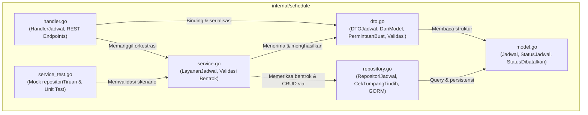
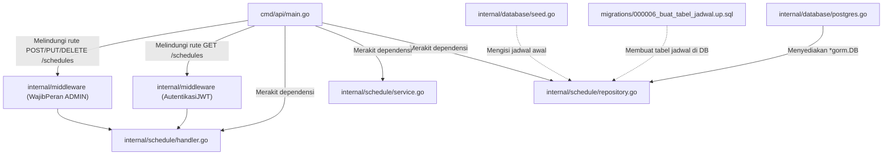

# Modul Jadwal Tayang (`internal/schedule`)

Direktori `internal/schedule` mengelola seluruh domain operasional jadwal penayangan film bioskop (*movie showtimes*). Modul ini menangani operasi CRUD jadwal, validasi rentang waktu, pencegahan konflik tumpang tindih penggunaan studio (*schedule overlap prevention*), serta pembatalan jadwal secara logis (*soft logical cancellation*).

---

## 1. Daftar Berkas & Peran Masing-Masing

| Nama Berkas | Lapisan (Layer) | Peran & Tanggung Jawab Utama |
|---|---|---|
| [`model.go`](file:///home/vinkanaka/Documents/Github/CinemaSystem/internal/schedule/model.go) | **Domain Entity** | Mendefinisikan struktur data model `Jadwal` yang dipetakan ke tabel PostgreSQL `jadwal`, serta konstanta status penayangan (`StatusJadwal`, `StatusDibatalkan`, `StatusSelesai`). |
| [`dto.go`](file:///home/vinkanaka/Documents/Github/CinemaSystem/internal/schedule/dto.go) | **Data Transfer Object** | Menyediakan struktur payload API: `DTOJadwal`, amplop respons tunggal/daftar, payload permintaan buat/perbarui, metode validasi logika waktu (`Validasi()`), serta fungsi konversi model ke DTO (`DariModel`). |
| [`repository.go`](file:///home/vinkanaka/Documents/Github/CinemaSystem/internal/schedule/repository.go) | **Data Access (Repository)** | Berkomunikasi dengan database PostgreSQL via GORM. Menyediakan query pengurutan waktu, pencarian ID, persistensi data, pembatalan logis, dan kueri krusial pemeriksaan jadwal bentrok (`CekTumpangTindih`). |
| [`service.go`](file:///home/vinkanaka/Documents/Github/CinemaSystem/internal/schedule/service.go) | **Business Logic (Service)** | Mengorkestrasi aturan bisnis bioskop: memastikan waktu mulai sebelum waktu selesai, mengecek tidak adanya jadwal ganda pada studio yang sama sebelum menyimpan, dan mengubah data model menjadi DTO. |
| [`handler.go`](file:///home/vinkanaka/Documents/Github/CinemaSystem/internal/schedule/handler.go) | **Presentation (Controller/HTTP)** | Mengimplementasikan 5 endpoint RESTful HTTP Gin (`GET /schedules`, `GET /schedules/:id`, `POST /schedules`, `PUT /schedules/:id`, `DELETE /schedules/:id`), melakukan binding JSON, parsing path parameter, serta memetakan galat ke kode status HTTP yang tepat (200, 201, 204, 400, 404, 409, 500). |
| [`service_test.go`](file:///home/vinkanaka/Documents/Github/CinemaSystem/internal/schedule/service_test.go) | **Unit Test** | Menguji logika layer service secara komprehensif menggunakan mock repositori memori (`repositoriTiruan`): validasi waktu, pembuatan jadwal, deteksi tumpang tindih waktu, isolasi antarstudio, pembatalan jadwal, dan pemesanan kembali slot yang telah dibatalkan. |

---

## 2. Rincian Teknis Per Berkas

### A. [`model.go`](file:///home/vinkanaka/Documents/Github/CinemaSystem/internal/schedule/model.go)
- **Konstanta Status Penayangan**:
  ```go
  const (
      StatusJadwal     = "SCHEDULED"
      StatusDibatalkan = "CANCELLED"
      StatusSelesai    = "COMPLETED"
  )
  ```
- **Struktur Entitas Basis Data (`Jadwal`)**:
  - `ID`: Kunci utama auto-increment (`primaryKey;autoIncrement`).
  - `FilmID`: ID referensi ke entitas film (`column:film_id;not null;index`).
  - `StudioID`: ID referensi ke studio penayangan (`column:studio_id;not null;index`).
  - `WaktuMulai`: Timestamp UTC dimulainya film (`column:waktu_mulai;not null`).
  - `WaktuSelesai`: Timestamp UTC berakhirnya penayangan (`column:waktu_selesai;not null`).
  - `Status`: Status jadwal (default: `"SCHEDULED"`).
  - `DibuatPada` & `DiperbaruiPada`: Timestamp audit.
  - `TableName() string { return "jadwal" }`.

### B. [`dto.go`](file:///home/vinkanaka/Documents/Github/CinemaSystem/internal/schedule/dto.go)
- **Struktur Output (`DTOJadwal`)**:
  - Merepresentasikan representasi bersih objek jadwal untuk klien: `id`, `movie_id`, `studio_id`, `start_time`, `end_time`, `status`.
- **Fungsi Transformasi (`DariModel`)**:
  - Mengonversi `*Jadwal` menjadi nilai `DTOJadwal`.
- **Payload Input (`PermintaanBuatJadwal` & `PermintaanPerbaruiJadwal`)**:
  - Mendukung fleksibilitas penamaan atribut JSON (menerima `movie_id` maupun `film_id`, serta `start_time` maupun `waktu_mulai`).
  - Method `Validasi()`:
    - Memastikan `film_id > 0` dan `studio_id > 0`.
    - Memastikan waktu mulai dan selesai tidak kosong (`IsZero()`).
    - **Integritas Waktu**: Memvalidasi bahwa `end_time` harus terjadi **setelah** `start_time` (`selesai.After(mulai)`).

### C. [`repository.go`](file:///home/vinkanaka/Documents/Github/CinemaSystem/internal/schedule/repository.go)
- **Kontrak Antarmuka (`RepositoriJadwal`)**:
  - `AmbilSemua(ctx context.Context) ([]Jadwal, error)`: Query seluruh jadwal diurutkan dari penayangan terdekat (`ORDER BY waktu_mulai ASC`).
  - `AmbilBerdasarkanID(ctx context.Context, id int64) (*Jadwal, error)`: Pencarian tunggal berdasarkan ID primer.
  - `Buat(ctx context.Context, jadwal *Jadwal) error`: Menulis data baru ke tabel `jadwal`.
  - `Perbarui(ctx context.Context, jadwal *Jadwal) error`: Menyimpan perubahan jadwal.
  - `Batalkan(ctx context.Context, id int64) (*Jadwal, error)`: Melakukan *soft logical cancel*: mengubah kolom `status` menjadi `'CANCELLED'` dan memperbarui `diperbarui_pada`.
  - `CekTumpangTindih(ctx context.Context, studioID int64, waktuMulai, waktuSelesai time.Time, kecualikanID int64) (bool, error)`:
    - Melakukan kueri interseksi interval waktu:
      ```sql
      SELECT count(*) FROM jadwal
      WHERE studio_id = ?
        AND status != 'CANCELLED'
        AND waktu_mulai < ?
        AND waktu_selesai > ?
        [AND id != ?]
      ```
    - Jika count > 0, berarti terdapat jadwal aktif lain yang bertabrakan di studio tersebut.

### D. [`service.go`](file:///home/vinkanaka/Documents/Github/CinemaSystem/internal/schedule/service.go)
- **Kontrak Antarmuka (`LayananJadwal`)**:
  - `DaftarJadwal(ctx)`
  - `AmbilJadwal(ctx, id)`
  - `BuatJadwal(ctx, permintaan)`
  - `PerbaruiJadwal(ctx, id, permintaan)`
  - `BatalkanJadwal(ctx, id)`
- **Aturan Bisnis Pencegahan Konflik Waktu (Overlap Conflict)**:
  1. Sebelum pembuatan atau pembaruan jadwal dilakukan, `service` memanggil `repo.CekTumpangTindih(...)`.
  2. Jika studio tersebut sudah memiliki jadwal lain pada rentang waktu yang beririsan (dan statusnya belum `CANCELLED`), sistem membatalkan operasi dan mengembalikan error `GalatKonflikJadwal` (`ErrScheduleConflict`: *"studio already has an overlapping schedule"*).
  3. Saat pembaruan (`PerbaruiJadwal`), ID jadwal saat ini dilewatkan sebagai `kecualikanID` sehingga jadwal tersebut tidak dianggap bertabrakan dengan dirinya sendiri.

### E. [`handler.go`](file:///home/vinkanaka/Documents/Github/CinemaSystem/internal/schedule/handler.go)
- **Implementasi Handler Gin (`HandlerJadwal`)**:
  - `Daftar(c *gin.Context)`: `GET /schedules` -> HTTP 200 OK.
  - `AmbilBerdasarkanID(c *gin.Context)`: `GET /schedules/:id` -> HTTP 200 OK atau 404 (`SCHEDULE_NOT_FOUND`).
  - `Buat(c *gin.Context)`: `POST /schedules` -> HTTP 201 Created, 400 (`INVALID_REQUEST`), atau 409 Conflict (`SCHEDULE_CONFLICT`).
  - `Perbarui(c *gin.Context)`: `PUT /schedules/:id` -> HTTP 200 OK, 400, 404, atau 409 Conflict.
  - `Hapus(c *gin.Context)`: `DELETE /schedules/:id` -> HTTP 204 No Content (pembatalan berhasil) atau 404.
- **Anotasi OpenAPI / Swagger**:
  - Setiap fungsi dilengkapi tag `@Summary`, `@Description`, `@Tags Jadwal`, `@Security BearerAuth`, dan pemetaan skema respons galat (`ResponsGalat`).

### F. [`service_test.go`](file:///home/vinkanaka/Documents/Github/CinemaSystem/internal/schedule/service_test.go)
- Menggunakan `repositoriTiruan` berbasis map memori murni (`map[int64]*Jadwal`) untuk memvalidasi skenario logika:
  1. **Validasi Waktu Terbalik**: Waktu selesai sebelum waktu mulai -> gagal validasi.
  2. **Pembuatan Jadwal Sukses**: Jadwal tersimpan dengan ID 1 dan status `SCHEDULED`.
  3. **Deteksi Bentrok (Overlap Conflict)**: Mencoba membuat jadwal di studio 1 pada waktu yang beririsan -> menghasilkan `GalatKonflikJadwal`.
  4. **Isolasi Studio**: Membuat jadwal pada jam yang sama di studio berbeda (studio 2) -> berhasil tanpa bentrok.
  5. **Pembatalan Jadwal**: Mengubah status jadwal menjadi `CANCELLED`.
  6. **Pemanfaatan Ulang Slot**: Setelah jadwal di studio 1 berstatus `CANCELLED`, slot waktu tersebut dapat dipesan kembali oleh film lain tanpa terhalang bentrok.

---

## 3. Logika Deteksi Tumpang Tindih Waktu (Interval Overlap)

Dua interval waktu $(A_{mulai}, A_{selesai})$ dan $(B_{mulai}, B_{selesai})$ dikatakan bertabrakan jika dan hanya jika:

$$A_{mulai} < B_{selesai} \quad \text{dan} \quad A_{selesai} > B_{mulai}$$

```
Kasus 1: Tumpang Tindih (Bentrok)
Jadwal A:       |-------------------|
Jadwal Baru B:            |-------------------|
Hasil: DITOLAK (HTTP 409 SCHEDULE_CONFLICT)

Kasus 2: Berurutan / Tepat Bersebelahan
Jadwal A:       |-------------------|
Jadwal Baru B:                      |-------------------|
Hasil: DIIZINKAN (Tidak ada irisan waktu)

Kasus 3: Studio Berbeda
Studio 1:       |-------------------| (Film A)
Studio 2:       |-------------------| (Film B)
Hasil: DIIZINKAN (Studio independen)
```

---

## 4. Hubungan Antarberkas di Dalam `internal/schedule`



---

## 5. Hubungan dengan Berkas & Direktori Lain



1. **`cmd/api/main.go`**:
   - Merakit instansiasi:
     - `repoJadwal := schedule.BaruRepositori(basisData)`
     - `layananJadwal := schedule.BaruLayanan(repoJadwal)`
     - `handlerJadwal := schedule.BaruHandler(layananJadwal)`
   - Memetakan endpoint ke router Gin dan memasang middleware keamanan.
2. **`internal/middleware`**:
   - Endpoint `GET /schedules` dan `GET /schedules/:id` diproteksi oleh `middleware.AutentikasiJWT` (dapat diakses oleh Customer maupun Admin).
   - Endpoint mutasi `POST /schedules`, `PUT /schedules/:id`, dan `DELETE /schedules/:id` diproteksi berlapis oleh `middleware.WajibPeran(auth.PeranAdmin)`.
3. **`internal/database` & `migrations`**:
   - `migrations/000006_buat_tabel_jadwal.up.sql`: Mendefinisikan tabel PostgreSQL `jadwal`, indeks `film_id`, indeks `studio_id`, serta constraint foreign key ke tabel `film(id)` dan `studio(id)`.
   - `internal/database/seed.go`: Menambahkan data dummy awal untuk jadwal film Inception di Studio 1.
4. **`docs/C-api-spec.md` & `docs/swagger`**:
   - Kontrak spesifikasi API yang terdaftar di Swagger UI diimplementasikan secara persis oleh `handler.go` dan `dto.go`.
