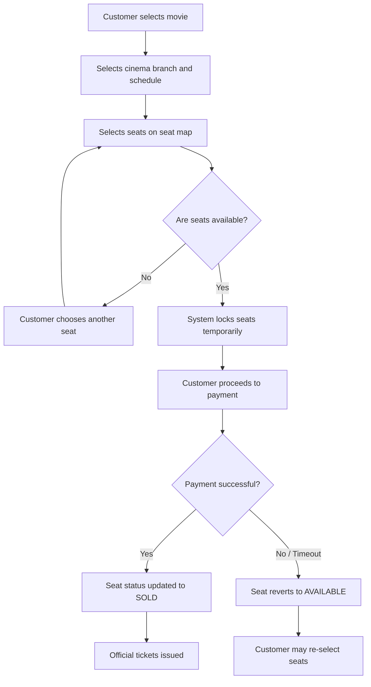
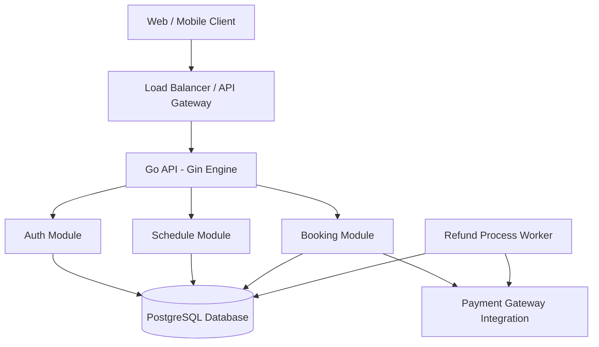
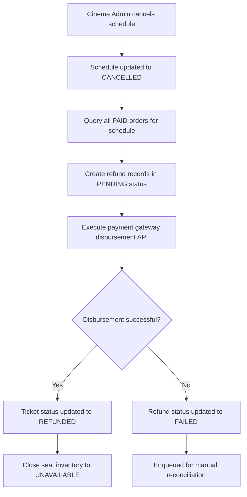

# A. System Design Test

## 📐 Cloud Architecture Topology (High-Resolution JPG)


## 🔄 Booking, Restocking, &amp; Refund Flowchart (User-Friendly)


---

## 1. System Objectives

This platform provides an online cinema ticket purchasing system for a nationwide cinema network with multiple branches across cities, servicing concurrent customer transactions.

Primary system objectives:

1. Customers can view movie screening schedules online.
2. Customers can select their preferred seats.
3. A seat on a given screening schedule cannot be sold to two different customers (*zero double-booking*).
4. The system maintains high throughput under concurrent peak traffic nationwide.
5. Seats can be temporarily held while a customer completes checkout.
6. Held seats automatically return to available inventory if payment fails or expires.
7. Sold tickets are recorded and fully auditable.
8. If a cinema cancels a schedule, affected customers are processed for automatic refunds.
9. Historical transaction records remain immutable for auditing and financial reconciliation.

---

## 2. Core Architectural Assumptions

To ensure clear design boundaries, the following assumptions are established:

- Each physical studio contains a defined layout of physical seats.
- Each schedule represents a specific movie screened in a specific studio during a specific time window.
- Seat availability is specific to a schedule, not global.
- Payments are processed via external payment gateway providers.
- Payment gateways notify the backend of payment status via secure webhooks or redirects.
- Seat holds have an explicit Time-to-Live (TTL) expiration window.
- Seat release upon cancellation adheres to defined cinema business rules.
- PostgreSQL acts as the single source of truth for transactional state.

---

## 3. Core Seat Inventory Modeling Concept

A common architectural anti-pattern is storing seat status on the physical seat entity:

```text
Seat A10 = SOLD
```

In reality, physical seat `A10` is screened multiple times throughout the day across different schedules:

```text
Schedule 1001 + Seat A10 = SOLD
Schedule 1002 + Seat A10 = AVAILABLE
```

Therefore, seat state must be modeled at the **schedule / show session level**.

The dynamic inventory table:

```text
show_seats
----------
id
schedule_id
seat_id
status
held_by
held_until
sold_at
updated_at
```

With an absolute unique constraint:

```text
UNIQUE(schedule_id, seat_id)
```

With this design, a single physical seat has exactly one deterministic state per screening schedule.

---

## 4. User-Friendly Main Booking Flowchart

High-level transaction lifecycle:



Step breakdown:

```text
Select seat
    ↓
Check availability
    ↓
Temporary hold (10 min)
    ↓
Payment processing
    ↓
Success → SOLD → Tickets Issued
Failed  → Revert to AVAILABLE
```

---

## 5. High-Level Modular Monolith Architecture



For the skill test implementation, the backend is organized as a clean **modular monolith**.
Booking, payment gateway, and refund modules are fully architected in Section A and Section B, while Section C implements the required authentication and schedule microservice endpoints.

---

## 6. Seat Selection &amp; Reservation Flow

Technical lifecycle:

```text
Customer selects seat A10
        ↓
Backend receives request
        ↓
Start database transaction
        ↓
Lock show_seats row for A10
        ↓
Verify current status
        ↓
Is it AVAILABLE?
    ┌───┴────┐
   Yes       No
    |          |
    v          v
Set HELD     Reject Request
    |
Set held_until (NOW + 10 min)
    |
Commit Transaction
```

Subsequent state transitions:

```text
HELD
 |
 +--> Payment success
 |       |
 |       v
 |      SOLD
 |
 +--> Payment failed
 |
 +--> Hold expired
         |
         v
      AVAILABLE
```

---

## 7. Concurrency &amp; Race Condition Prevention

### The Problem

When two customers attempt to reserve seat `A10` almost simultaneously:

```text
Customer A → Seat A10
Customer B → Seat A10
```

If the application executes a naive non-locking check:

```text
if status == AVAILABLE
    set status = HELD
```

Both concurrent requests could read `status == AVAILABLE` before either saves its update, resulting in a disastrous double-booking.

### The Solution: Database Transactions + Row-Level Locking

```sql
BEGIN;

SELECT id, status
FROM show_seats
WHERE schedule_id = $1
  AND seat_id = $2
FOR UPDATE;

-- Verify status in transaction isolation

UPDATE show_seats
SET status = 'HELD',
    held_by = $3,
    held_until = $4
WHERE id = $5;

COMMIT;
```

The `FOR UPDATE` clause instructs the PostgreSQL engine to acquire an exclusive row-level lock on the target seat record. Any concurrent transaction attempting to read or update that same row must wait in a lock queue until the first transaction commits or rolls back.

```text
Request A
    ↓
Lock row A10
    ↓
Reads: AVAILABLE
    ↓
Updates: HELD
    ↓
Commit (Lock released)

Request B
    ↓
Waits on lock queue
    ↓
Acquires lock after A commits
    ↓
Reads: HELD
    ↓
Rejects request with 409 Conflict
```

Only one customer can successfully acquire the hold on seat `A10` for that schedule session.

### 7.3 Dual-Layer Schedule Overlap Protection (Application + PostgreSQL)

A critical concurrency race condition occurs when two administrators concurrently schedule different movies in the same studio with overlapping timeframes:

```text
Admin 1 -> checks Studio 1 (14:00 - 16:00) -> Free -> INSERT
Admin 2 -> checks Studio 1 (15:00 - 17:00) -> Free -> INSERT
```

To eliminate this race condition completely, the system deploys a **dual-layer defense**:

1. **Layer 1: Go Application Validation (`CheckOverlap`)**:
   - Executes interval intersection query: `waktu_mulai < new_end AND waktu_selesai > new_start`.
   - Returns a friendly, actionable HTTP `409 Conflict` error to the client.
2. **Layer 2: PostgreSQL Engine-Level Exclusion Constraint**:
   - Enabled via the `btree_gist` extension:
   - Even if concurrent requests bypass application logic, PostgreSQL rejects the conflicting row at the storage engine level (SQLSTATE `23P01`).

---

## 8. Why Seat Locking Does Not Rely Exclusively on Cache

While an in-memory cache accelerates read performance, seat state represents mission-critical transactional data.

If a cache reports:

```text
A10 = AVAILABLE
```

while the database has already transitioned to:

```text
A10 = HELD
```

the application would serve stale data and cause false hopes.

Design principles:

- PostgreSQL remains the transactional source of truth.
- Distributed Redis locks act as a high-throughput fast-path guard.
- Final commit decisions always evaluate transactional constraints inside the database.

---

## 9. Temporary Seat Hold (TTL Management)

Customers need a reasonable window to complete payment (e.g., entering credit card details or scanning a QRIS code):

```text
19:00:00 → Seat A10 HELD
19:10:00 → Hold expired
```

If payment is not confirmed prior to `held_until`, the seat is automatically restored to `AVAILABLE`.

```text
AVAILABLE
    ↓
HELD
    ↓
┌───────────────────────┐
│ Payment successful?   │
└───────────────────────┘
       /       \
     Yes       No / Timeout
      |             |
      v             v
    SOLD        AVAILABLE
```

---

## 10. Database Transactions and Cross-Entity Consistency

All interdependent state changes are encapsulated within atomic database transactions:

```text
BEGIN
   |
Create order record
   |
Lock show_seat row
   |
Update show_seat status to HELD
   |
Create order item records
   |
Create pending payment record
   |
COMMIT
```

If any step throws an error:

```text
ROLLBACK
```

Guarantees the system never enters an inconsistent partial state such as a sold seat without an associated order or payment record.

---

## 11. Idempotency Architecture

Idempotency prevents duplicate side-effects when clients retry requests due to network timeouts:

```http
POST /api/v1/orders/123/pay
Idempotency-Key: 550e8400-e29b-41d4-a716-446655440000
```

On initial invocation:

- The payment is processed.
- The result is stored with the idempotency key.

On subsequent retries with the same idempotency key:

- The backend detects the existing key.
- Returns the cached response immediately without re-charging the customer.

Row-level locking versus idempotency:

- **Row-level locking** prevents concurrent conflicting updates to the same shared resource.
- **Idempotency** prevents duplicate execution of the exact same client intent.

### 11.2 Payment Webhook Retry Idempotency (`event_pembayaran`)

External payment providers (e.g. Midtrans, Xendit) frequently re-dispatch webhook events due to network acknowledgment timeouts. Without idempotency protection, a duplicate webhook could attempt double-credit or double-ticket issuance.

The system utilizes an dedicated table for webhook idempotency:

```sql
CREATE TABLE event_pembayaran (
    id BIGSERIAL PRIMARY KEY,
    id_event_provider VARCHAR(100) NOT NULL UNIQUE,
    pembayaran_id BIGINT REFERENCES pembayaran(id),
    tipe_event VARCHAR(100) NOT NULL,
    payload JSONB NOT NULL DEFAULT '{}'::jsonb,
    diterima_pada TIMESTAMPTZ DEFAULT CURRENT_TIMESTAMP,
    diproses_pada TIMESTAMPTZ
);
```

When a webhook arrives:

1. Backend checks `id_event_provider UNIQUE`.
2. If the provider event ID already exists:
   - Duplicate delivery is detected.
   - Event processing is bypassed and HTTP `200 OK` is immediately returned to acknowledge the provider.
3. If new:
   - Event is stored and transactional ticket state (`HELD` → `SOLD`, `tiket` issuance) is executed within an ACID block.

---

## 12. Ticket Inventory Tracking and Auto-Restock

Cinema seats are distinct physical assets rather than fungible inventory items:

```text
Schedule 1001

A1  SOLD
A2  SOLD
A3  AVAILABLE
A4  HELD
```

When `A4` times out:

```text
A4  HELD → AVAILABLE
```

When payment for `A3` completes:

```text
A3  AVAILABLE → SOLD
```

When an order is cancelled prior to showtime and business rules permit:

```text
A3  SOLD → AVAILABLE
```

Historical ledgers (orders, payments, tickets, and audit logs) are permanently preserved:

```text
Seat state
    → Dynamic and mutable per schedule

Transaction history
    → Immutable and never deleted
```

---

## 13. Ticket Issuance Flow

Upon payment confirmation:

```text
Payment = PAID
    ↓
Order = PAID
    ↓
Seat = SOLD
    ↓
Generate Ticket
    ↓
Ticket = ISSUED
```

Each issued ticket contains a cryptographically secure, unique identifier:

```text
ticket_code (e.g., TKT-20261001-A10-9F82)
```

used for QR code generation and entrance scanner verification.

---

## 14. Cinema-Initiated Screening Cancellation Workflow

When a cinema cancels a screening due to technical faults or emergency maintenance:

```text
Schedule
SCHEDULED → CANCELLED
```

The system identifies all paid orders for that schedule and triggers automated refund processing:



---

## 15. Refund Management &amp; Auditability

Refund transactions are managed in a dedicated `refunds` table:

Status progression:

- `PENDING`
- `PROCESSING`
- `COMPLETED`
- `FAILED`

Essential tracking attributes:

```text
order_id
payment_id
amount
reason
status
refund_reference
requested_at
completed_at
```

If a payment gateway disbursement temporarily fails, transaction history remains intact for automated retries or finance team reconciliation.

---

## 16. Performance and High Concurrency Nationwide

### Stateless API Cluster

The Go API is stateless. Multiple application replicas run across availability zones behind an Application Load Balancer:

```text
               Load Balancer (ALB)
              /         |         \
             /          |          \
        API Node 1  API Node 2  API Node 3
             \          |          /
              \         |         /
               PostgreSQL Multi-AZ
```

Authentication relies on self-contained JWT tokens, eliminating server-side session affinity constraints.

### Strategic Indexing

Crucial database indexes:

```text
schedules(movie_id, start_time)
schedules(studio_id, start_time)
show_seats(schedule_id, status)
orders(user_id)
orders(status)
tickets(ticket_code)
refunds(status)
```

### Connection Pooling

Go database connection pool parameters (`SetMaxOpenConns`, `SetMaxIdleConns`, `SetConnMaxLifetime`) prevent PostgreSQL connection saturation during traffic spikes.

### Read Replicas &amp; In-Memory Caching

Static metadata (cinemas, studios, movie synopses) are cached in Redis and served via database read replicas, dedicating primary database IOPS to transactional seat reservations.

### Nationwide Multi-City Timezone Architecture

A nationwide cinema network operates across multiple Indonesian timezones:

- **WIB (UTC+7)**: Jakarta, Bandung, Medan
- **WITA (UTC+8)**: Bali, Makassar, Balikpapan
- **WIT (UTC+9)**: Jayapura, Ambon

**Storage vs Presentation Standard**:

1. **Database Standard**: All screening timestamps (`waktu_mulai`, `waktu_selesai`) and order timestamps are stored as PostgreSQL **`TIMESTAMPTZ`** (canonical UTC instants).
2. **Cinema Timezone Contract**: The `bioskop` table explicitly defines `zona_waktu VARCHAR(50) NOT NULL DEFAULT 'Asia/Jakarta'`.
3. **Presentation Layer**: The API and frontend translate the UTC instant into the cinema branch's local time:
   ```text
    Database (UTC)           : 2026-10-01 12:00:00+00
    Jakarta Cinema (WIB)     : 19:00 WIB (+07:00)
    Bali Cinema (WITA)       : 20:00 WITA (+08:00)
   ```

   This prevents customer confusion when viewing screening times across different cities.

---

## 17. Security Architecture

- Passwords hashed with `bcrypt`.
- Authentication via HMAC-SHA256 JWT with expiration timestamps.
- All protected endpoints validate `Authorization: Bearer <token>`.
- Strict RBAC (`ADMIN` vs `CUSTOMER`).
- Parameterized queries and GORM prevent SQL injection.
- Credentials and secrets stored exclusively in environment variables.
- HTTPS enforced in production environments.

---

## 18. Audit Logging

Sensitive administrative actions generate permanent audit trails:

```text
Actor: ADMIN (User #1)
Action: CANCEL_SCHEDULE
Entity: Schedule
Entity ID: 1001
Timestamp: 2026-10-01 12:00:00 UTC
Old Data: {"status": "SCHEDULED"}
New Data: {"status": "CANCELLED"}
```

---

## 19. Failure Scenarios &amp; Mitigations


| Failure Scenario               | Threat / Failure Mode                         | Mitigating Architecture                                                              |
| ------------------------------ | --------------------------------------------- | ------------------------------------------------------------------------------------ |
| Concurrent seat selection      | Two customers claim seat A10 simultaneously   | PostgreSQL row-level lock (`SELECT ... FOR UPDATE`) + Redis Distributed Lock         |
| Abandoned checkout             | Customer closes app during checkout           | Automatic 10-minute hold TTL expiration reverts seat to `AVAILABLE`                  |
| Network timeout during payment | Payment succeeds but client disconnects       | Webhook reconciliation + client idempotency key verification                         |
| Duplicate payment webhooks     | Gateway sends duplicate webhook events        | Idempotent event processing based on unique payment gateway reference                |
| Cinema cancels screening       | Force majeure cancellation after tickets sold | Asynchronous Kafka event publishes batch refund workflow, marking tickets `REFUNDED` |


---

## 20. Architectural Solution Matrix


| Architectural Challenge       | Production Solution                                         |
| ----------------------------- | ----------------------------------------------------------- |
| Double-booking prevention     | Database transactions with row-level locking (`FOR UPDATE`) |
| Unattended reservations       | Temporary 10-minute hold with automated TTL expiry          |
| Releasing expired holds       | State transition: `HELD → AVAILABLE`                        |
| Successful purchase           | State transition: `HELD → SOLD` + ticket issuance           |
| Duplicate payment submissions | Idempotency keys and unique payment reference constraints   |
| Screening cancellation        | Logical schedule cancellation (`CANCELLED`)                 |
| Financial reimbursement       | Dedicated `refunds` ledger with automated disbursement      |
| Transaction history           | Zero hard deletes on orders, payments, and tickets          |
| Nationwide high concurrency   | Stateless Go API nodes + horizontal auto-scaling            |
| Database performance          | Strategic composite indexing + managed connection pooling   |
| Data consistency              | PostgreSQL as the authoritative single source of truth      |


