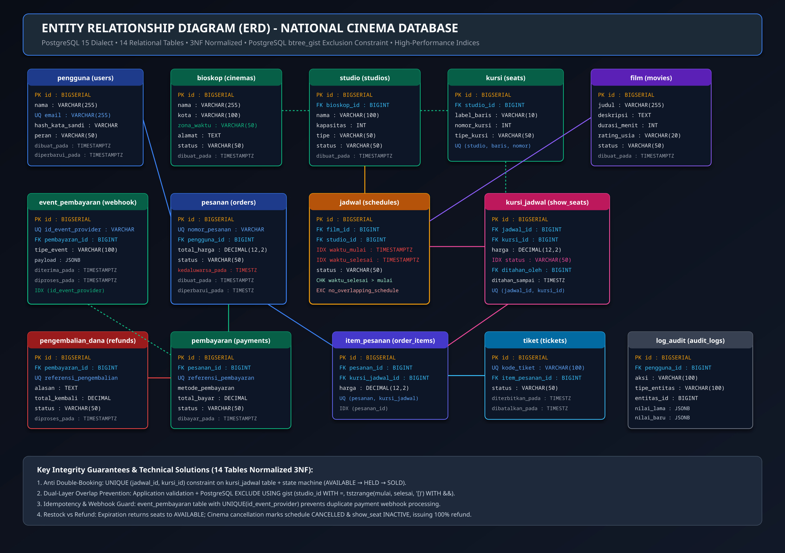
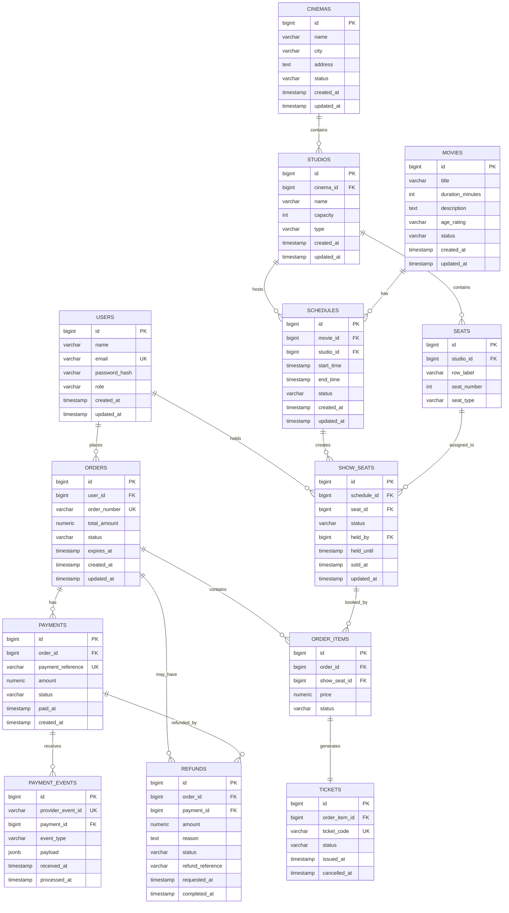

# B. Database Design Test

## 🗄️ Entity Relationship Diagram (ERD JPG Export)


> 💡 **Ready-to-Import SQL Script for Evaluators**:  
> The complete DDL schema (14 relational tables) with `btree_gist` exclusion constraints, timezone support, and initial seed data have been compiled into standalone files: [**`database.sql`**](../database.sql), [**`docs/database.sql`**](database.sql), and [**`docs/skema_dan_data_awal_bioskop.sql`**](skema_dan_data_awal_bioskop.sql).  
> Can be directly imported using: `psql -U bioskop -d bioskop -f docs/database.sql`

---

## 1. Objectives

The database must support:

- User authentication.
- Cinema chain and branch data.
- Studios/Auditoriums.
- Seats.
- Movies.
- Show schedules.
- Seat inventory per show schedule.
- Orders.
- Payments.
- Tickets.
- Refunds.
- Audit trail.

The design is constructed in greater detail than minimal API requirements to ensure full consistency with the System Design in Section A.

---

# 2. Entity Relationship



---

# 3. Table: users

Used for authentication and role-based access control.

```text
users
-----
id
name
email
password_hash
role
created_at
updated_at
```

### Constraints

```text
PRIMARY KEY (id)
UNIQUE (email)
```

### Roles

```text
CUSTOMER
ADMIN
```

Passwords are never stored in plaintext (hashed using bcrypt).

---

# 4. Table: cinemas

Stores cinema branches and locations.

```text
cinemas
-------
id
name
city
address
status
created_at
updated_at
```

One cinema contains multiple studios:

```text
cinema 1 ---- N studios
```

---

# 5. Table: studios

Stores auditoriums/rooms within a specific cinema branch.

```text
studios
-------
id
cinema_id
name
capacity
type
created_at
updated_at
```

Foreign key:

```text
cinema_id → cinemas.id
```

Hierarchy Example:

```text
Cinema Semarang
    ├── Studio 1
    ├── Studio 2
    └── Studio 3
```

---

# 6. Table: seats

Stores physical seats inside an auditorium/studio.

```text
seats
-----
id
studio_id
row_label
seat_number
seat_type
```

Example seat identifiers:

```text
A1
A2
A3
B1
B2
B3
```

One studio contains multiple seats:

```text
studio 1 ---- N seats
```

---

# 7. Table: movies

Stores film metadata and exhibition status.

```text
movies
------
id
title
duration_minutes
description
age_rating
status
created_at
updated_at
```

Example statuses:

```text
ACTIVE
INACTIVE
```

---

# 8. Table: schedules

A schedule represents a specific screening of a movie in a particular studio at a specific time range.

```text
schedules
---------
id
movie_id
studio_id
start_time
end_time
status
created_at
updated_at
```

Foreign keys:

```text
movie_id  → movies.id
studio_id → studios.id
```

Statuses:

```text
SCHEDULED
CANCELLED
COMPLETED
```

---

# 9. Table: show_seats

Critical table for managing seat availability, locks, and concurrency per screening.

```text
show_seats
----------
id
schedule_id
seat_id
status
held_by
held_until
sold_at
updated_at
```

### Statuses

```text
AVAILABLE
HELD
SOLD
```

### Unique Constraint

```text
UNIQUE(schedule_id, seat_id)
```

This constraint guarantees that a physical seat cannot have duplicate inventory records for the same screening schedule.

Example:

```text
schedule_id | seat_id | status
------------|---------|---------
1001        | A10     | SOLD
1002        | A10     | AVAILABLE
```

The same physical seat (A10) remains available for different screening schedules.

### Seat Locking (Hold Mechanism)

When a customer selects a seat during checkout:

```text
status = HELD
held_by = user_id
held_until = timestamp (now + 10 minutes)
```

Upon successful payment confirmation:

```text
status = SOLD
sold_at = timestamp
```

If the hold expires before payment completes:

```text
status = AVAILABLE
held_by = NULL
held_until = NULL
```

---

# 10. Table: orders

An order represents a customer checkout transaction.

```text
orders
------
id
user_id
order_number
total_amount
status
expires_at
created_at
updated_at
```

Example statuses:

```text
PENDING
PAID
CANCELLED
EXPIRED
REFUNDED
```

`order_number` must be strictly UNIQUE.

---

# 11. Table: order_items

An order can contain multiple tickets/seats.

```text
order_items
-----------
id
order_id
show_seat_id
price
status
```

Relationship:

```text
order 1 ---- N order_items
```

Each item links directly to a specific `show_seat` record.

---

# 12. Table: payments

Stores financial transaction records and payment gateway settlements.

```text
payments
--------
id
order_id
payment_reference
amount
status
paid_at
created_at
```

Example statuses:

```text
PENDING
PAID
FAILED
EXPIRED
```

`payment_reference` must be strictly UNIQUE to prevent duplicate payment processing.

---

# 13. Table: tickets

Generated upon successful payment settlement.

```text
tickets
-------
id
order_item_id
ticket_code
status
issued_at
cancelled_at
```

Example statuses:

```text
ISSUED
USED
CANCELLED
REFUNDED
```

`ticket_code` is strictly UNIQUE.  
Tickets are never hard-deleted during refund/cancellation; their status transitions to preserve financial auditability.

---

# 14. Table: refunds

Tracks refund requests, approvals, and banking disbursement status.

```text
refunds
-------
id
order_id
payment_id
amount
reason
status
refund_reference
requested_at
completed_at
```

Statuses:

```text
PENDING
PROCESSING
COMPLETED
FAILED
```

Example reasons:

```text
CINEMA_CANCELLED
CUSTOMER_CANCELLED
SYSTEM_ERROR
```

---

# 15. Table: audit_logs

Tracks administrative actions and critical state transitions for security compliance.

```text
audit_logs
----------
id
user_id
entity_type
entity_id
action
old_value
new_value
created_at
```

Example:

```text
entity_type = SCHEDULE
entity_id   = 1001
action      = CANCEL
```

Audit trails preserve the historical state of critical operations without destructive overwrites.

---

# 16. Relationships

## User
```text
users 1 ---- N orders
users 1 ---- N show_seats (held_by)
```

## Cinema
```text
cinemas 1 ---- N studios
```

## Studio
```text
studios 1 ---- N seats
studios 1 ---- N schedules
```

## Movie
```text
movies 1 ---- N schedules
```

## Schedule
```text
schedules 1 ---- N show_seats
```

## Order
```text
orders 1 ---- N order_items
orders 1 ---- N payments
orders 1 ---- N refunds
```

## Ticket
```text
order_items 1 ---- 1 tickets
```

---

# 17. Important Constraints

### User Email
```sql
UNIQUE(email)
```
Prevents duplicate user accounts with identical email addresses.

### Schedule Seat
```sql
UNIQUE(schedule_id, seat_id)
```
Guarantees a seat appears at most once in any given screening schedule.

### Order Number
```sql
UNIQUE(order_number)
```

### Payment Reference
```sql
UNIQUE(payment_reference)
```

### Ticket Code
```sql
UNIQUE(ticket_code)
```

---

# 18. Important Indexes

Recommended composite and B-tree indexes for production performance:

```text
idx_schedules_movie_start
    (movie_id, start_time)

idx_schedules_studio_start
    (studio_id, start_time)

idx_show_seats_schedule_status
    (schedule_id, status)

idx_orders_user
    (user_id)

idx_orders_status
    (status)

idx_tickets_code
    (ticket_code)

idx_refunds_status
    (status)
```

The composite index `show_seats(schedule_id, status)` optimizes high-frequency queries such as:
```text
SELECT * FROM show_seats WHERE schedule_id = ? AND status = 'AVAILABLE';
```

---

# 19. Data Integrity

Foreign key constraints enforce relational integrity:

```text
schedule.movie_id
    → movies.id

schedule.studio_id
    → studios.id

studio.cinema_id
    → cinemas.id

seat.studio_id
    → studios.id

show_seat.schedule_id
    → schedules.id

show_seat.seat_id
    → seats.id
```

Foreign keys prevent orphan records and enforce consistency across table hierarchies.

---

# 20. Cancellation Strategy

For schedules, logical cancellation (soft state transition) is preferred over hard deletes:

```text
SCHEDULED
    ↓
CANCELLED
```

Rather than:

```sql
DELETE FROM schedules;
```

This ensures existing orders, tickets, and refund records retain valid foreign references to historical schedules.

---

# 21. Database for API Technical Assessment Scope

Part C focuses on the core administrative and screening operations:

```text
Login
Schedule CRUD
```

The primary database tables actively interfaced by the assessment API are:

```text
users
cinemas
studios
movies
schedules
```

The supporting transactional tables are fully designed for enterprise completeness:

```text
show_seats
orders
order_items
payments
tickets
refunds
audit_logs
```

Not all supporting tables require exposed endpoints in the scoped Part C API implementation, but they complete the full architectural blueprint.

---

# 22. Relational Table Dependency & Migration Structure

Relational table creation dependency sequence (14 tables):

```text
01. users (pengguna)
      ↓
02. cinemas (bioskop) - with timezone (zona_waktu)
      ↓
03. studios (studio)
      ↓
04. seats (kursi)
      ↓
05. movies (film)
      ↓
06. schedules (jadwal) - with btree_gist exclusion constraint
      ↓
07. show_seats (kursi_jadwal)
      ↓
08. orders (pesanan)
      ↓
09. order_items (item_pesanan)
      ↓
10. payments (pembayaran)
      ↓
11. tickets (tiket)
      ↓
12. refunds (pengembalian_dana)
      ↓
13. audit_logs (log_audit)
      ↓
14. payment_events (event_pembayaran) - webhook idempotency
```

### Consolidated Migration Architecture:
- [**`migrations/000001_skema_awal_bioskop.up.sql`**](../migrations/000001_skema_awal_bioskop.up.sql): Contains the complete, unified DDL for all 14 tables, PostgreSQL extensions (`uuid-ossp`, `btree_gist`), and indexes.
- [**`database.sql`**](../database.sql): The complete standalone script containing both the 14-table DDL and initial seed data, ready for immediate import via `psql`.

---

# 23. Summary

The database utilizes a normalized relational architecture:

```text
Cinema
  ↓
Studio
  ↓
Seat

Movie
  ↓
Schedule
  ↓
Show Seat

User
  ↓
Order
  ├── Order Item
  │      ↓
  │    Ticket
  ├── Payment
  └── Refund
```

Seat inventory concurrency core:

```text
show_seats(schedule_id, seat_id)
```

With:

```text
UNIQUE(schedule_id, seat_id)
```

And lifecycle states:

```text
AVAILABLE
HELD
SOLD
```

This model provides robust support for high-concurrency seat locking, real-time inventory management, screening cancellations, and automated refund processing as detailed in System Design (Part A).
