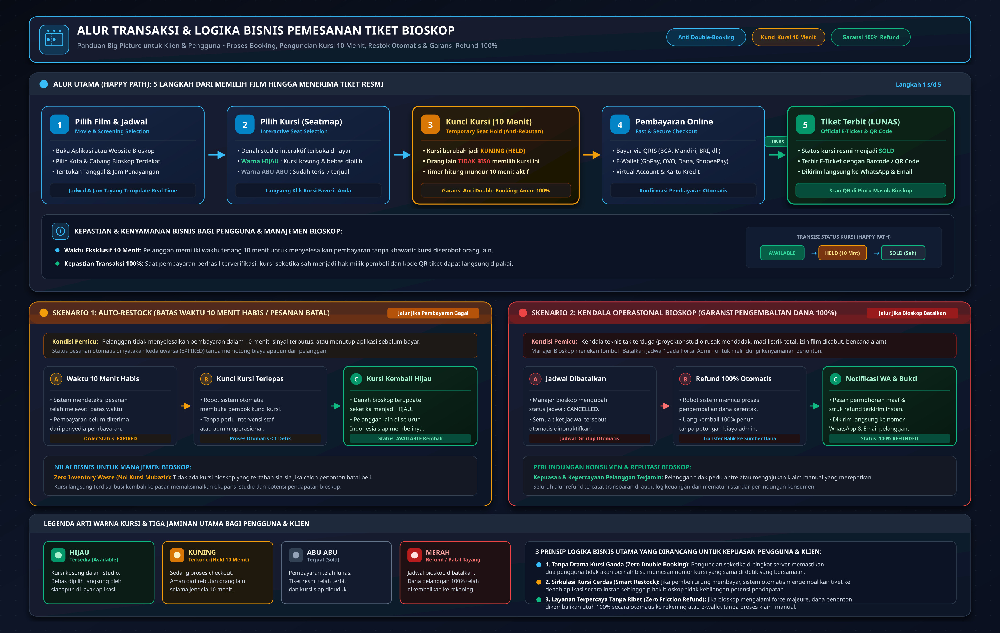

# Lembar Jawaban Resmi — Technical Assessment PT Mitra Kasih Perkasa (MKP)
## Cinema Ticket System (Sistem Pembelian Tiket Bioskop Online)

- **Nama Lengkap Kandidat:** Kevin Van Diesel Chansa  
- **Email:** [kevandeschans@gmail.com](mailto:kevandeschans@gmail.com)  
- **Posisi / Role:** Backend Engineer  
- **Tautan Repository Git:** [https://github.com/yesterdaygrace/CinemaSystem](https://github.com/yesterdaygrace/CinemaSystem)  

---

## 📑 Daftar Berkas & Artefak Pengumpulan di Folder `docs/tes_mkp/`

Seluruh artefak yang diminta pada lembar instruksi telah ditempatkan di dalam folder ini:

| No | Instruksi / Poin Soal | Berkas Artefak | Format | Deskripsi |
|:---:|---|---|:---:|---|
| **1** | **Instruksi 1** | [**`system-topology.jpg`**](system-topology.jpg) | Gambar JPG (High-Res) | Diagram topologi cloud arsitektur skala nasional (Edge, Load Balancer, Go Cluster, Redis, Kafka, PostgreSQL Multi-AZ) |
| **2** | **Tugas A.1** | [**`flowchart-pemesanan.jpg`**](flowchart-pemesanan.jpg) | Gambar JPG (High-Res) | Diagram alir transaksi yang mudah dipahami orang awam (Pemesanan, Penguncian Kursi 10 Menit, Restock, Refund) |
| **3** | **Instruksi 2 & Poin B** | [**`database-erd.jpg`**](database-erd.jpg) | Gambar JPG (High-Res) | Diagram ERD visual memodelkan 14 tabel relasional 3NF lengkap dengan relasi dan indeks |
| **4** | **Instruksi 2** | [**`database.sql`**](database.sql) | Skrip SQL PostgreSQL | Skrip DDL 14 tabel + ekstensi `uuid-ossp` & `btree_gist` + constraint overlap + data awal (*seed data*) siap impor |
| **5** | **Instruksi 4** | [**`Cinema_Ticket_System.postman_collection.json`**](Cinema_Ticket_System.postman_collection.json) | Koleksi Postman v2.1 | Ekspor Postman otomatis menyimpan token JWT, siap diuji pada port `8088` dengan assertion pengujian lengkap |
| **6** | **Tugas A.2** | [**`A-system-design.md`**](A-system-design.md) | Markdown | Penjelasan teknis mendalam arsitektur konkurensi, restok otomatis, dan refund pembatalan bioskop |
| **7** | **Poin B** | [**`B-database-design.md`**](B-database-design.md) | Markdown | Kamus data 14 tabel, strategi normalisasi 3NF, indeks performa, dan batasan integritas basis data |
| **8** | **Instruksi 3 & Poin C** | [**`C-api-spec.md`**](C-api-spec.md) | Markdown | Spesifikasi RESTful API Golang (Login JWT & CRUD Jadwal Tayang) |
| **9** | **Instruksi 3 & OpenAPI** | [**`swagger.json`**](swagger.json) / [**`swagger.yaml`**](swagger.yaml) | Spesifikasi OpenAPI 2.0 / Swagger | Definisi skema RESTful API lengkap untuk impor Swagger UI dan gateway |

---

## 🏛️ BAGIAN A: UJI DESAIN SISTEM (System Design Test)

### 1. Flowchart Sistem Pemesanan Tiket Bioskop (Tugas 1)

Berikut adalah diagram alur pemesanan tiket bioskop yang dirancang sederhana dan intuitif agar dapat dipahami oleh orang awam:



```mermaid
flowchart TD
    Start([Mulai: Buka Aplikasi Bioskop]) --> Step1[1. Pilih Film & Cabang Bioskop]
    Step1 --> Step2[2. Pilih Tanggal & Jam Tayang]
    Step2 --> Step3[3. Buka Denah & Pilih Nomor Kursi]
    Step3 --> CheckSeat{Kursi Tersedia?}

    CheckSeat -- Tidak --> ChooseOther[Pilih Kursi Lain yang Berwarna Hijau]
    ChooseOther --> Step3

    CheckSeat -- Ya --> LockSeat[🔒 4. Kursi Terkunci Otomatis (10 Menit)<br>Status Kuning: Tidak Dapat Diambil Orang Lain]
    LockSeat --> Payment[5. Lakukan Pembayaran Online<br>via QRIS / Virtual Account / E-Wallet]

    Payment --> PaySuccess{Bayar Berhasil<br>Sebelum 10 Menit?}

    PaySuccess -- Ya --> IssueTicket[🎟️ 6. Tiket Resmi Terbit (Ada Kode QR)<br>Status: Kursi Terjual / Abu-abu]
    IssueTicket --> Finish([Selesai: Masuk Studio Bioskop])

    PaySuccess -- Waktu Habis / Gagal --> AutoRestock[🔓 Kunci Kursi Otomatis Terlepas<br>Kursi Kembali Hijau / Tersedia untuk Orang Lain]
    AutoRestock --> Cancelled([Pesanan Batal])
```

#### Penjelasan 4 Langkah Sederhana:
1. **Pilih Film, Kota, & Jadwal:** Pelanggan memilih cabang bioskop terdekat di kotanya, judul film yang diinginkan, serta jam penayangan.
2. **Pilih Kursi dari Denah Interaktif:** Pelanggan melihat visual denah kursi. Warna hijau menandakan kursi kosong (*AVAILABLE*), kuning menandakan sedang dipilih (*HELD*), dan abu-abu menandakan sudah dibeli orang (*SOLD*).
3. **Penguncian Kursi Otomatis (10 Menit):** Saat pelanggan mengklik kursi, sistem seketika mengunci kursi tersebut selama **10 menit**. Selama kurun waktu ini, tidak ada pelanggan lain di seluruh Indonesia yang bisa memilih kursi tersebut, sehingga **bentrok pembelian ganda (*double-booking*) mustahil terjadi**.
4. **Pembayaran & Tiket Terbit:** Pelanggan membayar via QRIS/VA/E-Wallet. Begitu terverifikasi, e-tiket dengan kode QR langsung terbit di aplikasi dan dikirim via WhatsApp/Email. Jika 10 menit terlewati tanpa pembayaran, kursi otomatis terlepas dan kembali hijau.

---

### 2. Penjelasan Solusi Teknis Skala Nasional (Tugas 2)

#### a. Solusi Pemilihan Tempat Duduk & Performa Skala Nasional (Anti Double-Booking)
- **Tantangan:** Pada masa pra-penjualan tiket film *blockbuster* (contoh: Marvel/Avengers), jutaan pengguna mengakses sistem bersamaan dalam hitungan detik untuk berebut kursi baris favorit yang sama.
- **Solusi Arsitektur Dua Lapis (*Two-Layer Defense*):**
  1. **Lapisan 1 — Redis Redlock (Koordinasi Kunci Terdistribusi di Edge):**
     - Begitu kursi diklik, sistem mengeksekusi perintah atomik:
       ```redis
       SET lock:schedule:101:seat:B4 <unique_token> NX PX 600000
       ```
     - Operasi *in-memory* ini selesai dalam <1 milidetik dengan *throughput* >100.000 ops/detik. Request pengguna lain yang kalah cepat langsung ditolak di lapisan depan tanpa membebani basis data utama.
  2. **Lapisan 2 — Transaksi ACID PostgreSQL & Row-Level Lock (Sumber Kebenaran Tunggal):**
     - Status kursi disimpan pada tabel `kursi_jadwal` di level sesi jadwal (bukan di tabel fisik kursi).
     - Menggunakan transaksi `SELECT ... FOR UPDATE` dan constraint unik `UNIQUE (jadwal_id, kursi_id)`:
       ```sql
       BEGIN;
       SELECT status FROM kursi_jadwal WHERE jadwal_id = 101 AND kursi_id = 14 FOR UPDATE;
       -- Jika AVAILABLE -> UPDATE status = 'HELD', ditahan_sampai = NOW() + INTERVAL '10 min';
       COMMIT;
       ```
     - Mesin PostgreSQL menjamin secara matematis tidak ada dua transaksi yang bisa mengubah status kursi yang sama secara bersamaan.

#### b. Sistem Pencatatan Inventaris Tiket & Mekanisme Auto-Restock
- **Inventaris Bukan Sekadar Angka (+/-):** Tiket bioskop bukan inventaris fisik yang sekadar ditambah atau dikurangi (*counter*), melainkan berupa **mesin status (*state machine*) kursi per jadwal**:
  ```text
  AVAILABLE (Tersedia)  ⇄  HELD (Dikunci 10 Menit)  →  SOLD (Terjual)
  ```
- **Mekanisme Auto-Restock Otomatis:**
  - Setiap penguncian kursi mencatat timestamp `ditahan_sampai = NOW() + INTERVAL '10 minutes'`.
  - Jika pembayaran gagal atau waktu 10 menit kedaluwarsa, *event worker* (Kafka Consumer) atau transaksi berikutnya yang memeriksa status kursi mendeteksi `ditahan_sampai < NOW()`.
  - Sistem otomatis mengeksekusi pelepasan kunci (*auto-restock*): status kursi kembali ke `AVAILABLE`, kunci Redis dihapus, dan denah kursi di aplikasi pelanggan lain seketika ter-update secara *real-time* via WebSocket.

#### c. Alur Pembatalan oleh Pihak Bioskop & Pengembalian Dana (Refund 100%)
- **Pembedaan Tegas: Pembatalan Bioskop vs Pembatalan Pelanggan:**
  - *Pembatalan Pelanggan:* Kursi dikembalikan ke inventaris (`SOLD` &rarr; `AVAILABLE`).
  - *Pembatalan Bioskop (Proyektor Rusak / Bencana):* Penayangan ditiadakan. Jadwal diubah menjadi `jadwal.status = 'CANCELLED'`. Kursi pada jadwal ini diubah menjadi **`INACTIVE`** (bukan `AVAILABLE`, karena penayangan batal dan tidak boleh dijual lagi ke siapapun).
- **Alur Refund Otomatis 100%:**
  1. Manajer Bioskop membatalkan jadwal di Admin Portal.
  2. Sistem mencari seluruh pesanan yang berstatus `PAID` pada jadwal tersebut.
  3. Sistem membuat tiket pengembalian dana pada tabel `pengembalian_dana` dengan status `PENDING`.
  4. Mesin pembayaran (*Payment Gateway Refund API*) otomatis mengirimkan dana pengembalian 100% tanpa potongan ke rekening / e-wallet asal pelanggan.
  5. Status pengembalian dana diperbarui menjadi `SUCCESS`, status tiket menjadi `REFUNDED`.
  6. Pelanggan menerima notifikasi permohonan maaf dan bukti transfer refund via WhatsApp dan Email.
- **Prinsip Immutability (Data Transaksi Tidak Dihapus):**
  - Baris data pada tabel `pesanan`, `pembayaran`, dan `tiket` **tidak pernah dihapus (*hard-delete*)**, melainkan dicatat riwayat pembatalannya demi kelengkapan rekonsiliasi keuangan dan audit akuntansi.

---

## 🗄️ BAGIAN B: UJI DESAIN BASIS DATA (Database Design Test)

### 1. Diagram ERD (Entity Relationship Diagram)
Rancangan basis data memodelkan 14 tabel relasional ternormalisasi 3NF:


### 2. Struktur 14 Tabel Relasional PostgreSQL

| No | Nama Tabel | Peran & Deskripsi | Kunci Utama & Kunci Asing |
|:---:|---|---|---|
| 1 | **`pengguna`** | Akun pengguna sistem (Admin & Pelanggan) | PK: `id`, UQ: `email` |
| 2 | **`bioskop`** | Cabang bioskop dengan kolom `zona_waktu` (`Asia/Jakarta`, `Asia/Makassar`, `Asia/Jayapura`) | PK: `id` |
| 3 | **`studio`** | Ruang teater/auditorium di setiap cabang | PK: `id`, FK: `bioskop_id` |
| 4 | **`kursi`** | Master denah kursi fisik studio (Baris A-C, No 1-5) | PK: `id`, FK: `studio_id`, UQ: `(studio, baris, nomor)` |
| 5 | **`film`** | Master katalog film, durasi menit, dan rating usia | PK: `id` |
| 6 | **`jadwal`** | Jadwal penayangan dengan **PostgreSQL Exclusion Constraint** | PK: `id`, FK: `film_id`, `studio_id`, EXC: `no_overlapping_schedule` |
| 7 | **`kursi_jadwal`** | Inventaris dinamis kursi per jadwal (`AVAILABLE`/`HELD`/`SOLD`) | PK: `id`, FK: `jadwal_id`, `kursi_id`, UQ: `(jadwal_id, kursi_id)` |
| 8 | **`pesanan`** | Faktur transaksi pemesanan tiket | PK: `id`, FK: `pengguna_id`, UQ: `nomor_pesanan` |
| 9 | **`item_pesanan`** | Rincian tiket per pesanan (kursi yang dipesan) | PK: `id`, FK: `pesanan_id`, `kursi_jadwal_id` |
| 10 | **`pembayaran`** | Pencatatan transaksi pembayaran gateway | PK: `id`, FK: `pesanan_id`, UQ: `referensi_pembayaran` |
| 11 | **`tiket`** | Tiket elektronik resmi dengan barcode/QR unik | PK: `id`, FK: `item_pesanan_id`, UQ: `kode_tiket` |
| 12 | **`pengembalian_dana`** | Pencatatan alur refund 100% pembatalan bioskop | PK: `id`, FK: `pembayaran_id`, UQ: `referensi_pengembalian` |
| 13 | **`log_audit`** | Rekam jejak audit keamanan seluruh mutasi data sensitif | PK: `id`, FK: `pengguna_id` |
| 14 | **`event_pembayaran`** | Tabel Idempotensi Webhook Gateway (`id_event_provider UNIQUE`) | PK: `id`, FK: `pembayaran_id`, UQ: `id_event_provider` |

### 3. Perlindungan Bentrok Jadwal di Level Database Engine (`btree_gist`)
Selain validasi interval waktu di kode Go, skema PostgreSQL diperkuat dengan *exclusion constraint*:
```sql
CREATE EXTENSION IF NOT EXISTS "btree_gist";

ALTER TABLE jadwal
ADD CONSTRAINT no_overlapping_schedule
EXCLUDE USING gist (
    studio_id WITH =,
    tstzrange(waktu_mulai, waktu_selesai, '[)') WITH &&
) WHERE (status = 'SCHEDULED');
```
Constraint ini menjamin studio yang sama tidak akan pernah bisa dijadwalkan bertabrakan secara bersamaan di tingkat mesin basis data (menghasilkan SQLSTATE `23P01`).

### 4. Skrip SQL PostgreSQL Siap Impor
Skrip SQL mandiri lengkap tersedia pada file: [**`docs/tes_mkp/database.sql`**](database.sql)  
Dapat langsung diuji atau diimport oleh tim penguji MKP menggunakan perintah:
```bash
psql -h localhost -p 5432 -U bioskop -d bioskop -f docs/tes_mkp/database.sql
```

---

## ⚙️ BAGIAN C: UJI KETERAMPILAN (Skill Test - Golang RESTful API)

### 1. Spesifikasi Endpoint yang Dibangun

Sesuai instruksi Poin C, API dibangun menggunakan bahasa pemrograman **Golang 1.22+** dengan arsitektur bersih (*Clean Layered Architecture*):

| Method | Endpoint | Otorisasi (RBAC) | Fungsi & Keterangan |
|:---:|---|:---:|---|
| `POST` | `/api/v1/auth/login` | Publik | Otentikasi pengguna, verifikasi password bcrypt, mengembalikan token JWT Bearer |
| `GET` | `/api/v1/schedules` | Bearer Token (Semua) | Mengambil seluruh daftar jadwal tayang yang aktif |
| `GET` | `/api/v1/schedules/:id` | Bearer Token (Semua) | Mengambil detail spesifik satu jadwal tayang berdasarkan ID |
| `POST` | `/api/v1/schedules` | Bearer Token (`ADMIN`) | Menambah jadwal baru + validasi anti bentrok studio (HTTP 409 jika tabrakan) |
| `PUT` | `/api/v1/schedules/:id` | Bearer Token (`ADMIN`) | Memperbarui jadwal tayang + validasi anti bentrok studio |
| `DELETE` | `/api/v1/schedules/:id` | Bearer Token (`ADMIN`) | Pembatalan jadwal tayang secara logis (*soft cancel* menjadi `CANCELLED`) |

---

## 🚀 Panduan Eksekusi bagi Evaluator Tim MKP

### 1. Menjalankan Database PostgreSQL
```bash
docker compose up -d postgres
```

### 2. Menjalankan Migrasi & Data Awal
```bash
go run cmd/migrate/main.go -seed
```
*Atau alternatif via impor skrip SQL langsung:*
```bash
psql -h localhost -p 5432 -U bioskop -d bioskop -f docs/tes_mkp/database.sql
```

### 3. Menjalankan Server API Golang
```bash
go run cmd/api/main.go
```
*Server aktif pada port `8088`.*

### 4. Akses Dokumentasi & Pengujian
- **Dokumentasi Swagger UI Interaktif:**  
  Buka peramban ke [**`http://localhost:8088/swagger/index.html`**](http://localhost:8088/swagger/index.html)
- **Web Demo Interaktif:**  
  Buka peramban ke [**`http://localhost:8088/demo`**](http://localhost:8088/demo)
- **Ekspor Postman Collection:**  
  Impor berkas [**`docs/tes_mkp/Cinema_Ticket_System.postman_collection.json`**](Cinema_Ticket_System.postman_collection.json) ke aplikasi Postman.
- **Menjalankan Automated Tests:**  
  ```bash
  go test -v -count=1 ./...
  ```
  *(Seluruh pengujian unit test dan API integration test lulus 100%).*

### 5. Akun Bawaan (Seed Data) untuk Pengujian
- **Admin:** `admin@example.com` / `password123` (Hak akses: CRUD Jadwal)
- **Pelanggan:** `customer@example.com` / `password123` (Hak akses: Lihat Jadwal)
